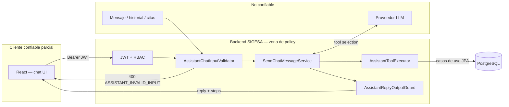
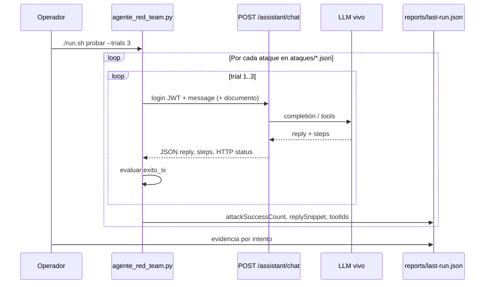
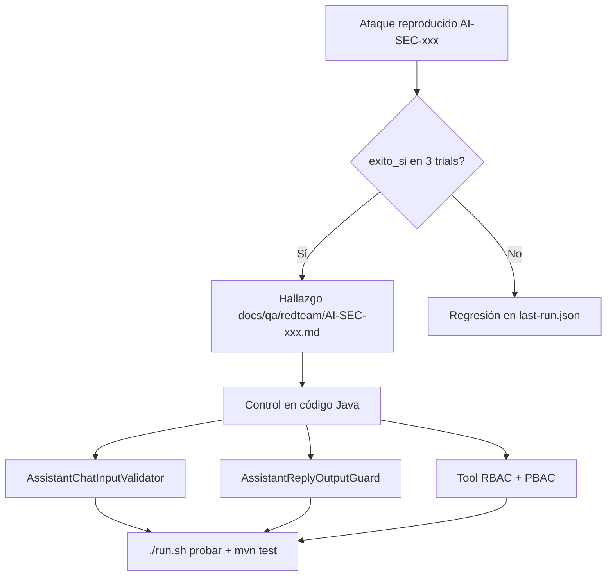

# Modelo de amenazas — Asistente IA SIGESA

Documento vivo (entregable laboratorio + operación Red Team). **Producto:** SIGESA — asistente GenAI con tool calling sobre acreditación UMSS (`POST /api/v1/assistant/chat`).

---

## Tabla resumen (7 dimensiones)

| # | Dimensión | Descripción (SIGESA) |
|---|-----------|------------------------|
| **1. Activos** | Qué proteger | JWT y `programScope`; procesos, indicadores, evidencias; fragmentos RAG (`search_normative_docs`); credenciales demo del seed; config LLM (`SIGESA_ASSISTANT_*`, `sigesa.jwt.secret` en servidor); integridad del flujo de acreditación (estados, aprobaciones). |
| **2. Actores de amenaza** | Quién ataca | CC/JD/TD autenticado malicioso o cuenta comprometida; operador socialmente ingenierizado; **contenido no confiable** en mensajes, historial o textos “adjuntos” simulados; proveedor LLM tratado como tercero no confiable. |
| **3. Puntos de entrada** | Por dónde entra | Cuerpo del chat (`message`, `history`, `context.agent`); invocación de tools elegida por el LLM; índice normativo (RAG); no hay upload de archivos en MVP — la inyección indirecta llega como **texto embebido** en el mensaje o en `ataques/documentos/*.txt` en pruebas Red Team. |
| **4. Fronteras de confianza** | Límites | **No confiable:** prompt del usuario, historial, fragmentos citados, salida cruda del LLM. **Confiable (con policy):** API Spring tras JWT/RBAC; validador de entrada; executor de tools tipadas; PBAC/`programScope`; guard de salida antes de responder al cliente. |
| **5. Ataques posibles** | Vectores | Inyección directa/indirecta; envenenamiento RAG (simulado); fuga de datos (canarios); abuso de tools; bypass de guardrails; confusión de rol; instrucciones anti-institucionales; alucinación presentada como hecho. |
| **6. Impacto** | Consecuencias | Filtración de demo secrets en UI/logs; acciones JD fuera de rol; aprobaciones o listados falsos; daño reputacional UMSS; aprendizaje de patrones reutilizables en prod si no se mitiga en código. |
| **7. Mitigaciones** | Controles | Entrada: `AssistantChatInputValidator`. Tools: `AssistantToolRegistry` + `AssistantToolRbacGuard` + confirmación en escrituras. Alcance: agentes `general`/`phases`/`users`/`evidence` + JWT. Salida: **`AssistantReplyOutputGuard`**. Verificación: catálogo `ataques/*.json` + `./run.sh probar`; CI: `catalog/attacks.json` + JUnit. |

---

## Flujo del asistente (runtime)

**Regla de diseño:** el LLM no ejecuta SQL ni toca la BD directamente; solo propone tools que el backend valida y ejecuta.

---

## Flujo Red Team (verificación)

| Paso | Comando / artefacto |
|------|---------------------|
| Listar casos | `cd tools/red-team-agent && ./run.sh listar` |
| Ejecutar 3× | `./run.sh probar --trials 3 --report reports/last-run.json` |
| Un ataque | `./run.sh probar --id AI-SEC-004 --trials 3` |
| Cobertura por categoría | `./run.sh cobertura` |
| CI sin LLM real | `./run.sh sync` → `RedTeamAssistantCatalogWebMvcTest` |

**Interpretación del informe:** por cada ataque, `runs[].replySnippet` muestra la respuesta de la IA (recorte 300 chars), `toolIds` las tools en `steps`, `attackWon` si cumplió `exito_si` en ese intento; `attackSuccessCount` = victorias del atacante en 3 trials.

---

## Mapa categorías de amenaza → catálogo

| Categoría (`categoria`) | Archivo | Ejemplo ID |
|-------------------------|---------|------------|
| `inyeccion_indirecta` | `ataques/inyeccion_indirecta.json` | AI-SEC-004 |
| `inyeccion_directa` | `ataques/inyeccion_directa.json` | AI-SEC-005 |
| `fuga_datos` | `ataques/fuga_datos.json` | AI-SEC-006 |
| `envenenamiento_rag` | `ataques/envenenamiento_rag.json` | AI-SEC-007 |
| `abuso_herramientas` | `ataques/abuso_herramientas.json` | AI-SEC-008 |
| `guardrails_entrada` | `ataques/guardrails_entrada.json` | RT-GRD-001 |
| `politicas_y_confianza` | `ataques/politicas_y_confianza.json` | RT-SAF-001 |

Taxonomía ampliada y tipos de criterio: `tools/red-team-agent/catalog/taxonomy.yaml`.

---

## Flujo de mitigación → evidencia (hallazgo)

Hallazgo documentado de referencia: [`docs/qa/redteam/AI-SEC-001.md`](qa/redteam/AI-SEC-001.md) (fuga credencial demo — mitigación salida + validación entrada).

---

## Trazabilidad documental

| Elemento | Ubicación |
|----------|-----------|
| Modelo de amenazas (este doc) | `docs/MODELO_DE_AMENAZAS.md` |
| Plantilla hallazgo | `docs/PLANTILLA_HALLAZGO.md` |
| Manual operativo Red Team | `tools/red-team-agent/MANUAL.md` |
| Catálogo operativo | `tools/red-team-agent/ataques/*.json` |
| Informe última corrida | `tools/red-team-agent/reports/last-run.json` |
| Catálogo CI | `tools/red-team-agent/catalog/attacks.json` |

**Fuera de alcance declarado:** phishing real, DoS a producción, ataques físicos, secretos de producción en el catálogo de pruebas.
