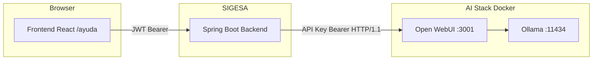
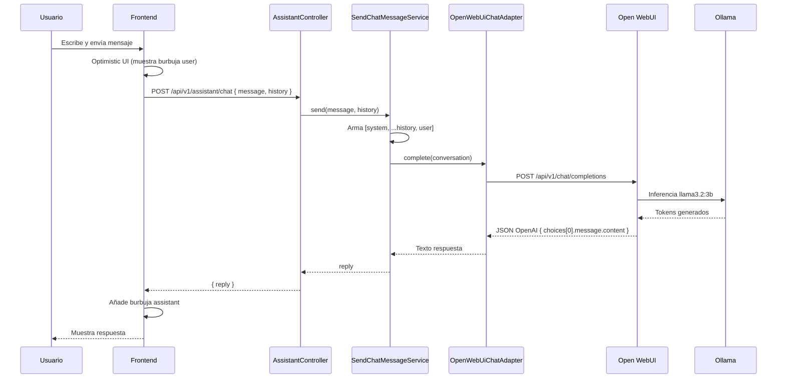
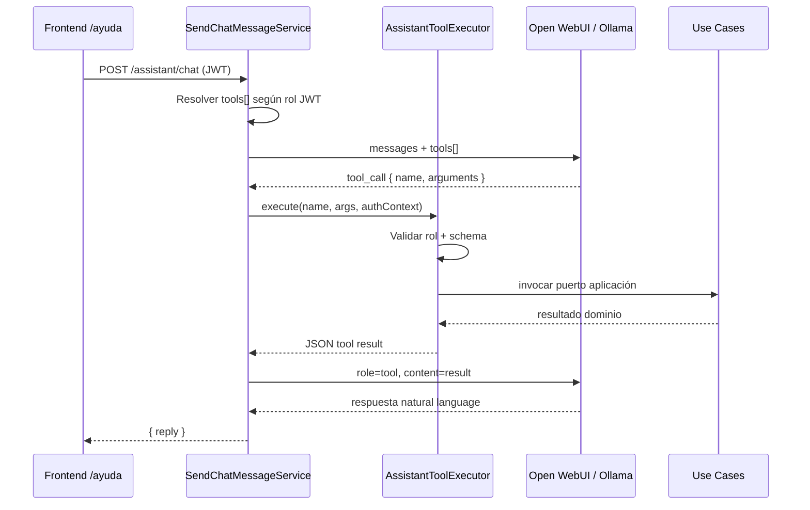

# DD-SYS-002: Asistente Virtual SIGESA

## 1. Contexto y alcance

Este documento resume la implementación del **asistente virtual** integrado en SIGESA: un chat in-app accesible desde `/ayuda` que responde consultas sobre acreditación, evidencias, indicadores y uso del sistema.

**Enfoque MVP:** el backend actúa como **proxy autenticado** hacia **Open WebUI** (API compatible con OpenAI), que a su vez ejecuta inferencia en **Ollama** con el modelo `llama3.2:3b`. El frontend **no** contacta directamente al LLM ni expone la API key de Open WebUI.

### Dentro de alcance (implementado)

- Endpoint REST de estado y chat en el backend SIGESA.
- UI de chat en React (`/ayuda`) con historial de sesión en memoria del navegador.
- Configuración vía `application.yaml` y variables de entorno.
- Stack Docker Compose: `ollama`, `open-webui`, `backend`, `frontend`.
- System prompt institucional definido en el servidor.
- Manejo de errores con códigos semánticos (`ASSISTANT_UNAVAILABLE`, `ASSISTANT_COMPLETION_FAILED`).

### Fuera de alcance (MVP)

- Persistencia de conversaciones en base de datos.
- Streaming token a token (SSE).
- RAG / embeddings sobre documentos normativos aprobados.
- Rate limiting, auditoría de prompts o moderación de contenido.
- Cambio de modelo desde la UI (solo lectura del modelo configurado).

> **Tool calling (v1.1):** implementado en [§11](#11-tool-calling-fase-11--read-only) — [`PR-IMPL-013`](../../prompts/impl/PR-IMPL-013.md).

---

## 2. Arquitectura

### 2.1 Diagrama de componentes



### 2.2 Flujo de un mensaje



### 2.3 Puertos (Docker Compose local)

| Servicio        | Puerto host | Rol                                      |
|-----------------|-------------|------------------------------------------|
| Frontend nginx  | 3000        | SPA React                                |
| SIGESA backend  | 8080        | API REST + proxy asistente               |
| Open WebUI      | 3001        | UI admin LLM + API OpenAI-compatible     |
| Ollama          | 11434       | Runtime de modelos                       |
| PostgreSQL      | 5432        | Persistencia SIGESA (no guarda chats)    |

---

## 3. Backend — arquitectura hexagonal

El módulo respeta la separación **adaptador entrada → aplicación → adaptador salida**. El dominio no depende de Spring ni de HTTP.

### 3.1 Mapa de clases

| Capa            | Archivo | Responsabilidad |
|-----------------|---------|-----------------|
| **Entrada web** | `adapter/in/web/AssistantController.java` | Expone `/api/v1/assistant/status` y `/chat`; mapea DTOs ↔ dominio |
| **Entrada web** | `adapter/in/web/dto/SendChatMessageRequest.java` | `{ message, history[] }` con validación Jakarta |
| **Entrada web** | `adapter/in/web/dto/SendChatMessageResponse.java` | `{ reply }` |
| **Entrada web** | `adapter/in/web/dto/AssistantStatusResponse.java` | `{ enabled, model }` |
| **Entrada web** | `adapter/in/web/advice/AssistantExceptionHandler.java` | Traduce excepciones a HTTP 503/502 + JSON error |
| **Aplicación**  | `application/port/in/SendChatMessageUseCase.java` | Puerto de entrada del caso de uso |
| **Aplicación**  | `application/service/assistant/SendChatMessageService.java` | Orquesta system prompt + historial + mensaje |
| **Aplicación**  | `application/port/out/ChatCompletionPort.java` | Puerto de salida hacia el proveedor LLM |
| **Salida**      | `adapter/out/assistant/OpenWebUiChatAdapter.java` | Cliente HTTP hacia Open WebUI |
| **Dominio**     | `domain/model/ChatMessage.java`, `ChatRole.java` | Modelo puro de mensaje |
| **Dominio**     | `domain/exception/AssistantUnavailableException.java` | Config/auth deshabilitado |
| **Dominio**     | `domain/exception/AssistantCompletionException.java` | Fallo al completar inferencia |
| **Config**      | `config/AssistantProperties.java` | `@ConfigurationProperties(prefix = "sigesa.assistant")` |
| **Config**      | `config/AssistantModuleConfig.java` | Bean `SendChatMessageUseCase` (wiring explícito, sin `@Service`) |

### 3.2 Caso de uso — construcción del contexto

`SendChatMessageService` arma la conversación enviada al LLM en este orden:

1. **System prompt** (siempre desde servidor, nunca confía en el cliente).
2. **Historial** enviado por el frontend (`user` / `assistant`; se filtran roles `system` del cliente).
3. **Mensaje actual** del usuario.

```java
conversation.add(new ChatMessage(ChatRole.SYSTEM, systemPrompt));
// ... history (sin SYSTEM) ...
conversation.add(new ChatMessage(ChatRole.USER, userMessage.trim()));
return chatCompletionPort.complete(conversation);
```

### 3.3 Adaptador Open WebUI

`OpenWebUiChatAdapter` implementa `ChatCompletionPort`:

- **Endpoint:** `{sigesa.assistant.base-url}/v1/chat/completions`
- **Autenticación:** `Authorization: Bearer {SIGESA_ASSISTANT_API_KEY}`
- **Body:** formato OpenAI (`model`, `stream: false`, `messages[]`)
- **Parseo:** `choices[0].message.content`
- **Timeout:** 120 segundos
- **HTTP/1.1 obligatorio:** Java `HttpClient` usa HTTP/2 por defecto; uvicorn/Open WebUI respondía `400 Invalid HTTP request received` con HTTP/2. Se fuerza `HttpClient.Version.HTTP_1_1`.

### 3.4 API REST expuesta por SIGESA

#### `GET /api/v1/assistant/status`

Respuesta:

```json
{
  "enabled": true,
  "model": "llama3.2:3b"
}
```

No consulta Open WebUI; lee solo `AssistantProperties`.

#### `POST /api/v1/assistant/chat`

Request:

```json
{
  "message": "¿Cómo cargo una evidencia?",
  "history": [
    { "role": "user", "content": "Hola" },
    { "role": "assistant", "content": "Hola, ¿en qué puedo ayudarte?" }
  ]
}
```

Response (200):

```json
{
  "reply": "Para cargar una evidencia..."
}
```

Errores:

| HTTP | Código JSON                  | Causa típica                                      |
|------|------------------------------|---------------------------------------------------|
| 503  | `ASSISTANT_UNAVAILABLE`      | Deshabilitado, sin API key, 401/403 de Open WebUI |
| 502  | `ASSISTANT_COMPLETION_FAILED`| Error HTTP del modelo, timeout, respuesta vacía   |
| 401  | (JWT)                        | Sesión SIGESA expirada o no autenticada           |

### 3.5 Seguridad

- Los endpoints `/api/v1/assistant/**` quedan bajo el **perímetro JWT** estándar (`SecurityConfig`: todo `/api/v1/**` excepto login requiere Bearer token).
- La **API key de Open WebUI** solo existe en el backend (variable de entorno / `.env` raíz para Docker Compose). El navegador nunca la recibe.
- Roles JD/CC/TD autenticados pueden usar el asistente (no hay restricción por rol adicional en MVP).

---

## 4. Frontend — estructura y comportamiento

### 4.1 Árbol de archivos

```
frontend/src/
├── features/assistant/
│   ├── AssistantPage.tsx              # Contenedor: Sidebar + hook + UI
│   ├── components/
│   │   └── AssistantChatUI.tsx        # Presentación pura (props in / events out)
│   └── hooks/
│       ├── useAssistantChat.ts        # Estado, envío, historial, errores
│       └── mapAssistantError.ts       # Códigos backend → mensajes UX
├── api/
│   ├── endpoints/assistant-controller/assistant-controller.ts  # Orval-style client
│   └── model/assistantTypes.ts        # Tipos TS del contrato
└── App.tsx                            # Ruta /ayuda
```

### 4.2 Separación presentación / lógica

| Componente | Tipo | Rol |
|------------|------|-----|
| `AssistantPage` | Contenedor | Instancia `useAssistantChat`, pasa props a UI |
| `useAssistantChat` | Hook | React Query (`useAssistantStatus`, `useSendChatMessage`), estado local |
| `AssistantChatUI` | UI pura | Renderiza mensajes, textarea, loading, alertas |
| `assistant-controller.ts` | Cliente API | Llama `customFetch` (JWT automático) |

### 4.3 Comportamiento UX

- **Ruta:** `/ayuda`, enlace en Sidebar (`AYUDA`, icono `HelpCircle`).
- **Estado del modelo:** badge en header desde `GET /status`.
- **Optimistic UI:** al enviar, muestra la burbuja del usuario de inmediato; si falla la API, revierte el mensaje y restaura el texto en el draft.
- **Historial:** vive en `useState` del hook; se pierde al recargar la página (MVP sin persistencia).
- **Atajos:** Enter envía, Shift+Enter nueva línea.
- **Errores:** `mapAssistantError` prioriza el `message` detallado del backend sobre etiquetas genéricas.

### 4.4 Contrato TypeScript

```typescript
interface SendChatMessageRequest {
  message: string;
  history?: { role: 'user' | 'assistant'; content: string }[];
}

interface SendChatMessageResponse {
  reply: string;
}

interface AssistantStatusResponse {
  enabled: boolean;
  model: string;
}
```

---

## 5. Configuración

### 5.1 `application.yaml` (backend)

```yaml
sigesa:
  assistant:
    enabled: ${SIGESA_ASSISTANT_ENABLED:true}
    base-url: ${SIGESA_ASSISTANT_BASE_URL:http://localhost:3001/api}
    api-key: ${SIGESA_ASSISTANT_API_KEY:}
    model: ${SIGESA_ASSISTANT_MODEL:llama3.2:3b}
    system-prompt: >-
      Eres el asistente virtual de SIGESA...
```

### 5.2 Variables de entorno

| Variable | Dónde | Descripción |
|----------|-------|-------------|
| `SIGESA_ASSISTANT_ENABLED` | Backend | `true`/`false` |
| `SIGESA_ASSISTANT_BASE_URL` | Backend | Base URL API Open WebUI (sin trailing slash problemático) |
| `SIGESA_ASSISTANT_API_KEY` | Backend + `.env` raíz | API key generada en Open WebUI → Settings → Account → API Keys |
| `SIGESA_ASSISTANT_MODEL` | Backend | Nombre del modelo Ollama (ej. `llama3.2:3b`) |
| `VITE_API_URL` | Frontend build | URL del backend (default `http://localhost:8080`) |

### 5.3 Docker Compose

Servicios añadidos:

- **`ollama`:** monta blobs/manifests del host (`/var/lib/ollama/...`) + volumen `ollama_state`.
- **`open-webui`:** `OLLAMA_BASE_URL=http://ollama:11434`, volumen `open-webui`.
- **`backend`:** `depends_on: open-webui (healthy)`, `SIGESA_ASSISTANT_BASE_URL=http://open-webui:8080/api`.

El backend arranca solo cuando Open WebUI reporta healthcheck OK (~30–60 s la primera vez).

---

## 6. Operación y troubleshooting

### 6.1 Arranque recomendado

```bash
# Desde la raíz del repo (con .env configurado)
docker compose up -d
```

Verificar:

```bash
# Open WebUI accesible
curl -s -o /dev/null -w "%{http_code}\n" http://localhost:3001/health

# Modelos visibles desde el backend (usa API key del contenedor)
docker exec sigesa-backend sh -c \
  'wget -S -O /dev/null --header="Authorization: Bearer $SIGESA_ASSISTANT_API_KEY" \
   http://open-webui:8080/api/v1/models 2>&1 | grep HTTP'
# Esperado: HTTP/1.1 200 OK
```

### 6.2 Problemas frecuentes (resueltos en MVP)

| Síntoma | Causa | Solución |
|---------|-------|----------|
| `ASSISTANT_UNAVAILABLE` + 401 | API key inválida o contenedor Open WebUI recreado | Generar nueva key en Open WebUI, actualizar `.env`, `docker compose up -d backend --force-recreate` |
| `ASSISTANT_COMPLETION_FAILED` + HTTP 400 Invalid HTTP request | Java HttpClient con HTTP/2 | Fix en `OpenWebUiChatAdapter`: forzar HTTP/1.1 |
| Ollama sin modelos en Docker | Montaje incorrecto de `/var/lib/ollama` | Montar solo `blobs` y `manifests` + volumen `ollama_state` |
| Puerto 11434 ocupado | Ollama nativo (`systemctl`) + contenedor | Detener servicio nativo mientras corre Docker |
| Primera respuesta lenta (~5–10 s) | Carga del modelo en GPU/RAM | Comportamiento normal de Ollama |

### 6.3 Rotación de API key

1. Abrir http://localhost:3001 → Settings → Account → API Keys.
2. Crear key nueva.
3. Actualizar `SIGESA_ASSISTANT_API_KEY` en `.env` (raíz del repo).
4. `docker compose up -d backend --force-recreate`.

**No commitear** el archivo `.env`.

---

## 7. Decisiones técnicas

| Decisión | Motivo |
|----------|--------|
| Proxy en backend vs llamada directa desde frontend | Ocultar API key, centralizar system prompt, habilitar auditoría/RAG futuro |
| Open WebUI + Ollama local | Stack self-hosted, sin costo de API externa en desarrollo |
| Sin streaming en MVP | Menor complejidad en adapter y UI |
| Historial en memoria (frontend) | Sin migraciones DB; suficiente para FAQ de sesión |
| Beans en `*ModuleConfig` vs `@Service` | Alineado con convención hexagonal estricta del proyecto |
| System prompt en YAML | Editable por ops sin redeploy de lógica Java |

---

## 8. Evolución prevista

1. **Tool calling read-only** — loop de orquestación en backend; catálogo en [`assistant/TOOL-CATALOG.md`](assistant/TOOL-CATALOG.md) (§11).
2. **Streaming SSE** — respuesta progresiva en `AssistantChatUI`.
3. **RAG normativo** — embeddings sobre documentos aprobados por DUEA (alineado a PRD-REQ-028).
4. **Persistencia opcional** — tabla `assistant_conversation` / `assistant_message` con TTL.
5. **Regeneración Orval** — ejecutar `pnpm run generate:api` con backend activo para sincronizar OpenAPI.
6. **Actualización DTP.md** — registrar dependencias (`ollama`, `open-webui`) y variables de entorno en el contrato técnico vivo.

---

## 9. Inventario de archivos tocados

### Backend (nuevos / modificados)

- `adapter/in/web/AssistantController.java`
- `adapter/in/web/advice/AssistantExceptionHandler.java`
- `adapter/in/web/dto/*` (AssistantStatus, SendChatMessage*, ChatMessageDto)
- `adapter/out/assistant/OpenWebUiChatAdapter.java`
- `application/port/in/SendChatMessageUseCase.java`
- `application/port/out/ChatCompletionPort.java`
- `application/service/assistant/SendChatMessageService.java`
- `config/AssistantProperties.java`
- `config/AssistantModuleConfig.java`
- `domain/model/ChatMessage.java`, `ChatRole.java`
- `domain/exception/Assistant*.java`
- `resources/application.yaml` (bloque `sigesa.assistant`)

### Frontend (nuevos / modificados)

- `features/assistant/**`
- `api/endpoints/assistant-controller/assistant-controller.ts`
- `api/model/assistantTypes.ts`
- `App.tsx` (ruta `/ayuda`)
- `components/layout/Sidebar.tsx` (nav AYUDA)

### Infraestructura

- `docker-compose.yml` (servicios `ollama`, `open-webui`, env assistant en `backend`)
- `.env` (raíz, gitignored — `SIGESA_ASSISTANT_API_KEY`)

---

## 10. Trazabilidad

| Artefacto | Referencia |
|-----------|------------|
| Requisito producto | PRD-REQ-028, BRD-REQ-024 |
| Diseño | DD-SYS-002 (este documento) |
| Prompt implementación | [PR-IMPL-012](../prompts/impl/PR-IMPL-012.md) |
| Prompt mapping | [Sprint 02 PM-001](../sprints/sprint_02/PROMPT_MAPPING.md) |
| DTP vivo | `docs/product/DTP.md` §B.5 |
| Catálogo tools | [`assistant/TOOL-CATALOG.md`](assistant/TOOL-CATALOG.md) |
| Contrato API tool `list_users` | [`docs/product/api/API-USER-03.md`](../product/api/API-USER-03.md) |
| Rama desarrollo | `feature/chatbot-boris` |

---

## 11. Tool calling (Fase 1.1 — read-only)

Esta sección define la **evolución arquitectónica** del asistente hacia **tool calling**: el LLM puede invocar operaciones de lectura del dominio SIGESA, ejecutadas en el backend con el contexto JWT del usuario.

> **Fuente de verdad del catálogo:** [`docs/design/assistant/TOOL-CATALOG.md`](assistant/TOOL-CATALOG.md)

### 11.1 Principio de diseño

| Regla | Descripción |
|-------|-------------|
| **Orquestación en backend** | El loop tool-call vive en `SendChatMessageService` (o servicio dedicado `AssistantOrchestrator`). Open WebUI/Ollama solo inferencia. |
| **Use cases como única puerta** | Cada tool delega en un puerto de aplicación existente (`ListUsersUseCase`, etc.). Prohibido acceder a JPA o REST interno desde el executor. |
| **Registro dinámico por rol** | Las tools se incluyen en el payload al LLM **solo** si el JWT cumple `allowed_roles`. |
| **Defensa en profundidad** | `AssistantToolExecutor` revalida rol y parámetros antes de ejecutar. |
| **Sin side-effects en Fase 1** | Solo tools `read`. Escritura (ej. `create_process`) queda para fase posterior con confirmación explícita en UI. |

### 11.2 Arquitectura del loop



### 11.3 Componentes previstos (implementación)

| Capa | Componente | Responsabilidad |
|------|------------|-----------------|
| **Aplicación** | `SendChatMessageService` (extendido) | Loop multi-turno con límite de iteraciones |
| **Aplicación** | `AssistantToolExecutor` | Dispatch por `toolId`; validación rol + args |
| **Aplicación** | `AssistantToolRegistry` | Catálogo en memoria desde definiciones tipadas |
| **Aplicación** | `AssistantAuthContext` | `userId`, `role`, `programScope` extraídos del JWT |
| **Puerto out** | `ChatCompletionPort` (extendido) | Soporte `tools[]` y respuestas `tool_calls` |
| **Adaptador out** | `OpenWebUiChatAdapter` | Serializar/deserializar formato OpenAI function calling |

### 11.4 Tools registradas — Fase 1

Ver detalle completo (schemas, ejemplos, tests) en [`TOOL-CATALOG.md`](assistant/TOOL-CATALOG.md).

| Tool ID | Side-effect | Roles | Use case | Contrato API |
|---------|-------------|-------|----------|--------------|
| `list_users` | `read` | **JD** | `ListUsersUseCase` | [API-USER-03](../product/api/API-USER-03.md) |

### 11.5 Autorización — tool `list_users`

- **Quién puede invocar:** exclusivamente usuarios con rol `JD` en el JWT.
- **CC / TD:** la tool **no se registra** en `tools[]`; el LLM responde con texto genérico sin datos de usuarios.
- **Alineación REST:** mismo perímetro que `GET /api/v1/admin/users` (`SecurityConfig.hasRole("JD")`).

### 11.6 Formato de respuesta de tools

Envoltura estándar devuelta al LLM como contenido `role=tool`:

```json
{
  "ok": true,
  "data": { "users": [], "total": 0 },
  "error": null
}
```

En fallo:

```json
{
  "ok": false,
  "data": null,
  "error": { "code": "ACCESS_DENIED", "message": "..." }
}
```

### 11.7 Límites operativos

| Parámetro | Valor propuesto |
|-----------|-----------------|
| Max iteraciones tool-call por mensaje | 3 |
| Timeout por tool | Hereda timeout LLM (120 s) |
| Tools con escritura | Fuera de Fase 1 |

### 11.8 Estado e implementación

| Aspecto | Estado |
|---------|--------|
| Catálogo `TOOL-CATALOG.md` | **Implementado** (Fase 1 — `list_users`) |
| Contrato `API-USER-03.md` | **Documentado** |
| Loop backend + executor | **Implementado** — [`PR-IMPL-013`](../../prompts/impl/PR-IMPL-013.md) |
| Extensión `ChatCompletionPort` | **Implementado** — [`PR-IMPL-013`](../../prompts/impl/PR-IMPL-013.md) |
| Tests tool `list_users` | **Implementado** — unit + WebMvc |

### 11.9 Trazabilidad §11

| Artefacto | Referencia |
|-----------|------------|
| Catálogo tools | [`assistant/TOOL-CATALOG.md`](assistant/TOOL-CATALOG.md) |
| API listado usuarios | [`docs/product/api/API-USER-03.md`](../product/api/API-USER-03.md) |
| FSD gestión usuarios | [FSD-UC-002](../product/uc/FSD-UC-002.md) |
| Prompt implementación | [`PR-IMPL-013`](../../prompts/impl/PR-IMPL-013.md) |
