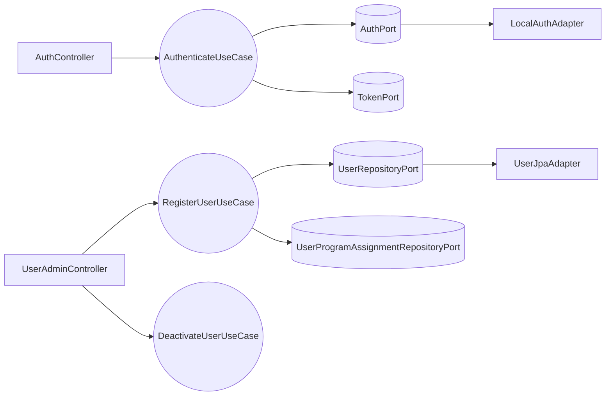

# Design Doc `DD-UC-001` — Autenticación y Gestión de Usuarios (MOD-AUTH)

> **Qué es**: documento de diseño del módulo **MOD-AUTH** para SIGESA v1.0. Describe **cómo** implementar autenticación JWT (FSD-UC-001) y gestión de usuarios por [JD] (FSD-UC-002) con arquitectura hexagonal estricta.
>
> **Relación con otros documentos**:
> - **Trazabilidad obligatoria al FSD**: `FSD-UC-001`, `FSD-UC-002`.
> - **Implementa** [`ADR-0003`](../baseline/05_dti/adrs/ADR_003_adapter_autenticacion.md) (`AuthPort` + `LocalAuthAdapter` v1.0).
> - Complementa JWT/RBAC (ADR_007 baseline); no reemplaza el ADR.
> - Alimenta el **DTP** vía `@dtp-sync` tras implementar.

## 1. Objetivo y contexto

- **Qué resuelve este feature**: Identidad y acceso seguro para [CC], [TD] y [JD] mediante login JWT con claims `role` y `programScope`; registro de usuarios por [JD] con cuenta **INACTIVA** hasta primer acceso; revocación que conserva historial de auditoría. Prerrequisito de MOD-PROCESS, MOD-EVIDENCE y MOD-DASH.
- **Caso(s) de uso del FSD que implementa**:
  - `FSD-UC-001` (Autenticación y sesión) — [`docs/product/uc/FSD-UC-001.md`](../product/uc/FSD-UC-001.md)
  - `FSD-UC-002` (Gestión de usuarios [JD]) — [`docs/product/uc/FSD-UC-002.md`](../product/uc/FSD-UC-002.md)
- **Alcance**:
  | Incluido | Excluido (v1.0) |
  |---|---|
  | `POST /api/v1/auth/login` con JWT (`role`, `programScope`) | `LdapAuthAdapter` (v1.1) |
  | `POST /api/v1/admin/users` ([JD]) | SSO / OIDC |
  | `PATCH /api/v1/admin/users/{id}/deactivate` | Multi-rol por usuario |
  | Entidad `user_program_assignment` (FSD-BR-09) | Frontend `/login` |
  | Activación INACTIVE→ACTIVE en primer login | Recuperación de contraseña |
  | 401 genérico sin revelar existencia (A1 UC-001) | Blocklist refresh token (opcional) |
  | Validación `@umss.edu.bo` (FSD-BR-12) | UC-017 completo (stub `AuditLogPort`) |

## 2. Diseño (el "cómo") `[humano+máquina]`

- **Enfoque elegido**: Módulo hexagonal `com.umss.sigesa.auth`. **Dominio y aplicación sin dependencias de Spring/JPA.** Spring Security y JPA solo en adaptadores de entrada/salida. Credenciales vía `AuthPort` → `LocalAuthAdapter` (ADR-0003).

- **Componentes tocados** (capas hexagonales):

  | Capa | Componentes |
  |---|---|
  | **Dominio** | `User`, `Role`, `UserStatus`, `UserProgramAssignment`, `Email`, `ProgramScope`, excepciones |
  | **Aplicación** | `AuthenticateUseCase`, `RegisterUserUseCase`, `DeactivateUserUseCase` |
  | **Puertos out** | `AuthPort`, `UserRepositoryPort`, `UserProgramAssignmentRepositoryPort`, `TokenPort`, `AuditLogPort` |
  | **Adaptadores in** | `AuthController`, `UserAdminController`, `JwtAuthenticationFilter`, `SecurityConfig` |
  | **Adaptadores out** | `LocalAuthAdapter`, `UserJpaAdapter`, `UserProgramAssignmentJpaAdapter`, `JwtTokenAdapter` |

- **Reglas de dominio**:
  1. Un usuario = un rol (`CC`, `TD`, `JD`).
  2. **`User` sin `programId` plano**; alcance en **`UserProgramAssignment`**.
  3. `UserStatus`: `INACTIVE` → `ACTIVE` (primer login) → `DEACTIVATED` (revocación).
  4. Login A1: usuario inexistente, password incorrecto o `DEACTIVATED` → mismo `401 AUTH_INVALID_CREDENTIALS`.
  5. Login A2: sin rol → `403`.
  6. Revocación A1 UC-002: soft deactivate + `revoked_at` en asignaciones; **sin DELETE** de usuario ni auditoría.

- **Contratos y tipos**:

  ```java
  public interface AuthPort {
      Optional<AuthenticatedIdentity> authenticate(Email email, char[] rawPassword);
  }

  public record LoginRequest(String email, String password) {}
  public record LoginResponse(String accessToken, long expiresIn, String role, List<UUID> programScope) {}
  public record RegisterUserRequest(String email, String role, UUID programId) {}
  public record RegisterUserResponse(UUID userId, String status) {}
  ```

  **JWT claims**: `sub` (userId), `email`, `role`, `programScope[]`, `exp`, `iat`.

  **DDL**:

  ```sql
  CREATE TABLE app_user (
      id UUID PRIMARY KEY,
      email VARCHAR(150) NOT NULL UNIQUE,
      password_hash VARCHAR(255) NOT NULL,
      role VARCHAR(10) NOT NULL CHECK (role IN ('CC','TD','JD')),
      status VARCHAR(15) NOT NULL CHECK (status IN ('INACTIVE','ACTIVE','DEACTIVATED')),
      failed_attempts INT NOT NULL DEFAULT 0,
      locked_until TIMESTAMP,
      created_at TIMESTAMP NOT NULL DEFAULT CURRENT_TIMESTAMP,
      updated_at TIMESTAMP NOT NULL DEFAULT CURRENT_TIMESTAMP,
      CONSTRAINT chk_email_umss CHECK (email LIKE '%@umss.edu.bo')
  );

  CREATE TABLE user_program_assignment (
      id UUID PRIMARY KEY,
      user_id UUID NOT NULL REFERENCES app_user(id),
      program_id UUID NOT NULL,
      assigned_at TIMESTAMP NOT NULL DEFAULT CURRENT_TIMESTAMP,
      revoked_at TIMESTAMP
  );
  CREATE UNIQUE INDEX uk_upa_active ON user_program_assignment(user_id, program_id) WHERE revoked_at IS NULL;
  ```

- **API REST** ([`api_contracts.md`](../product/api_contracts.md)):

  | Método | Ruta | UC | Rol |
  |---|---|---|---|
  | POST | `/api/v1/auth/login` | FSD-UC-001 | público |
  | POST | `/api/v1/admin/users` | FSD-UC-002 | `[JD]` |
  | PATCH | `/api/v1/admin/users/{id}/deactivate` | FSD-UC-002 | `[JD]` |

- **Diagrama**:



## 3. Alternativas consideradas

| Alternativa | Pros | Contras | ¿Elegida? |
|---|---|---|---|
| **A. `AuthPort` + `LocalAuthAdapter`; Spring Security solo en adaptador in** | Cumple ADR-0003; dominio testeable; LDAP = nuevo adaptador | Filtro JWT + lógica en use case | **sí** |
| **B. Acoplar auth a `AuthenticationManager` / `UserDetailsService` en aplicación** | Menos clases | Acopla dominio a Spring; refactor costoso v1.1 | **no** |
| **C. `@Service` Spring en casos de uso** | Prototipo rápido | Rompe hexagonal estricta | **no** |
| **D. JWT en controlador sin `TokenPort`** | Menos interfaces | Duplicación; difícil rotar TTL | **no** |

**Conclusión ADR-0003**: **No requiere ADR nuevo.** La alternativa A implementa la decisión ya aceptada en ADR-0003. Spring Security queda en el **perímetro** (filtro, `@PreAuthorize`); verificación de credenciales detrás de `AuthPort`.

> Cambio de contrato `AuthPort` o abandono del patrón adapter → delta + ADR antes de merge.

## 4. Impacto en las specs vivas `[máquina]`

| Artefacto vivo | Cambio | ¿Delta vs DTI vFinal? |
|---|---|---|
| `docs/product/uc/FSD-UC-001.md` | Sin cambio de criterios | no |
| `docs/product/uc/FSD-UC-002.md` | Confirmar `user_program_assignment` en DTP | no |
| `docs/product/03_prd/PRD.md` | US-001/002/003 en progreso | no |
| `docs/product/api_contracts.md` | Verificar `/api/v1` y códigos error | no |
| `docs/product/DTP.md` | Changelog + §A.3 FSD-UC-001/002 | no |
| `docs/product/modelo_datos.md` | Añadir `app_user`, `user_program_assignment` | no |

> **Recordatorio**: `docs/baseline/` **no se toca**.

## 5. Prompts usados `[máquina]`

| Prompt | Tarea | Artefacto generado |
|---|---|---|
| `PR-IMPL-004` | Implementación MOD-AUTH (hexagonal, JWT, user_program_assignment) | `src/.../auth/**`, tests, DDL |

> Ver [`PR-IMPL-004`](../prompts/impl/PR-IMPL-004.md). Tras ejecutar: `@save-prompt-mapping PR-IMPL-004` → `@dtp-sync`.

## 6. Plan de pruebas y evals

Derivado de Gherkin FSD-UC-001 y FSD-UC-002.

- **Unit** (sin BD/HTTP/Spring):
  - `AuthenticateUseCaseTest`: login OK [CC] con `programScope`; 401 genérico credenciales inválidas **y** usuario inexistente (A1); 403 sin rol (A2); INACTIVE→ACTIVE en primer login; DEACTIVATED→401 genérico.
  - `RegisterUserUseCaseTest`: alta [CC] → INACTIVE + assignment; email no `@umss.edu.bo` → 422; [CC] sin `programId` → error dominio.
  - `DeactivateUserUseCaseTest`: DEACTIVATED + `revoked_at`; login bloqueado; auditoría intacta (A1 UC-002).
  - `LocalAuthAdapterTest`: Argon2 verify OK/KO.

- **Integration**:
  - `AuthControllerTest`: 200 JWT; 401 body idéntico user-missing vs bad-password.
  - `UserAdminControllerTest`: POST solo [JD]; 403 [CC]/[TD].
  - `UserProgramAssignmentRepositoryTest` (`@DataJpaTest`): FK, unique parcial, filtro FSD-BR-09.
  - `JwtAuthenticationFilterTest`: acción sensible sin token → 401 (US-003).

- **E2E / Gherkin**:

  | Escenario | Test |
  |---|---|
  | UC-001: Login exitoso con rol | 200 + claims `role` |
  | UC-001: Credenciales inválidas | 401 mensaje genérico |
  | UC-001 (US-003): Sin autenticación en acción sensible | 401 sin side-effects |
  | UC-002: Alta con rol | 201 INACTIVE + assignment |
  | UC-002: Revocación | PATCH deactivate → login 401; audit preservado |

- **JaCoCo**: ≥ 90% en `*UseCase*` del módulo auth.

- **Evals de IA**: N/A.

## 7. Definition of Done (checklist)

- [ ] `fsd_uc` declarado y enlazado (FSD-UC-001, FSD-UC-002).
- [ ] Diseño (§2) y alternativas (§3) documentados.
- [ ] ADR-0003 referenciado; no ADR adicional requerido.
- [ ] §4 Impacto en specs vivas registrado.
- [x] Prompt(s) en `docs/prompts/impl/` (`PR-IMPL-004`) y `PROMPT_MAPPING.md` (PM-001 registrado).
- [ ] Tests/evals (§6) pasando tras implementación.
- [ ] DTP actualizado vía `@dtp-sync`.
- [ ] PR declara prompts y archivos generados vs editados.
