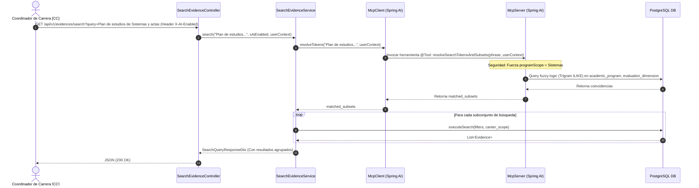

# Documento de Diseño e Implementación: Búsqueda Inteligente Multi-Token con MCP (FSD-UC-007)

Este documento define la especificación funcional, el diseño técnico y el plan de implementación detallado para integrar un **servidor MCP de contexto PostgreSQL (`sigesa-postgres-mcp`)** en el caso de uso `FSD-UC-007` (Buscar Evidencia Inteligente) utilizando exclusivamente el ecosistema de **Java y Spring AI**.

---

## 1. Escenarios de Producto y Casos de Uso (FSD Extension)

### 1.1 Escenarios de Búsqueda de Producto (Matriz Completa)

Este módulo se integra con la lógica existente de enrutamiento híbrido de consultas. El sistema maneja **5 Escenarios**:

| Escenario | Condición | Método de Resolución | `routingPath` |
|---|---|---|---|
| **1. Controlado** | Palabra clave exacta en el catálogo local (ej. "infraestructura"). | Código tradicional (Query directo en BD). | `KEYWORD` |
| **2. Sinónimo** | Término indirecto o sinónimo simple (ej. "aulas"). | LLM traduce a dimensión + BD ejecuta Query. | `LLM` |
| **3. Fuera de Alcance** | Consulta ajena a la acreditación (ej. "clima"). | LLM detecta y rechaza con mensaje formal. | `REFUSAL` |
| **4. IA Apagada / Falla** | `IA_HABILITADA == false` o error de conexión. | Fallback a búsqueda `ILIKE` clásica sobre metadata. | `KEYWORD` (Fallback) |
| **5. Multi-Token (Nuevo)** | Frases complejas con múltiples intenciones (ej. "planes de sistemas del 2024 y actas"). | El LLM invoca al **MCP Java Server** para resolver subconjuntos y fundir resultados. | `LLM_MULTIPATH` |

---

### 1.2 Especificación de Casos de Uso (Gherkin)

```gherkin
# language: es
@PRD-US-004 @FSD-UC-007 @NFR-002
Característica: Búsqueda Inteligente Multi-Token con MCP (Java Stack)

  Escenario: Búsqueda de frase compleja con múltiples intenciones de acreditación (Escenario 5)
    Dado un Coordinador [CC] de "Ingeniería de Sistemas" autenticado
    Cuando realiza la búsqueda por "Plan de estudios de Sistemas 2024 y actas de consejo"
    Entonces el sistema invoca al Servidor MCP embebido en Spring Boot
    Y el MCP descompone la consulta en dos subconjuntos autorizados:
      - Subconjunto 1: Dimensión "Plan de Estudios", Carrera "Sistemas" (ID), Año "2024"
      - Subconjunto 2: Término "actas de consejo", Carrera "Sistemas" (ID)
    Y devuelve al usuario los resultados agrupados y rotulados por subconjunto en la interfaz
```

---

## 2. Restricciones Técnicas y de Gobernanza (AGENTS.md Compliance)

Para cumplir estrictamente con las reglas de desarrollo del monorepo SIGESA:
1. **Arquitectura Hexagonal Estricta:**
   * El controlador REST no debe tocar entidades JPA. Toda la comunicación pasa por DTOs (`SearchQueryResponseDto`) y mappers explícitos.
   * La lógica de negocio del MCP y la consulta se mantiene dentro de la Capa de Aplicación (`com.umss.sigesa.application.service.SearchEvidenceService`).
2. **Lombok:** Uso obligatorio de `@Getter`, `@Setter`, `@Builder`, `@NoArgsConstructor` y `@AllArgsConstructor` en DTOs y modelos.
3. **TypeScript Estricto:** Prohibido el uso de `any` en el frontend al procesar los resultados estructurados del MCP.
4. **Gobernanza Documental:** Queda estrictamente prohibido modificar archivos dentro de `docs/baseline/`. Este documento en `docs/design/` servirá como la especificación viva del cambio.

---

## 3. Especificación de Diseño Técnico (DD-UC-007-MCP)

### 3.1 Diagrama de Secuencia Completo (Embebido en Spring Boot)


### 3.2 Contratos e Interfaces de Entrada/Salida

#### A. Firma del Componente Servidor MCP en Java:
```java
package com.umss.sigesa.adapter.out.assistant.mcp;

import org.springframework.ai.tool.annotation.Tool;
import org.springframework.stereotype.Component;

@Component
public class AcademicContextMcpServer {

    @Tool(description = "Descompone frases complejas en subconjuntos de búsqueda mediante coincidencia de base de datos.")
    public MatchedSubsetsResponse resolveSearchTokensAndSubsets(String phrase, UserContextDto userContext) {
        // Lógica de tokenización, búsqueda con pg_trgm y validación de seguridad de carrera
    }
}
```

#### B. DTO de Respuesta del Backend (`SearchQueryResponseDto`):
```json
{
  "query": "Plan de estudios de Sistemas 2024 y actas",
  "routingPath": "LLM_MULTIPATH",
  "subsets": [
    {
      "label": "Plan de Estudios (Sistemas - 2024)",
      "results": [
        {
          "evidenceId": "3fa85f64-5717-4562-b3fc-2c963f66afa6",
          "title": "plan_estudios_sistemas_2024.pdf"
        }
      ]
    },
    {
      "label": "Actas de Consejo",
      "results": [
        {
          "evidenceId": "6ea85f64-5717-4562-b3fc-2c963f66aba1",
          "title": "acta_consejo_carrera_01.pdf"
        }
      ]
    }
  ]
}
```

---

## 4. Plan de Implementación Detallado Paso a Paso

### Fase 1: Habilitar Trigram Search en PostgreSQL (BD)
1. Modificar los scripts de migración de Flyway o aplicar directamente en PostgreSQL:
   ```sql
   CREATE EXTENSION IF NOT EXISTS pg_trgm;
   CREATE INDEX IF NOT EXISTS idx_academic_program_name_trgm ON academic_program USING gin (name gin_trgm_ops);
   CREATE INDEX IF NOT EXISTS idx_evaluation_dimension_name_trgm ON evaluation_dimension USING gin (name gin_trgm_ops);
   ```

### Fase 2: Configurar Dependencias en Spring Boot
1. En `pom.xml`, añadir la librería del cliente/servidor MCP de Spring AI:
   ```xml
   <dependency>
       <groupId>org.springframework.ai</groupId>
       <groupId>spring-ai-mcp-store</groupId> <!-- Módulo oficial de Spring AI -->
   </dependency>
   ```

### Fase 3: Crear el Servidor MCP Embebido en Java
1. Crear la clase `com.umss.sigesa.adapter.out.assistant.mcp.AcademicContextMcpServer`.
2. Implementar los métodos anotados con `@Tool` para resolver los tokens y realizar las consultas difusas de solo lectura en la base de datos PostgreSQL utilizando los repositorios JPA existentes.
3. Incorporar validaciones duras: si `userContext.getRole() == actor_role.CC`, cualquier coincidencia que no pertenezca al `userContext.getProgramScope()` será omitida.

### Fase 4: Integración del Cliente en la Lógica de Negocio
1. Configurar el `McpClient` en `com.umss.sigesa.config.McpClientConfig` para registrar localmente las herramientas expuestas por `AcademicContextMcpServer`.
2. Adaptar `SearchEvidenceService` para invocar al cliente MCP de Spring AI y procesar los subconjuntos del DTO resultantes.
3. Consolidar los resultados ejecutando las búsquedas JPA de forma ordenada por cada subconjunto e inyectando las respuestas agrupadas en `SearchQueryResponseDto`.

### Fase 5: UI React y Validación de Calidad
1. Adaptar el componente de visualización en el frontend para soportar la respuesta paginada y agrupada por subsets.
2. Ejecutar validación de código con `oxlint` para asegurar calidad sin advertencias.
