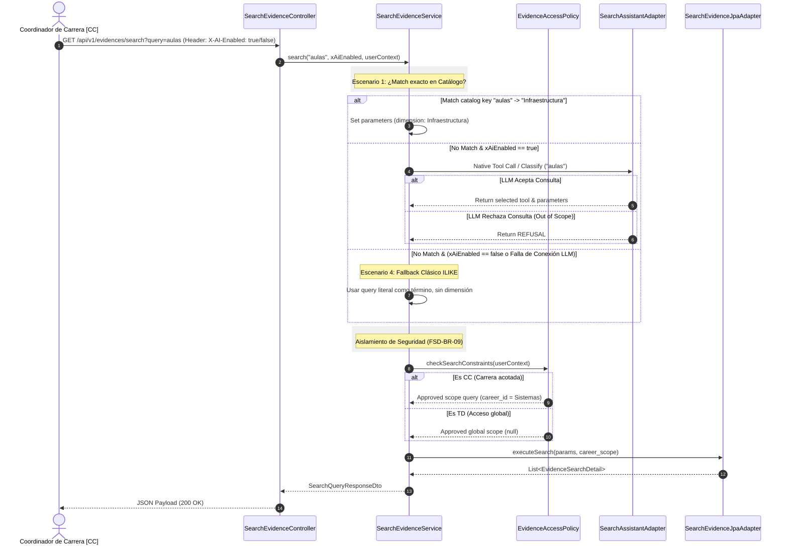

# Design Doc `DD-UC-007` — Buscar Evidencia Inteligente

> **Qué es**: Documento de diseño técnico para la búsqueda y consulta de evidencias utilizando un **Enrutador de Consultas Híbrido** (Hybrid Query Router). Resuelve la búsqueda basada en texto y sinónimos a través de IA, controlando el acceso de seguridad (CC acotado a carrera, TD con acceso global) y operando de manera puramente determinista (el LLM clasifica el intent y el código tradicional ejecuta las consultas a base de datos).
>
> **Relación con otros documentos**:
> - **Trazabilidad al FSD**: [`FSD-UC-007`](../product/uc/FSD-UC-007.md).
> - **API Contracts**: [`api_contracts.md`](../product/api_contracts.md) (GET `/api/v1/evidences/search`).
> - **Modelo de Datos**: [`modelo_datos.md`](../product/modelo_datos.md).
> - **Reglas de negocio**: `FSD-BR-09` (Aislamiento de carrera [CC]), `FSD-BR-25` (Enrutador Híbrido).

---

## 1. Objetivo y Contexto

- **Qué resuelve**: Proporciona un mecanismo de búsqueda amigable para localizar documentos de evidencia. Soporta consultas por términos exactos (código nativo), sinónimos (resolución vía LLM de forma segura y controlada), rechazo ante entradas inválidas (out-of-scope) y resiliencia ante cortes del servicio de IA (`IA_HABILITADA == false`).
- **Alcance**:

| Incluido (v1.0) | Excluido (v1.0) |
|---|---|
| `GET /api/v1/evidences/search` con query de texto | Indexación en tiempo real (se asume base de datos sincronizada) |
| Enrutamiento Híbrido de consultas (4 Escenarios) | Búsqueda semántica vectorial (RAG/Embeddings) completa en archivos |
| RBAC (Aislamiento para [CC] y acceso global para [TD]) | Carga masiva de sinónimos personalizados por UI |
| Estructura de respuesta de trazabilidad en UI | Corrección ortográfica avanzada |

---

## 2. Diseño (El "Cómo")

### 2.1 Enfoque Elegido (Arquitectura Hexagonal)

Mantenemos la **Separación de Capas** limpia:
1. **Controlador REST** (`SearchEvidenceController`) intercepta la petición y valida la sesión (JWT).
2. **Caso de Uso** (`SearchEvidenceUseCase`) encapsula la lógica del enrutador híbrido:
   * Revisa el catálogo local de palabras clave exactas.
   * Si no hay match exacto y la IA está habilitada, invoca al puerto `AssistantQueryPort` para clasificar la consulta.
   * Si está fuera de alcance, aborta y retorna la negativa estructurada.
   * Si es un sinónimo, el LLM mapea los parámetros al dominio conocido (ej: "aulas" -> "Infraestructura") y el caso de uso realiza la consulta filtrando por base de datos tradicional.
3. **Persistencia** (`SearchEvidenceQueryPort`) realiza la búsqueda en base de datos PostgreSQL utilizando búsquedas FTS o aproximadas (`ILIKE`) sobre títulos, descripciones, criterios y etiquetas.

---

## 2.2 Componentes Tocados

| Capa | Componentes nuevos / extendidos |
|---|---|
| **Dominio** | Reutiliza entidades `Evidence` y `EvidenceVersion`. |
| **Aplicación** | `SearchEvidenceUseCase` (Puerto de entrada), `SearchEvidenceService` (Implementación), `EvidenceAccessPolicy` (Políticas de aislamiento de seguridad). |
| **Puertos OUT** | `SearchEvidenceQueryPort` (Búsqueda en persistencia), `AssistantQueryPort` (Llamada al proxy de IA para clasificación). |
| **Adaptadores IN** | `SearchEvidenceController` (Endpoint GET `/api/v1/evidences/search`). |
| **Adaptadores OUT** | `SearchEvidenceJpaAdapter` (Adaptador JPA PostgreSQL), `SearchAssistantAdapter` (Adaptador HTTP local a Ollama / Open WebUI). |
| **Modelos/DTOs** | `SearchQueryRequest`, `SearchQueryResponseDto`, `EvidenceSearchDetailDto`. |

---

### 2.3 Especificaciones de Enrutamiento e Interfaces

#### Contrato de Herramienta para Búsqueda (JSON Schema)
Cuando se invoca al LLM para traducción de sinónimos, se provee el siguiente catálogo de herramientas:

```json
{
  "name": "buscar_evidencias_por_parametros",
  "description": "Busca documentos de evidencia mapeando sinónimos a términos y dimensiones oficiales de acreditación.",
  "parameters": {
    "type": "object",
    "properties": {
      "dimension": {
        "type": "string",
        "enum": ["Infraestructura", "Plan de Estudios", "Docentes", "Administracion"],
        "description": "Dimensión o criterio oficial al que se mapea la búsqueda del usuario."
      },
      "termino": {
        "type": "string",
        "description": "Término limpio extraído de la búsqueda para usar en la consulta de texto."
      }
    },
    "required": ["termino"]
  }
}
```

#### Prompt de Sistema para Clasificación
```text
Eres un asistente de búsqueda y enrutamiento inteligente para el sistema de acreditación universitaria SIGESA. Tu tarea es enrutar las consultas del usuario utilizando las herramientas provistas para mapear sinónimos a criterios oficiales.
Si la consulta no está relacionada con la acreditación universitaria, no intentes responder ni uses ninguna herramienta; simplemente responde con la palabra 'OUT_OF_SCOPE'.
```

---

### 2.4 Contratos de API (Adaptador IN)

**Headers:**
*   `X-AI-Enabled`: `boolean` (Controla si se permite el uso del LLM para resolver sinónimos en esta petición)

**Request params:**
`GET /api/v1/evidences/search?query=aulas%20de%20clase`

**Response Payload - Caso Exitoso (Escenario 1, 2 & 4) (`SearchQueryResponseDto`):**

```json
{
  "query": "aulas de clase",
  "routingPath": "LLM", 
  "toolUsed": "buscar_evidencias_por_parametros",
  "dataSource": "evidence, evidence_version, programs",
  "results": [
    {
      "evidenceId": "3fa85f64-5717-4562-b3fc-2c963f66afa6",
      "title": "inventario_aulas_bloque_nuevo.pdf",
      "description": "Inventario detallado de mobiliario y capacidad en aulas de clase.",
      "dimensionName": "Infraestructura",
      "criterionCode": "CRT-04",
      "carreraName": "Ingeniería de Sistemas",
      "uploadedAt": "2026-08-01T10:00:00"
    }
  ]
}
```

**Response Payload - Caso Fuera de Alcance (Escenario 3) (`SearchQueryResponseDto`):**

```json
{
  "query": "dame una receta de pizza",
  "routingPath": "REFUSAL", 
  "toolUsed": null,
  "dataSource": "Ninguno",
  "message": "Lo siento, la consulta está fuera del alcance de SIGESA. Solo puedo asistirte en búsquedas relacionadas con el proceso de acreditación (ej. evidencias, infraestructura, docentes).",
  "results": []
}
```

---

### 2.5 Flujo de Secuencia (Mermaid)



---

## 3. Plan de Pruebas

### Pruebas Unitarias y de Integración
1. `SearchEvidenceServiceTest`:
   * Validar Escenario 1: Entrada "infraestructura" ejecuta directo el query sin llamar al puerto del asistente.
   * Validar Escenario 2: Entrada "clases de computación" con `X-AI-Enabled: true` llama al puerto de IA y ejecuta el query con los parámetros resultantes.
   * Validar Escenario 3: Entrada "receta de cocina" retorna código `REFUSAL` con la explicación y sin consultar base de datos.
   * Validar Escenario 4 (Fallback Clásico): Si `X-AI-Enabled` es `false` y el query no es palabra clave exacta, el sistema no aborta; ejecuta una búsqueda clásica `ILIKE` en persistencia buscando en título/descripción y aplicando restricciones de rol.
   * Validar aislamiento de roles (TD vs CC): Verificar que para `TD` no se filtre la query con el scope de programas (scope es `null`) y para `CC` sí se restrinja.
2. `EvidenceAccessPolicy`:
   * Validar que un Coordinador de Ingeniería de Sistemas reciba resultados solo de su carrera.
   * Validar que un Técnico DUEA (TD) vea resultados de todas las carreras (acceso global).
