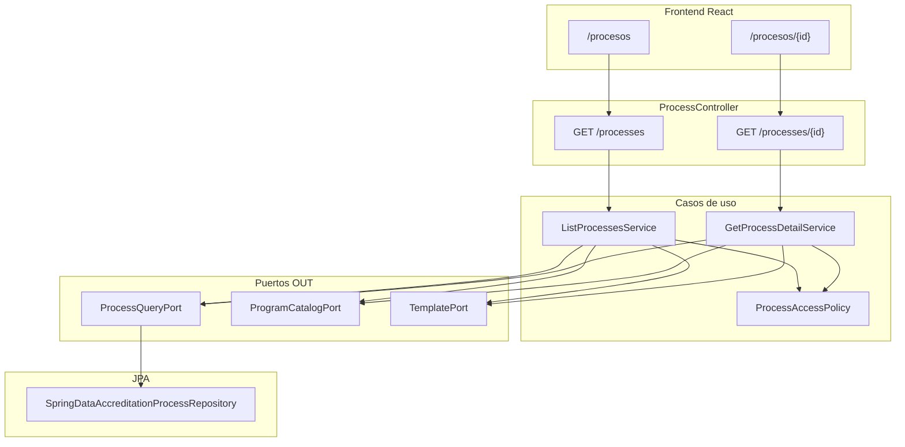

# Design Doc `DD-UC-019` — Consulta de procesos de acreditación

> **Qué es**: Documento de diseño técnico para exponer **lectura** de procesos de acreditación (`AccreditationProcess`) a roles **[JD]**, **[TD]** y **[CC]**, con filtrado por alcance de carrera (`programScope`) para [CC] y vistas de listado + detalle con árbol **Fase → Subfase**.
>
> **Relación con otros documentos**:
> - **Trazabilidad obligatoria al FSD**: [`FSD-UC-019`](../product/uc/FSD-UC-019.md).
> - **Complementa creación de proceso**: [`DD-UC-003`](DD-UC-003.md) (`POST /api/v1/processes`).
> - **Contratos de API del Producto**: [`api_contracts.md`](../product/api_contracts.md) — API-PROC-03, API-PROC-04.
> - **Reglas de negocio**: `FSD-BR-09` (aislamiento [CC] por carrera), `FSD-BR-17`.

---

## 1. Objetivo y contexto

- **Qué resuelve este feature**: Permite consultar procesos CEUB/ARCU-SUR existentes sin duplicar la lógica de creación (FSD-UC-003). [JD] y [TD] ven el universo completo; [CC] solo procesos cuya `career_id` pertenece a su `programScope` JWT. El detalle devuelve el árbol clonado de fases/subfases ordenado por `order`.
- **Caso(s) de uso del FSD que implementa**: [`FSD-UC-019`](../product/uc/FSD-UC-019.md) (`Consulta de procesos de acreditación`).
- **Alcance**:

| Incluido (v1.0) | Excluido (v1.0) |
|---|---|
| `GET /api/v1/processes` — listado resumido | Paginación, filtros por estado/plantilla |
| `GET /api/v1/processes/{processId}` — detalle con árbol | Edición de fases/subfases (FSD-UC-010) |
| RBAC JD/TD/CC + `programScope` | Evidencias/indicadores por subfase |
| UI `/procesos` y `/procesos/{processId}` | KPIs dashboard (FSD-UC-011) |
| Enriquecimiento carrera + plantilla en DTOs | Acciones de cierre/aprobación |

---

## 2. Diseño (el "cómo") `[humano+máquina]`

### 2.1 Enfoque elegido

Patrón **Query Port + Use Cases de lectura** sobre la persistencia existente (`accreditation_processes`, `phases`, `subphases`). Se separa el puerto de escritura (`AccreditationProcessPort`) del de consulta (`ProcessQueryPort`) para no inflar la interfaz de creación y mantener hexagonal estricta.

Autorización centralizada en **`ProcessAccessPolicy`** (capa aplicación, sin Spring): dado `role` + `programScope` + `process.careerId`, decide si el proceso es visible. Para [CC] fuera de alcance → **`ProcessNotFoundException`** (404, no 403) para no filtrar existencia cross-carrera (decisión FSD-UC-019 §Excepciones A2).

Enriquecimiento de respuesta vía puertos existentes:
- `ProgramCatalogPort.findById(careerId)` → `careerCode`, `careerName`
- `TemplatePort.findById(templateId)` → `templateName`, `templateType`

### 2.2 Componentes tocados (capas hexagonales)

| Capa | Componentes nuevos / extendidos |
|---|---|
| **Dominio** | Sin cambios estructurales. Reutiliza `AccreditationProcess`, `Phase`, `Subphase`. |
| **Aplicación** | `ListProcessesUseCase`, `GetProcessDetailUseCase`; servicios `ListProcessesService`, `GetProcessDetailService`; `ProcessAccessPolicy`; excepción `ProcessNotFoundException`. |
| **Puertos IN** | `ListProcessesUseCase`, `GetProcessDetailUseCase`. |
| **Puertos OUT** | **`ProcessQueryPort`** (nuevo): `findAllSummaries()`, `findSummariesByCareerIds(List<UUID>)`, `findDetailById(UUID)`. Reutiliza `ProgramCatalogPort`, `TemplatePort`. |
| **Adaptadores IN** | Extender `ProcessController` con `GET` list + detail; DTOs `ProcessSummaryResponseDto`, extender `ProcessResponseDto` con campos de lectura. |
| **Adaptadores OUT** | `ProcessQueryJpaAdapter` + métodos en `SpringDataAccreditationProcessRepository` (proyección listado sin fetch de subfases; `@EntityGraph` o join fetch solo en detalle). |
| **Config** | `ProcessModuleConfig` — beans de nuevos use cases. |
| **Frontend** | Feature `frontend/src/features/processes/` — listado, detalle, árbol fases/subfases; rutas y sidebar. |

### 2.3 Contratos y tipos

#### Puertos de aplicación

```java
// application/port/in/ListProcessesUseCase.java
List<ProcessSummary> list(ProcessQueryContext ctx);

// application/port/in/GetProcessDetailUseCase.java
AccreditationProcess getDetail(UUID processId, ProcessQueryContext ctx);

// application/model/process/ProcessQueryContext.java
record ProcessQueryContext(String role, List<UUID> programScope) {}

// application/port/out/ProcessQueryPort.java
List<AccreditationProcess> findAllSummaries();  // sin phases/subphases cargadas
List<AccreditationProcess> findSummariesByCareerIds(List<UUID> careerIds);
Optional<AccreditationProcess> findDetailById(UUID id);  // con phases + subphases, ordenadas
```

#### DTOs REST (adaptador IN)

**Listado — `ProcessSummaryResponseDto`:**

| Campo | Tipo | Notas |
|---|---|---|
| `id` | UUID | |
| `careerId` | UUID | |
| `careerCode` | String | catálogo `programs` |
| `careerName` | String | |
| `templateId` | UUID | |
| `templateName` | String | ej. "CEUB 2026" |
| `templateType` | String | `CEUB` \| `ARCU-SUR` |
| `status` | String | `ACTIVE` \| `COMPLETED` \| `CANCELLED` |
| `startDate` | LocalDateTime | |
| `phaseCount` | int | opcional v1.0 |
| `subphaseCount` | int | opcional v1.0 |

**Detalle — extender `ProcessResponseDto`:**

Campos adicionales respecto al POST create: `templateId`, `careerCode`, `careerName`, `templateName`, `templateType`. Mantener `phases[]` con `subphases[]` ordenadas por `order`.

#### API

| ID | Método | Path | Roles | Respuesta |
|---|---|---|---|---|
| API-PROC-03 | `GET` | `/api/v1/processes` | JD, TD, CC | `200` → `ProcessSummaryResponseDto[]` |
| API-PROC-04 | `GET` | `/api/v1/processes/{processId}` | JD, TD, CC | `200` → `ProcessResponseDto` enriquecido |

Errores alineados a [`GlobalExceptionHandler`](../backend/src/main/java/com/umss/sigesa/adapter/in/web/GlobalExceptionHandler.java) existente:

| Código | Condición |
|---|---|
| `401` | Sin JWT |
| `404 PROCESS_NOT_FOUND` | ID inexistente o [CC] fuera de `programScope` |
| `200 []` | [CC] sin carreras asignadas o sin procesos en alcance |

#### Seguridad en controlador

```java
@GetMapping
@PreAuthorize("hasAnyRole('JD','TD','CC')")
public List<ProcessSummaryResponseDto> listProcesses(Authentication auth) { ... }

@GetMapping("/{processId}")
@PreAuthorize("hasAnyRole('JD','TD','CC')")
public ProcessResponseDto getProcess(@PathVariable UUID processId, Authentication auth) { ... }
```

Extracción de `programScope`: reutilizar patrón de `DashboardCompositeController.extractProgramScopes(userId)` vía `UserProgramAssignmentRepositoryPort.findActiveByUserId`.

#### Persistencia — consultas JPA

```java
// SpringDataAccreditationProcessRepository
List<AccreditationProcessJpaEntity> findAllByOrderByStartDateDesc();

List<AccreditationProcessJpaEntity> findByCareerIdInOrderByStartDateDesc(Collection<UUID> careerIds);

@EntityGraph(attributePaths = {"phases", "phases.subphases"})
Optional<AccreditationProcessJpaEntity> findWithPhasesById(UUID id);
```

Ordenamiento de fases/subfases en mapper (`ProcessPersistenceMapper` o assembler dedicado `@PostLoad` / sort en servicio).

### 2.4 Diagrama



### 2.5 Frontend (FSD-UC-019)

| Ruta | Componente | Datos |
|---|---|---|
| `/procesos` | `ProcessListView` | `useListProcesses` → Orval `GET /processes` |
| `/procesos/:processId` | `ProcessDetailView` | `useProcessDetail` → Orval `GET /processes/{id}` |

- **Presentación**: tabla/cards con tokens Tailwind institucionales; badge de estado (`ACTIVE` → primary, etc.).
- **Detalle**: `ProcessPhaseTree` — acordeón Fase → Subfase ordenado; enlace subrayado «Subir evidencia» / «Cargar evidencia» → `SubphaseEvidenceUploadModal`.
- **Navegación**: enlace en `Sidebar` para JD/TD/CC; post-creación en `CreateProcessView` → redirect opcional a detalle.
- **Hooks Orval exclusivos** — prohibido `fetch` manual.

---

## 3. Alternativas consideradas

| Alternativa | Pros | Contras | ¿Elegida? |
|---|---|---|---|
| A. Extender `AccreditationProcessPort` con métodos read | Un solo puerto | Mezcla CQRS write/read; dificulta tests de create | no |
| B. **`ProcessQueryPort` dedicado** | Separación clara; alinea hexagonal | Un adapter JPA adicional | **sí** |
| C. 403 FORBIDDEN_SCOPE para [CC] cross-carrera | Semántica HTTP explícita | Filtra existencia de procesos ajenos | no |
| D. **404 PROCESS_NOT_FOUND** para [CC] cross-carrera | No revela IDs ajenos; alinea FSD | Misma respuesta que ID inexistente | **sí** |
| E. Vista materializada para listado | Performance en escala | Overkill v1.0 (<100 procesos esperados) | no |

> No requiere ADR: la elección 404 vs 403 está acotada al FSD-UC-019 y no altera arquitectura global.

---

## 4. Impacto en las specs vivas `[máquina]`

| Artefacto vivo | Cambio | ¿Delta vs DTI vFinal? |
|---|---|---|
| `docs/product/FSD.md` | Enlace `DD-UC-019`; estado UC → Implementado tras merge | no |
| `docs/product/uc/FSD-UC-019.md` | Trazabilidad técnica con rutas reales | no |
| `docs/product/api_contracts.md` | Añadir API-PROC-03, API-PROC-04 | no |
| `docs/product/DTP.md` | §B.2 endpoints GET processes; módulo frontend `processes/` | no |
| `docs/product/reglas_negocio.md` | UC-019 ya referenciado en FSD-BR-09 | no |

---

## 5. Prompts usados `[máquina]`

| Prompt | Tarea | Artefacto generado |
|---|---|---|
| `PR-IMPL-019` | Backend query port + use cases + controller GET; frontend list/detail; Orval; tests | `ProcessQueryPort`, `ListProcessesService`, `GetProcessDetailService`, `ProcessController`, `features/processes/**`, tests unitarios |

> Registrar en `docs/sprints/sprint_01/PROMPT_MAPPING.md` vía `@save-prompt-mapping PR-IMPL-019` **después** de implementar.

---

## 6. Plan de pruebas y evals

### Unitarias (sin BD)

| Test | Escenario |
|---|---|
| `ProcessAccessPolicyTest` | JD/TD acceden a cualquier `careerId`; CC solo si ∈ `programScope` |
| `ListProcessesServiceTest` | JD recibe N procesos; CC recibe subconjunto filtrado; CC sin scope → `[]` |
| `GetProcessDetailServiceTest` | Detalle OK para JD; CC cross-carrera → `ProcessNotFoundException` |
| `ListProcessesServiceTest` | Fases/subfases ordenadas por `order` en detalle |

### Integración / WebMvc

| Test | Escenario |
|---|---|
| `ProcessControllerListTest` | Mock use cases; JWT mock JD vs CC; verifica 200 y shape JSON |
| `ProcessQueryJpaAdapterTest` | `@DataJpaTest` — findDetail carga árbol; list no carga subfases |

### Gherkin (FSD-UC-019)

Derivar de escenarios TC-19: JD ve todos, CC filtrado, CC 404 ajeno, detalle ordenado, listado vacío.

**Cobertura JaCoCo**: ≥90% en `ListProcessesService`, `GetProcessDetailService`, `ProcessAccessPolicy`.

---

## 7. Definition of Done (checklist)

- [x] `fsd_uc` declarado y enlazado (trazabilidad al FSD).
- [x] Diseño (§2) y alternativas (§3) documentados.
- [ ] ADR creado/enlazado si hubo decisión significativa (N/A).
- [x] §4 Impacto en specs vivas registrado (sin tocar el baseline).
- [x] Prompt versionado en `docs/prompts/impl/PR-IMPL-019.md`.
- [ ] Tests/evals definidos y pasando (post PR-IMPL-019).
- [ ] DTP actualizado vía `@dtp-sync` (post-implementación).
- [ ] PR declara: `FSD-UC-019` · `DD-UC-019` · `PR-IMPL-019`.
