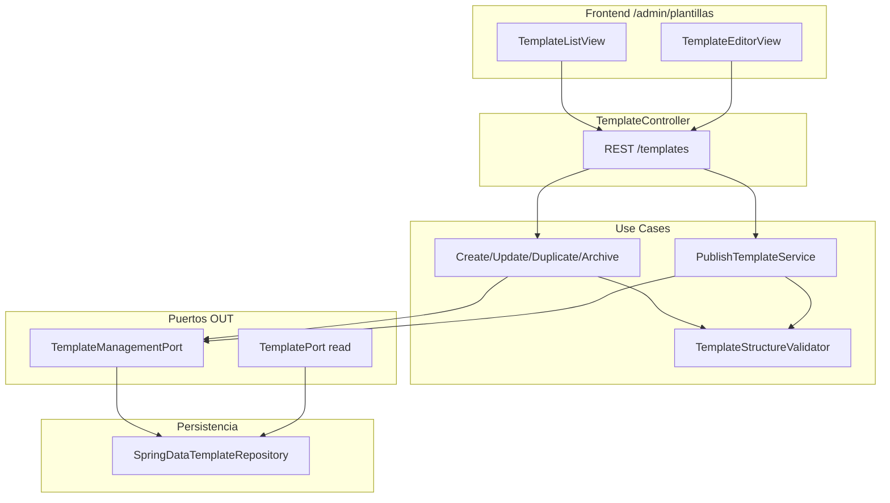

# Design Doc `DD-UC-021` — Gestión de plantillas normativas

> **Qué es**: Diseño técnico para CRUD de **plantillas normativas** (`Template` → `TemplatePhase` → `TemplateSubphase`) con metadatos (nombre, descripción, tipo, estado) y **enlace obligatorio por subfase** (`referenceUrl`). Solo actor **[JD]**.
>
> **Trazabilidad FSD**: [`FSD-UC-021`](../product/uc/FSD-UC-021.md) · Complementa [`DD-UC-003`](DD-UC-003.md) (crear proceso desde plantilla publicada) · Contratos [`api_contracts.md`](../product/api_contracts.md) API-TPL-01…08 · Reglas **FSD-BR-21**, **FSD-BR-23**.

---

## 1. Objetivo y contexto

- **Problema**: Hoy las plantillas CEUB/ARCU-SUR se cargan por **seed** (`TemplateSeedDataLoader`) y `TemplatePort` es **solo lectura**. No hay UI/API para que [JD] arme o ajuste taxonomías con enlaces normativos.
- **Solución**: Módulo de escritura de plantillas con ciclo de vida `DRAFT → PUBLISHED → ARCHIVED`, sin alterar procesos ya instanciados (FSD-BR-21).
- **Estado actual del código** (gap analysis):

| Artefacto existente | Gap |
|---|---|
| `TemplateJpaEntity`: `id`, `name`, `type` | Falta `description`, `status`, timestamps |
| `TemplateSubphaseJpaEntity`: `name`, `order` | Falta `reference_url`, `description` |
| `TemplatePhaseJpaEntity`: `name`, `order` | Falta `description` |
| `TemplatePort` + `TemplatePersistenceAdapter` | Solo `findById`; sin persistencia write |
| `ActivateTemplateUseCase` | Interfaz sin implementación |
| Flyway | Tablas `templates*` vía Hibernate; migración explícita pendiente |

| Incluido (v1.0) | Excluido (v1.0) |
|---|---|
| CRUD plantilla + árbol fases/subfases | Indicadores/criterios por subfase |
| Publicar / archivar / duplicar | Versionado diff (v1.1) |
| Validación `referenceUrl` HTTPS | Import CSV/Excel |
| UI `/admin/plantillas/**` | Migración retroactiva a procesos ACTIVE |

---

## 2. Diseño (el "cómo")

### 2.1 Enfoque elegido

**Aggregate Root `Template`** en dominio puro con invariantes:
- Al publicar: ≥1 fase, ≥1 subfase total, cada subfase con `referenceUrl` válida.
- `order` único por nivel (fase en plantilla; subfase en fase).
- Tipo restringido a `CEUB` \| `ARCU-SUR`.

Separar puertos **read** vs **write** (CQRS ligero):
- **`TemplatePort`** (existente): lectura para `CreateProcessUseCase` y listados publicados.
- **`TemplateManagementPort`** (nuevo): persistencia transaccional del agregado completo.

Controlador REST dedicado **`TemplateController`** bajo `/api/v1/templates` — no mezclar con `ProcessController`.

### 2.2 Modelo de datos

#### Migración Flyway `V5__template_management.sql`

```sql
-- templates
ALTER TABLE templates ADD COLUMN IF NOT EXISTS description TEXT;
ALTER TABLE templates ADD COLUMN IF NOT EXISTS status VARCHAR(20) NOT NULL DEFAULT 'PUBLISHED';
ALTER TABLE templates ADD COLUMN IF NOT EXISTS created_at TIMESTAMPTZ NOT NULL DEFAULT now();
ALTER TABLE templates ADD COLUMN IF NOT EXISTS updated_at TIMESTAMPTZ NOT NULL DEFAULT now();

-- template_phases
ALTER TABLE template_phases ADD COLUMN IF NOT EXISTS description TEXT;

-- template_subphases
ALTER TABLE template_subphases ADD COLUMN IF NOT EXISTS reference_url VARCHAR(2048);
ALTER TABLE template_subphases ADD COLUMN IF NOT EXISTS description TEXT;

-- Seed existente → PUBLISHED + backfill reference_url placeholder si null
UPDATE templates SET status = 'PUBLISHED' WHERE status IS NULL;
UPDATE template_subphases SET reference_url = 'https://duea.umss.edu.bo/normativa/pendiente'
  WHERE reference_url IS NULL;

CREATE INDEX idx_templates_status_type ON templates (status, type);
```

> **Nota seed**: Tras migración, actualizar `TemplateSeedDataLoader` con URLs reales por subfase.

#### Dominio (extensiones)

```java
// domain/model/Template.java — campos nuevos
String description;
TemplateStatus status; // DRAFT, PUBLISHED, ARCHIVED
LocalDateTime createdAt, updatedAt;

// domain/model/TemplatePhase.java
String description;

// domain/model/TemplateSubphase.java
String referenceUrl;
String description;
```

#### Enum

```java
public enum TemplateStatus { DRAFT, PUBLISHED, ARCHIVED }
```

### 2.3 Capas hexagonales

| Capa | Componentes |
|---|---|
| **Dominio** | Extender `Template`, `TemplatePhase`, `TemplateSubphase`; excepciones `TemplateNotFoundException`, `TemplateInUseException`, `TemplateStructureIncompleteException`, `TemplateOrderConflictException`, `TemplateSubphaseLinkRequiredException` |
| **Aplicación IN** | `CreateTemplateUseCase`, `UpdateTemplateUseCase`, `GetTemplateUseCase`, `ListTemplatesUseCase`, `PublishTemplateUseCase`, `ArchiveTemplateUseCase`, `DuplicateTemplateUseCase`, `DeleteTemplateUseCase` |
| **Aplicación OUT** | **`TemplateManagementPort`**: `save(Template)`, `findByIdForEdit(UUID)`, `existsActiveProcessByTemplateId(UUID)`, `delete(UUID)` |
| **Adaptador IN** | `TemplateController`; DTOs `TemplateSummaryResponseDto`, `TemplateDetailResponseDto`, `CreateTemplateRequestDto`, `UpdateTemplateRequestDto`, `TemplatePhaseDto`, `TemplateSubphaseDto` |
| **Adaptador OUT** | `TemplateManagementJpaAdapter` reutilizando `SpringDataTemplateRepository` + mapper extendido |
| **Config** | `ProcessModuleConfig` — registrar beans write |

### 2.4 Servicios de aplicación (lógica clave)

**`TemplateStructureValidator`** (puro, testeable):
- Valida órdenes únicos.
- Valida `referenceUrl` no blank y patrón `^https://.+`.
- Valida estructura mínima al publicar.

**`PublishTemplateService`**:
1. Carga plantilla `DRAFT`.
2. Ejecuta validator estructura completa.
3. Transición `DRAFT → PUBLISHED`.

**`ArchiveTemplateService`**:
- `PUBLISHED → ARCHIVED`; no borra filas referenciadas por procesos.

**`DeleteTemplateService`**:
- Si `existsActiveProcessByTemplateId` → `TemplateInUseException` (409).
- Solo permitido en `DRAFT` sin referencias.

**`DuplicateTemplateService`**:
- Deep copy agregado con nuevo UUID, nombre `"Copia de {name}"`, status `DRAFT`.

### 2.5 Contratos API

| ID | Método | Path | Roles | Notas |
|---|---|---|---|---|
| API-TPL-01 | GET | `/api/v1/templates` | JD | Query `status?`, `type?` |
| API-TPL-02 | POST | `/api/v1/templates` | JD | Body árbol completo → 201 DRAFT |
| API-TPL-03 | GET | `/api/v1/templates/{id}` | JD | Detalle con fases/subfases |
| API-TPL-04 | PUT | `/api/v1/templates/{id}` | JD | Replace agregado |
| API-TPL-05 | DELETE | `/api/v1/templates/{id}` | JD | Solo DRAFT sin uso |
| API-TPL-06 | POST | `/api/v1/templates/{id}/publish` | JD | |
| API-TPL-07 | POST | `/api/v1/templates/{id}/duplicate` | JD | |
| API-TPL-08 | POST | `/api/v1/templates/{id}/archive` | JD | |

**Request ejemplo (POST/PUT):**

```json
{
  "name": "CEUB 2026 — Ingenierías",
  "description": "Plantilla piloto convocatoria 2026",
  "type": "CEUB",
  "phases": [
    {
      "name": "Autoevaluación",
      "order": 1,
      "description": "Fase 1",
      "subphases": [
        {
          "name": "Diagnóstico institucional",
          "order": 1,
          "referenceUrl": "https://duea.umss.edu.bo/guia/diagnostico",
          "description": "Guía DUEA"
        }
      ]
    }
  ]
}
```

**Response resumen:**

```json
{
  "id": "850e8400-e29b-41d4-a716-446655440010",
  "name": "CEUB 2026 — Ingenierías",
  "description": "...",
  "type": "CEUB",
  "status": "PUBLISHED",
  "phaseCount": 2,
  "subphaseCount": 5
}
```

#### Impacto en UC-003

- `CreateProcessUseCaseImpl` debe rechazar plantillas no `PUBLISHED` → `400 TEMPLATE_NOT_PUBLISHED`.
- Selector frontend `/procesos/nuevo`: `GET /templates?status=PUBLISHED` (reemplaza hardcode `SEED_TEMPLATES`).

### 2.6 Diagrama



### 2.7 Frontend

| Ruta | Componentes | Hooks Orval |
|---|---|---|
| `/admin/plantillas` | `TemplateListTable`, `TemplateStatusBadge` | `useListTemplates` |
| `/admin/plantillas/nueva` | `TemplateEditorForm`, `PhaseSubphaseEditor`, `ReferenceUrlInput` | `useCreateTemplate` |
| `/admin/plantillas/:templateId` | Mismo editor + acciones Publicar/Archivar/Duplicar | `useGetTemplate`, `useUpdateTemplate`, `usePublishTemplate` |

- **Editor anidado**: lista ordenable de fases; cada fase expande subfases con campo URL obligatorio.
- **Contadores en vivo**: `phaseCount`, `subphaseCount` en header del formulario.
- **Sidebar**: entrada «Plantillas» visible solo [JD].
- Tokens Tailwind institucionales; sin colores arbitrarios.

---

## 3. Alternativas consideradas

| Alternativa | Pros | Contras | ¿Elegida? |
|---|---|---|---|
| A. Reutilizar solo `TemplatePort` con métodos write | Un puerto | Mezcla read path crítico de create process | no |
| B. **`TemplateManagementPort` dedicado** | CQRS claro | Adapter adicional | **sí** |
| C. Edición in-place de plantilla usada | Simple UX | Viola FSD-BR-21 si muta procesos | no |
| D. **Snapshot al clonar + plantilla editable** | Alineado FSD-BR-21 | Procesos no se actualizan solos | **sí** (ya en UC-003) |
| E. Soft-delete subfases plantilla | Trazabilidad | Complejidad mapper | v1.1 |

---

## 4. Impacto en specs vivas

| Artefacto | Cambio |
|---|---|
| `FSD.md` | Enlace `DD-UC-021`; UC-021 → En Curso al implementar |
| `DD-UC-003.md` | Nota: selector plantillas vía API TPL; clonación incluye `referenceUrl` |
| `DD-UC-019.md` | Detalle subfase expone `referenceUrl` en DTO |
| `api_contracts.md` | API-TPL-01…08 (ya borrador) |
| `DTP.md` | §MOD-TEMPLATE; tablas/columnas V5; frontend `/admin/plantillas` |
| `CreateProcessUseCaseImpl` | Validar `PUBLISHED`; clonar `referenceUrl` a `Subphase` |

---

## 5. Plan de pruebas

| Test | Escenario |
|---|---|
| `TemplateStructureValidatorTest` | URL vacía, order duplicado, publicar sin subfases |
| `PublishTemplateServiceTest` | DRAFT válido → PUBLISHED |
| `DeleteTemplateServiceTest` | DRAFT OK; con proceso ACTIVE referenciado → 409 |
| `DuplicateTemplateServiceTest` | Copia independiente con status DRAFT |
| `TemplateControllerWebMvcTest` | JWT JD vs CC → 403 |
| `CreateProcessUseCaseImplTest` | Rechaza plantilla DRAFT |

**JaCoCo**: ≥90% en validators + publish/delete/duplicate services.

---

## 6. Definition of Done

- [x] `fsd_uc` enlazado a FSD-UC-021.
- [x] Modelo de datos y migración V5 definidos.
- [x] Puertos, use cases y API documentados.
- [ ] `PR-IMPL-021` generado e implementado.
- [ ] Orval regenerado; UI `/admin/plantillas`.
- [ ] `@dtp-sync` y `@save-prompt-mapping` post-merge.

**Orden de implementación sugerido**: DD-UC-021 → PR-IMPL-021 → extender clonación UC-003 → actualizar selector UC-003 frontend.
