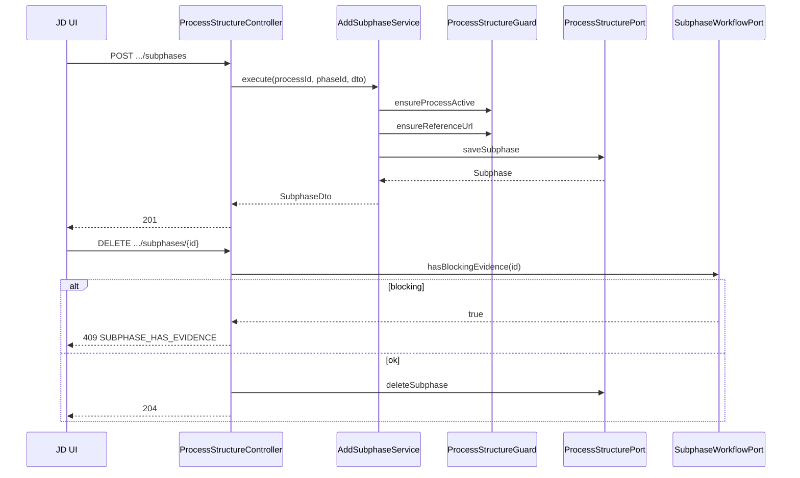

# Design Doc `DD-UC-022` — Gestión de fases y subfases en proceso

> **Qué es**: Diseño para CRUD de **instancias** `Phase` / `Subphase` dentro de un `AccreditationProcess` **ACTIVE**, incluyendo `referenceUrl` por subfase. Solo **[JD]**. Distinto de cierre de fase ([FSD-UC-010](../product/uc/FSD-UC-010.md)).
>
> **Trazabilidad FSD**: [`FSD-UC-022`](../product/uc/FSD-UC-022.md) · Complementa [`DD-UC-019`](DD-UC-019.md) · Reglas **FSD-BR-07**, **FSD-BR-21**, **FSD-BR-22**, **FSD-BR-23**.

---

## 1. Objetivo y contexto

- **Problema**: Tras crear un proceso (UC-003), la estructura clonada es **inmutable** en código actual. [JD] necesita ajustes puntuales (nueva subfase, reordenar, corregir enlace) sin tocar la plantilla origen.
- **Solución**: **`ProcessStructurePort`** + use cases transaccionales con guardas de negocio; extensión de entidades JPA con campos descriptivos y URL.
- **Gap analysis**:

| Existente | Gap |
|---|---|
| `PhaseJpaEntity` / `SubphaseJpaEntity` | Sin `description`, sin `reference_url` en subfase |
| `AccreditationProcessPort` | Solo create + existsActive |
| `ProcessQueryPort` | Solo lectura |
| Evidencias | Aún sin FK `subphase_id` en MOD-EVIDENCE → guard BR-22 vía puerto stub hasta UC-004 |

| Incluido (v1.0) | Excluido (v1.0) |
|---|---|
| CRUD fases/subfases en proceso ACTIVE | CRUD indicadores |
| Reordenamiento `order` | Migración desde otra plantilla |
| Validación borrado condicionado | Edición por TD/CC |
| UI `/procesos/{id}/estructura` | Bitácora UC-017 (hook preparado) |

---

## 2. Diseño (el "cómo")

### 2.1 Enfoque elegido

Tratar **`AccreditationProcess` + phases** como agregado de escritura parcial:
- Operaciones atómicas por fase o subfase (no replace completo del árbol en v1.0 — reduce riesgo de borrado accidental).
- **`ProcessStructureGuard`** centraliza: proceso `ACTIVE`, rol implícito en controller, subfase eliminable.

Puerto dedicado **`ProcessStructurePort`** separado de `ProcessQueryPort` y `AccreditationProcessPort`.

### 2.2 Modelo de datos

#### Migración `V5__process_structure.sql` (misma release que DD-UC-021)

```sql
ALTER TABLE phases ADD COLUMN IF NOT EXISTS description TEXT;

ALTER TABLE subphases ADD COLUMN IF NOT EXISTS reference_url VARCHAR(2048);
ALTER TABLE subphases ADD COLUMN IF NOT EXISTS description TEXT;

-- Backfill desde plantilla no es posible retroactivamente; placeholder operativo
UPDATE subphases SET reference_url = 'https://duea.umss.edu.bo/normativa/pendiente'
  WHERE reference_url IS NULL;

ALTER TABLE subphases ALTER COLUMN reference_url SET NOT NULL;
```

#### Dominio

```java
// Phase — agregar
String description;

// Subphase — agregar
String referenceUrl;
String description;
```

Actualizar **`AccreditationProcess.createFromTemplate()`** y **`ProcessPersistenceMapper`** para clonar `referenceUrl` y `description` desde plantilla (post DD-UC-021).

### 2.3 Capas hexagonales

| Capa | Componentes |
|---|---|
| **Dominio** | Extender `Phase`, `Subphase`; excepciones `ProcessNotEditableException`, `SubphaseHasEvidenceException`, `ProcessStructureOrderConflictException`, `SubphaseLinkRequiredException` |
| **Aplicación IN** | `AddProcessPhaseUseCase`, `UpdateProcessPhaseUseCase`, `DeleteProcessPhaseUseCase`, `AddProcessSubphaseUseCase`, `UpdateProcessSubphaseUseCase`, `DeleteProcessSubphaseUseCase`, `ReorderProcessStructureUseCase` |
| **Aplicación OUT** | **`ProcessStructurePort`**: load process with phases; save phase/subphase; delete; **`SubphaseWorkflowPort`**: `boolean hasBlockingEvidence(UUID subphaseId)` |
| **Adaptador IN** | Extender `ProcessController` o `ProcessStructureController` bajo `/api/v1/processes/{processId}/...` |
| **Adaptador OUT** | `ProcessStructureJpaAdapter`; `SubphaseWorkflowJpaAdapter` (stub `return false` hasta evidencias ligadas) |
| **Config** | Beans en `ProcessModuleConfig` |

### 2.4 Puertos

```java
public interface ProcessStructurePort {
    AccreditationProcess loadActiveProcess(UUID processId);
    Phase savePhase(UUID processId, Phase phase);
    Subphase saveSubphase(UUID processId, UUID phaseId, Subphase subphase);
    void deletePhase(UUID processId, UUID phaseId);
    void deleteSubphase(UUID processId, UUID phaseId, UUID subphaseId);
    void reorderPhases(UUID processId, List<UUID> phaseIdsInOrder);
    void reorderSubphases(UUID processId, UUID phaseId, List<UUID> subphaseIdsInOrder);
}

public interface SubphaseWorkflowPort {
    /** true si existe evidencia/indicador que impide DELETE (FSD-BR-22) */
    boolean hasBlockingEvidence(UUID subphaseId);
}
```

### 2.5 Use cases — reglas

**`ProcessStructureGuard`**:
```java
void ensureProcessActive(AccreditationProcess p); // status == ACTIVE
void ensureUniqueOrders(...);
void ensureReferenceUrl(String url); // https, non-blank
```

**Delete subfase**:
1. `loadActiveProcess`
2. Si `subphaseWorkflowPort.hasBlockingEvidence(subphaseId)` → `SubphaseHasEvidenceException`
3. `deleteSubphase`

**Delete fase**:
- Todas las subfases deben pasar guard de delete.

**Reorder**:
- Transacción única; reasignar `order` 1..N.

### 2.6 API (API-PROC-05…08)

| Método | Path | Body | Respuesta |
|---|---|---|---|
| POST | `/processes/{processId}/phases` | `{ name, order, description? }` | 201 `PhaseDto` |
| PUT | `/processes/{processId}/phases/{phaseId}` | parcial | 200 |
| DELETE | `/processes/{processId}/phases/{phaseId}` | — | 204 / 409 |
| POST | `/processes/{processId}/phases/{phaseId}/subphases` | `{ name, order, referenceUrl, description? }` | 201 |
| PUT | `/processes/{processId}/phases/{phaseId}/subphases/{subphaseId}` | parcial | 200 |
| DELETE | `/processes/{processId}/phases/{phaseId}/subphases/{subphaseId}` | — | 204 / 409 |
| PUT | `/processes/{processId}/structure/reorder` | `{ phases?: [uuid], subphases?: { phaseId, ids[] } }` | 200 árbol |

**Seguridad**: `@PreAuthorize("hasRole('JD')")` en todos.

**Errores**:

| Código | Condición |
|---|---|
| `409 PROCESS_NOT_EDITABLE` | status ≠ ACTIVE |
| `409 SUBPHASE_HAS_EVIDENCE` | BR-22 |
| `400 SUBPHASE_LINK_REQUIRED` | URL inválida |
| `400 PROCESS_STRUCTURE_ORDER_CONFLICT` | order duplicado |
| `404 PROCESS_NOT_FOUND` | id inexistente |

### 2.7 Impacto en lectura (DD-UC-019)

Extender DTOs:

```java
// PhaseDto
String description;

// SubphaseDto
String referenceUrl;
String description;
```

`GetProcessDetailService` / mapper devuelven campos nuevos sin cambio de RBAC.

### 2.8 Diagrama



### 2.9 Frontend

| Ruta | UX |
|---|---|
| `/procesos/:processId/estructura` | Modo edición: botones Agregar fase/subfase, drag-and-drop reorder (opcional v1.0: inputs numéricos order) |
| Enlace desde detalle UC-019 | Botón «Editar estructura» solo visible [JD] |

Componentes:
- `ProcessStructureEditor` — contenedor
- `EditablePhaseCard`, `EditableSubphaseRow` — filas con `ReferenceUrlInput`
- `useProcessStructure` — hooks Orval por operación

---

## 3. Alternativas consideradas

| Alternativa | Pros | Contras | ¿Elegida? |
|---|---|---|---|
| A. Replace completo del árbol (PUT process) | Un request | Riesgo borrado masivo; payload grande | no |
| B. **Operaciones granulares REST** | Seguro; RESTful | Más endpoints | **sí** |
| C. Editar solo metadata, no add/remove | Simple | No cumple FSD | no |
| D. Hard DELETE subfase | Simple SQL | Pierde trazabilidad futura | v1.0 sí; soft v1.1 |

---

## 4. Impacto en specs vivas

| Artefacto | Cambio |
|---|---|
| `DD-UC-019` | DTOs con `referenceUrl`; invalidar caché React Query tras edit estructura |
| `DD-UC-021` | Clonación plantilla → subfase instancia incluye URL |
| `api_contracts.md` | API-PROC-05…08 |
| `FSD-UC-019.md` | Fuera de alcance → enlace DD-UC-022 |

---

## 5. Plan de pruebas

| Test | Escenario |
|---|---|
| `ProcessStructureGuardTest` | ACTIVE vs COMPLETED |
| `DeleteSubphaseServiceTest` | Con/sin blocking evidence (mock port) |
| `AddSubphaseServiceTest` | URL requerida |
| `ReorderProcessStructureServiceTest` | Orders 1..N consistentes |
| `ProcessStructureControllerWebMvcTest` | JD 201; CC 403 |
| Integración JPA | Cascade delete fase elimina subfases elegibles |

---

## 6. Definition of Done

- [x] Diseño puertos/use cases/API.
- [ ] Migración V5 aplicada.
- [ ] `PR-IMPL-022` implementado.
- [ ] Frontend estructura + detalle UC-019 con enlaces clicables.
- [ ] `SubphaseWorkflowPort` documentado para enchufar UC-004.

**Dependencia**: Implementar campos `referenceUrl` en plantilla (DD-UC-021) antes o en la misma migración V5 para clonación coherente.
