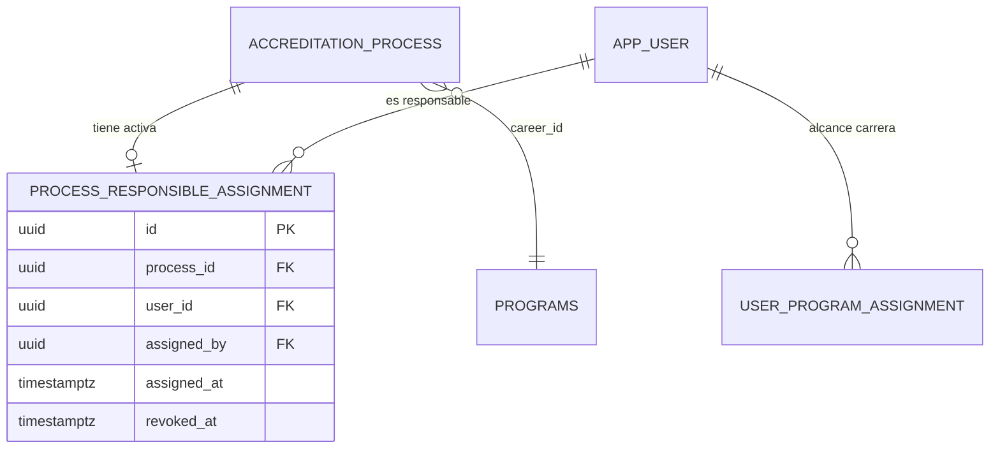

# Design Doc `DD-UC-023` — Asignación de responsable [CC] a proceso

> **Qué es**: Diseño para que **[JD]** designe un **Coordinador [CC]** como responsable único de un proceso `ACTIVE`, con unicidad global: un [CC] no puede ser responsable de dos procesos activos a la vez (**FSD-BR-20**). Alcance carrera vía `user_program_assignment` (**FSD-BR-09**).
>
> **Trazabilidad FSD**: [`FSD-UC-023`](../product/uc/FSD-UC-023.md) · Complementa [`DD-UC-002`](DD-UC-002.md), [`DD-UC-019`](DD-UC-019.md) · API **API-PROC-09…10**.

---

## 1. Objetivo y contexto

- **Problema**: Hoy el coordinador se modela solo como **rol CC + asignación a carrera** (`user_program_assignment`), sin vínculo explícito proceso ↔ responsable. [JD] no puede registrar quién lidera operativamente cada acreditación.
- **Solución**: Tabla **`process_responsible_assignment`** con historial soft-revoke y restricciones únicas parciales en PostgreSQL.
- **Gap analysis**:

| Existente | Gap |
|---|---|
| `AccreditationProcessJpaEntity` | Sin FK responsable |
| `UserProgramAssignmentRepositoryPort` | Alcance carrera; no consulta por proceso |
| `ProcessSummaryResponseDto` | Sin campo responsable |
| List users CC | Existe vía admin; falta filtro «disponibles para proceso» |

| Incluido (v1.0) | Excluido (v1.0) |
|---|---|
| Asignar / cambiar / quitar responsable | Múltiples responsables |
| Listado candidatos [CC] elegibles | Notificación UC-015 |
| Exposición en GET proceso/listado | Auto-asignación [CC] |
| Validación carrera + unicidad | Reasignación automática al desactivar usuario |

---

## 2. Diseño (el "cómo")

### 2.1 Enfoque elegido

Entidad de asignación **independiente** (no columna suelta en `accreditation_processes`) para:
- Historial `assigned_at` / `revoked_at` / `assigned_by`.
- Soft revoke al cambiar responsable (auditoría UC-017 futura).

**Invariantes (dominio `ProcessResponsibleAssignment`)**:
- Máximo **una** fila activa (`revoked_at IS NULL`) por `process_id`.
- Máximo **un** proceso `ACTIVE` por `user_id` como responsable activo.
- `user.role == CC`, `user.status == ACTIVE`.
- `user_program_assignment` activo con `program_id == process.career_id`.

### 2.2 Modelo de datos

#### Migración `V6__process_responsible.sql`

```sql
CREATE TABLE process_responsible_assignment (
    id UUID PRIMARY KEY DEFAULT gen_random_uuid(),
    process_id UUID NOT NULL REFERENCES accreditation_processes(id),
    user_id UUID NOT NULL REFERENCES app_user(id),
    assigned_by UUID NOT NULL REFERENCES app_user(id),
    assigned_at TIMESTAMPTZ NOT NULL DEFAULT now(),
    revoked_at TIMESTAMPTZ NULL
);

CREATE UNIQUE INDEX uk_pra_active_process
    ON process_responsible_assignment (process_id)
    WHERE revoked_at IS NULL;

CREATE UNIQUE INDEX uk_pra_active_user
    ON process_responsible_assignment (user_id)
    WHERE revoked_at IS NULL;

CREATE INDEX idx_pra_user ON process_responsible_assignment (user_id);
CREATE INDEX idx_pra_process ON process_responsible_assignment (process_id);
```

> **Nota BR-20**: El índice `uk_pra_active_user` garantiza un [CC] en un solo proceso **con asignación activa**. Combinar con validación en servicio: el proceso referenciado debe estar `ACTIVE` (al completar proceso, revocar asignación en `CompleteProcessUseCase` futuro o job).

#### Dominio

```java
@Getter @Builder
public class ProcessResponsibleAssignment {
    UUID id;
    UUID processId;
    UUID userId;
    UUID assignedBy;
    LocalDateTime assignedAt;
    LocalDateTime revokedAt;

    public void revoke() { this.revokedAt = LocalDateTime.now(); }
    public boolean isActive() { return revokedAt == null; }
}
```

#### Value object enriquecido (lectura)

```java
public record ProcessResponsibleInfo(
    UUID userId,
    String fullName,
    String email,
    LocalDateTime assignedAt
) {}
```

### 2.3 Capas hexagonales

| Capa | Componentes |
|---|---|
| **Dominio** | `ProcessResponsibleAssignment`; excepciones `CcAlreadyAssignedToProcessException`, `InvalidResponsibleUserException`, `CareerScopeMismatchException` |
| **Aplicación IN** | `AssignProcessResponsibleUseCase`, `RemoveProcessResponsibleUseCase`, `ListEligibleResponsiblesUseCase`, `GetProcessResponsibleUseCase` |
| **Aplicación OUT** | **`ProcessResponsiblePort`**: save, revokeActiveByProcessId, findActiveByProcessId, findActiveByUserId, existsActiveByUserIdExcludingProcess |
| **Reutiliza** | `ProcessQueryPort` (verificar proceso ACTIVE + careerId), `UserRepositoryPort` / `ListUsersUseCase` patrón, `UserProgramAssignmentRepositoryPort` |
| **Adaptador IN** | Endpoints en `ProcessController` o `ProcessResponsibleController` |
| **Adaptador OUT** | `ProcessResponsibleJpaAdapter` + `SpringDataProcessResponsibleRepository` |
| **Config** | Beans en `ProcessModuleConfig` |

### 2.4 Puertos

```java
public interface ProcessResponsiblePort {
    ProcessResponsibleAssignment save(ProcessResponsibleAssignment assignment);
    Optional<ProcessResponsibleAssignment> findActiveByProcessId(UUID processId);
    Optional<ProcessResponsibleAssignment> findActiveByUserId(UUID userId);
    void revokeActiveByProcessId(UUID processId);
    List<UUID> findUserIdsActiveAsResponsible(); // para filtros
}

public interface AssignProcessResponsibleUseCase {
    ProcessResponsibleInfo assign(UUID processId, UUID userId, UUID assignedByUserId);
}

public interface ListEligibleResponsiblesUseCase {
    List<UserSummary> listEligible(UUID processId);
}
```

### 2.5 Flujo `AssignProcessResponsibleService`

1. Cargar proceso; `ensureStatus(ACTIVE)`.
2. Cargar usuario; verificar rol `CC`, status `ACTIVE`.
3. `userProgramAssignmentPort` → `programId` debe contener `process.careerId`.
4. `processResponsiblePort.findActiveByUserId(userId)` → si existe y proceso distinto ACTIVE → `CcAlreadyAssignedToProcessException`.
5. Revocar asignación activa previa del mismo proceso (si hay).
6. Persistir nueva asignación.
7. Retornar `ProcessResponsibleInfo`.

### 2.6 API

| ID | Método | Path | Roles | Body / Respuesta |
|---|---|---|---|---|
| API-PROC-09 | PUT | `/processes/{processId}/responsible` | JD | `{ "userId": "uuid" }` → 200 `{ userId, fullName, email, assignedAt }` |
| API-PROC-10 | DELETE | `/processes/{processId}/responsible` | JD | 204 |
| API-PROC-11 | GET | `/processes/{processId}/responsible/candidates` | JD | 200 `[{ userId, fullName, email }]` — solo CC elegibles |

**Errores**:

| Código | Condición |
|---|---|
| `409 CC_ALREADY_ASSIGNED_TO_PROCESS` | FSD-BR-20 |
| `409 CAREER_SCOPE_MISMATCH` | CC sin assignment a carrera |
| `400 INVALID_RESPONSIBLE_USER` | No CC o inactivo |
| `409 PROCESS_NOT_EDITABLE` | Proceso no ACTIVE |

### 2.7 Impacto en DD-UC-019 (lectura)

Extender DTOs:

```java
// ProcessSummaryResponseDto
ProcessResponsibleDto responsible; // nullable

// ProcessResponseDto — mismo campo
```

`ListProcessesService` / `GetProcessDetailService`: join vía `ProcessResponsiblePort.findActiveByProcessId` + datos usuario (sin exponer contraseña).

**RBAC consulta**: [TD] y [JD] ven responsable en cualquier proceso; [CC] ve responsable solo en procesos de su carrera (misma regla que listado).

### 2.8 Diagrama



### 2.9 Frontend

| Ubicación | UX |
|---|---|
| `/procesos/:processId` | Sección «Responsable del proceso»: nombre + email o «Sin asignar» |
| Modal asignar | Combobox alimentado por `GET .../responsible/candidates` |
| `/procesos` listado | Columna opcional «Responsable» |

Componentes:
- `ProcessResponsibleSection` (presentacional)
- `AssignResponsibleModal` + `useAssignProcessResponsible`, `useEligibleResponsibles`

Visible solo [JD] para acciones PUT/DELETE.

---

## 3. Alternativas consideradas

| Alternativa | Pros | Contras | ¿Elegida? |
|---|---|---|---|
| A. Columna `responsible_user_id` en proceso | Simple | Sin historial; difícil auditoría | no |
| B. **Tabla assignment con revoke** | Trazabilidad; soft history | Join extra | **sí** |
| C. Reutilizar solo `user_program_assignment` | Sin tabla nueva | No liga CC↔proceso; no unicidad por proceso | no |
| D. Permitir 2 procesos ACTIVE mismo CC | Flexible | Viola FSD-BR-20 | no |

---

## 4. Impacto en specs vivas

| Artefacto | Cambio |
|---|---|
| `api_contracts.md` | API-PROC-09…11 |
| `DD-UC-019` | Campos responsable en DTOs |
| `modelo_datos.md` | Entidad `ProcessResponsibleAssignment` |
| `FSD-BR-20` | Refuerzo índice único parcial |
| `DTP.md` | Tabla + endpoints |

---

## 5. Plan de pruebas

| Test | Escenario |
|---|---|
| `AssignProcessResponsibleServiceTest` | Happy path; CC ocupado; carrera mismatch |
| `RemoveProcessResponsibleServiceTest` | Revoke; CC disponible de nuevo |
| `ListEligibleResponsiblesServiceTest` | Excluye CC ya asignados |
| `@DataJpaTest` | Violación índice único → constraint |
| `ProcessControllerResponsibleWebMvcTest` | JD vs CC |
| Integración UC-019 | Detalle incluye responsable tras asignar |

---

## 6. Definition of Done

- [x] Modelo relacional e invariantes documentados.
- [ ] Migración V6 aplicada.
- [ ] `PR-IMPL-023` implementado.
- [ ] UI sección responsable en detalle/listado.
- [ ] Extender UC-019 backend con join responsable.

**Dependencia recomendada**: Puede implementarse en paralelo a DD-UC-022; migración V6 independiente de V5.

**Post v1.0**: Al marcar proceso `COMPLETED`, revocar automáticamente asignación activa (hook en use case de cierre futuro).
