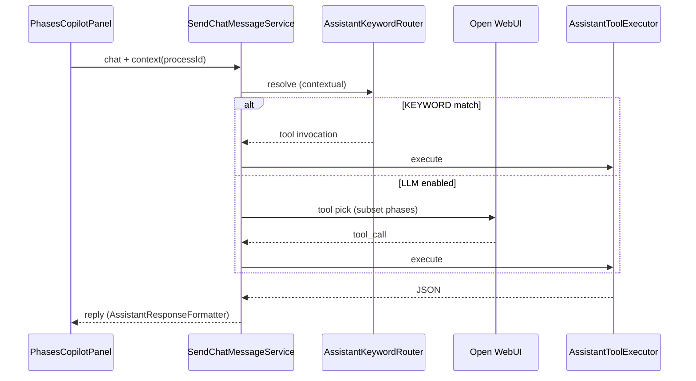

# DD-AGENT-001 — Copiloto de Fases embebido

## 1. Propósito

Perfil especializado del asistente SIGESA (`agent=phases`) embebido en las pantallas de proceso. Comparte motor con `/ayuda` pero acota tools, contexto (`processId`) y UI.

## 2. Superficies UI

| Pantalla | Roles | Modo |
|----------|-------|------|
| `/procesos/{id}` | JD, TD, CC | JD/TD: lectura + escritura* · CC: **solo lectura** |
| `/procesos/{id}/estructura` | JD, TD | Lectura + escritura (proceso ACTIVE) |
| `/ayuda` | Todos (según rol) | Asistente general |

\*Escritura vía chat con confirmación (`confirmed=true`).

### Layout responsive

- **Desktop (`xl+`):** panel sticky 340px a la derecha.
- **Mobile:** panel colapsable bajo el contenido principal.

## 3. Contrato API

```http
POST /api/v1/assistant/chat
GET  /api/v1/assistant/status?agent=phases
```

```json
{
  "message": "Lista las fases de este proceso",
  "context": {
    "agent": "phases",
    "processId": "uuid-del-proceso"
  }
}
```

`AssistantChatContextFactory` resuelve carrera/plantilla desde `GetProcessDetailUseCase` + RBAC (`ProcessAccessPolicy`).

## 4. Tools del agente phases

| Tool | Tipo | JD | TD | CC |
|------|------|:--:|:--:|:--:|
| `list_process_phases` | read | ✓ | ✓ | ✓ |
| `list_process_structure` | read | ✓ | ✓ | ✓ |
| `manage_process_phase` | write | ✓ | ✓ | — |
| `manage_process_subphase` | write | ✓ | ✓ | — |

Fuera del agente phases el asistente general conserva el catálogo completo por rol.

## 5. Flujo



## 6. Palabras clave contextuales (sin nombrar carrera)

- Fases: «lista las fases», «etapas del proceso», «cuántas fases»
- Estructura: «estructura completa», «subfases», «enlaces de subfases»

## 7. Componentes

| Capa | Archivo |
|------|---------|
| API | `AssistantController`, `AssistantChatContextDto` |
| Contexto | `AssistantChatContextFactory` |
| Orquestación | `SendChatMessageService` |
| Router | `AssistantKeywordRouter` |
| Tools | `AssistantToolRegistry`, `AssistantToolExecutor`, `AssistantStructureLookup` |
| Resolución orden | `AssistantStructureLookup.SubphaseOrderPlan` (CREATE subfase) |
| UI | `PhasesCopilotPanel`, `usePhasesCopilot` |

### 7.1 Lecciones aprendidas (iteración 2026-08-11)

| Problema | Mitigación actual | Pendiente |
|----------|-------------------|-----------|
| LLM inventa UUIDs (`UUID_FASE_1`) | `AssistantStructureLookup`: `phaseOrder`, nombre, hint «Fase N» | Catálogo de subfases en prompt |
| Confunde «Fase 1» con `order=1` de subfase | `SubphaseOrderPlan`: preview con último orden + siguiente disponible | Botón confirmar en UI |
| Preview ilegible (mapa JSON crudo) | `AssistantResponseFormatter` resumido en CREATE_SUBPHASE | Formateador unificado para todas las tools `write` |

## 8. Backlog de evolución

Roadmap vivo para mejorar el copiloto. Priorizar ítems **P1** en siguientes sprints del módulo asistente.

### 8.1 UX del panel (frontend)

| ID | Prioridad | Mejora | Criterio de aceptación |
|----|-----------|--------|------------------------|
| AGENT-UX-01 | P1 | Botones **Confirmar / Cancelar** en lugar de escribir «confirmo» | Tras preview `confirmationRequired`, UI muestra acciones; no requiere texto libre |
| AGENT-UX-02 | P1 | **Refrescar árbol** de fases/subfases tras escritura exitosa | `ProcessDetailView` / `ProcessStructureView` recargan estructura sin F5 |
| AGENT-UX-03 | P2 | Indicador visual **KEYWORD vs LLM** (badge en burbuja) | Usuario ve `path` y `toolId` de forma amigable |
| AGENT-UX-04 | P2 | **Historial persistente** por `processId` (sessionStorage) | Al volver al detalle, conversación previa recuperable |
| AGENT-UX-05 | P3 | Samples contextuales para **subfases** (CREATE, listar enlaces) | `AssistantController` expone escenarios phases con subfases |
| AGENT-UX-06 | P3 | Afinar **layout mobile**: altura máxima del chat, gestos colapsar | Panel usable en viewport &lt; 640px sin tapar CTA de edición |

### 8.2 Motor de tools e IA (backend)

| ID | Prioridad | Mejora | Criterio de aceptación |
|----|-----------|--------|------------------------|
| AGENT-BE-01 | P1 | **Catálogo de subfases** en `phaseCatalogPrompt` (order, id, name, referenceUrl) | Prompt incluye subfases por fase; menos alucinación de IDs |
| AGENT-BE-02 | P1 | **KEYWORD router** para CREATE subfase («agrega subfase … en Fase N») | Camino KEYWORD sin LLM para patrón frecuente; tests en `AssistantKeywordRouter` |
| AGENT-BE-03 | P2 | Estado de **confirmación multi-turno** explícito (session/tool call id) | Segundo mensaje «confirmo» reutiliza args de preview sin re-invocar LLM |
| AGENT-BE-04 | P2 | **Insertar subfase en posición** intermedia (no solo append) | Parámetro opcional `insertAtOrder` con validación de huecos |
| AGENT-BE-05 | P2 | Tool **`reorder_process_subphases`** o extender `manage_process_subphase` | JD/TD pueden reordenar subfases por chat con confirmación |
| AGENT-BE-06 | P3 | Tool **`close_process_phase`** (UC-010, TD) | Cierre de fase con RBAC y preview |
| AGENT-BE-07 | P3 | Métricas: contador KEYWORD / LLM / OUT_OF_SCOPE por agente | Log estructurado o endpoint interno de observabilidad |

### 8.3 Formato de respuestas

| ID | Prioridad | Mejora | Criterio de aceptación |
|----|-----------|--------|------------------------|
| AGENT-FMT-01 | P1 | Preview legible para **todas** las tools `write` (phase, subphase, user status) | Sin `{key=value}` crudo; mensajes en español institucional |
| AGENT-FMT-02 | P2 | Listar subfases existentes en preview CREATE cuando `existingCount > 0` | «Subfases actuales: 1. X, 2. Y → se agregará 3. Z» |
| AGENT-FMT-03 | P3 | Respuestas CC **solo lectura** con resumen de progreso (% fase, evidencias) | Requiere agregación dashboard en tool read |

### 8.4 Calidad y operación

| ID | Prioridad | Mejora | Criterio de aceptación |
|----|-----------|--------|------------------------|
| AGENT-QA-01 | P1 | Tests E2E: CC lectura, JD CREATE subfase con confirmación | Playwright o REST integración con seed demo |
| AGENT-QA-02 | P2 | Tests executor: `manage_process_subphase` CREATE con 0, 1 y N subfases | Cubre `SubphaseOrderPlan` vía `AssistantToolExecutorTest` |
| AGENT-QA-03 | P2 | Contract test OpenAPI ↔ Orval tras cada cambio en `AssistantController` | CI ejecuta `pnpm run generate:api` contra backend levantado |
| AGENT-OPS-01 | P3 | Exponer **`/actuator/health`** en dev Docker o documentar `/v3/api-docs` como health | Scripts de espera de backend unificados |

### 8.5 Integración producto

| ID | Prioridad | Mejora | Criterio de aceptación |
|----|-----------|--------|------------------------|
| AGENT-PROD-01 | P2 | Copiloto CC: **progreso por fase** (dashboard coordinator) | CC pregunta «¿cómo vamos en Fase 2?» con datos reales |
| AGENT-PROD-02 | P3 | Agente **`evidence`** embebido en subfase (UC evidencias) | Nuevo `agent=evidence` con scope `subphaseId` |
| AGENT-PROD-03 | P3 | Sincronizar **`TOOL-CATALOG.md`** §agente phases tras cada tool nueva | Trazabilidad AI-SDLC |

### 8.6 Deuda técnica conocida

- El LLM puede omitir `referenceUrl` en el primer intento → validación backend OK, UX mejorable con slot-filling en prompt.
- `AssistantChatContext` duplica tipos con Orval (`assistantTypes.ts` vs `assistantChatContextDto.ts`) → consolidar o documentar convención «manual + generate».
- Flyway deshabilitado en dev (`ddl-auto: update`) → seeds de subfases no siempre alineados con plantilla; considerar loader de estructura demo unificado.

## 10. Seguridad del chat y trazabilidad (desarrollo)

### 10.1 Validación de entrada (`AssistantChatInputValidator`)

Toda petición a `POST /api/v1/assistant/chat` pasa por validación **antes** del caso de uso:

| Control | Límite / regla |
|---------|----------------|
| Longitud mensaje | Máx. 4 000 caracteres (`message` e ítems de `history`) |
| Historial | Máx. 30 mensajes; roles permitidos: `user`, `assistant`, `system`, `tool` |
| Caracteres de control | Rechazados salvo `\n`, `\r`, `\t` |
| Inyección SQL | Patrones `SELECT … FROM`, `UNION SELECT`, `DROP TABLE`, `DELETE FROM`, `INSERT INTO`, `UPDATE … SET`, `';--`, `' OR '1'='1`, comentarios `/* */`, `EXEC`/`xp_` |
| XSS | `<script`, `javascript:`, atributos `on*=`` |
| Null bytes | Rechazados |

**Respuesta HTTP:** `400 Bad Request` con código `ASSISTANT_INVALID_INPUT`.

**Ubicación:** `AssistantChatInputValidator` (capa aplicación), invocado desde `AssistantController`.

> Las tools siguen ejecutándose vía casos de uso tipados (JPA); la validación es defensa en profundidad sobre el texto libre del usuario.

### 10.2 Modal de acciones del agente (solo desarrollo)

Para inspeccionar qué hace el copiloto durante el chat (tools, camino KEYWORD/LLM, fuentes):

| Aspecto | Detalle |
|---------|---------|
| Componente | `PhasesCopilotActionDebugModal` |
| Hook | `usePhasesCopilot` registra `actionHistory` y abre el modal al enviar |
| Interruptor código | `PHASES_COPILOT_DEBUG_ACTIONS_ENABLED` en `frontend/src/lib/config/phasesCopilotDebug.ts` |
| Variable build | `VITE_PHASES_COPILOT_DEBUG_ACTIONS=true` (incrustada en el bundle al compilar) |
| Producción | Dejar `false` o omitir → modal **no** se renderiza |

#### Docker Compose (desarrollo con contenedores)

En la raíz del repo, archivo `.env` (copiar desde `.env.example`):

```bash
# Activar modal de seguimiento del agente
VITE_PHASES_COPILOT_DEBUG_ACTIONS=true

# Desactivar (valor por defecto si no se define)
# VITE_PHASES_COPILOT_DEBUG_ACTIONS=false
```

`docker-compose.yml` pasa la variable al build del frontend:

```yaml
frontend:
  build:
    args:
      VITE_PHASES_COPILOT_DEBUG_ACTIONS: ${VITE_PHASES_COPILOT_DEBUG_ACTIONS:-false}
```

**Tras cambiar el valor hay que reconstruir el frontend** (es build-time, no runtime):

```bash
docker compose up -d --build frontend
```

| Valor | Efecto |
|-------|--------|
| `true` | Modal visible al chatear con el copiloto de fases |
| `false` (default) | Sin modal; comportamiento de producción |

#### Vite local (`pnpm dev`)

En `frontend/.env`:

```bash
VITE_PHASES_COPILOT_DEBUG_ACTIONS=true
```

Reiniciar Vite tras cambiar la variable.

**Contenido del modal:** resumen por turno, pasos (envío, contexto `processId`, tool ejecutada, LLM, tablas fuente), estado (`ok` / `error` / `out_of_scope` / `pending`).

## 11. Referencias

- [`TOOL-CATALOG.md`](TOOL-CATALOG.md)
- [`DD-SYS-002.md`](../DD-SYS-002.md) §11
- [`FSD-UC-022.md`](../../product/uc/FSD-UC-022.md)
