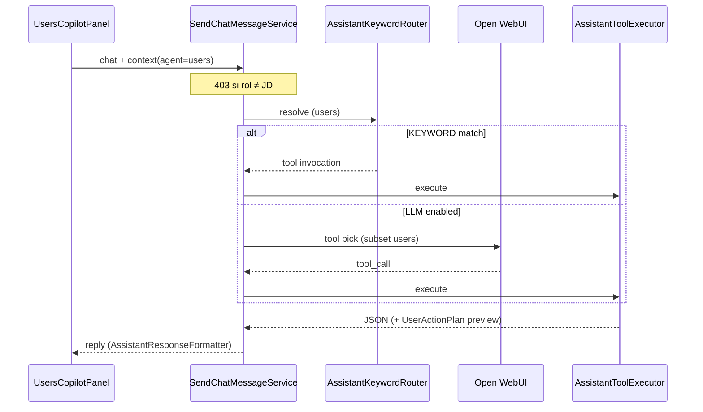

# DD-AGENT-002 — Copiloto de Usuarios embebido

## 1. Propósito

Perfil especializado del asistente SIGESA (`agent=users`) embebido en `/admin/users`. Comparte motor con `/ayuda` y el copiloto de fases (`DD-AGENT-001`), pero acota tools, RBAC **exclusivo [JD]** y UI.

Extiende la gestión CRUD tradicional de [FSD-UC-002](../../product/uc/FSD-UC-002.md) / [DD-UC-002](../DD-UC-002.md) / [PR-IMPL-002](../../prompts/impl/PR-IMPL-002.md) con interacción conversacional. **No reemplaza** el CRUD de pantalla; lo complementa.

## 2. Trazabilidad

| Artefacto | ID |
|-----------|-----|
| FSD | FSD-UC-002 (estado Hecho — CRUD; esta es extensión agente) |
| Design CRUD | DD-UC-002 |
| Prompt CRUD | PR-IMPL-002 |
| Design agente | **DD-AGENT-002** (este documento) |
| Prompt agente | **PR-IMPL-025** (convención análoga a PR-IMPL-024 / DD-AGENT-001) |
| Catálogo | TOOL-CATALOG.md §agente users |
| Bitácora | UC-017 vía `AuditLogPort` en register / activate / deactivate |

## 3. Superficies UI

| Pantalla | Roles | Modo |
|----------|-------|------|
| `/admin/users` | **JD** | Lectura + escritura con confirmación |
| Otros roles | — | Panel **no montado** (JdOnlyRoute + sin nav) |
| `/ayuda` | Según rol | Asistente general (catálogo completo; no subset users) |

### Layout responsive

- **Desktop (`xl+`):** panel sticky ~340px a la derecha (mismo patrón que `PhasesCopilotPanel`).
- **Mobile:** panel colapsable (acordeón) bajo el listado.

## 4. Contrato API

```http
POST /api/v1/assistant/chat
GET  /api/v1/assistant/status?agent=users
```

```json
{
  "message": "Lista los usuarios CC activos",
  "context": {
    "agent": "users",
    "userId": "uuid-opcional",
    "programId": "uuid-opcional"
  }
}
```

| Campo | Obligatorio | Uso |
|-------|-------------|-----|
| `agent` | sí (`users`) | Selecciona perfil |
| `userId` | no | Foco conversacional (detalle / estado) |
| `programId` | no | Hint de carrera para alta / asignación |

**RBAC HTTP:** si `agent=users` y el JWT no es `ROLE_JD` → **403** en chat y status (no solo tools vacías).

## 5. Tools del agente users

| Tool | Tipo | JD | Notas |
|------|------|:--:|-------|
| `list_users` | read | ✓ | Filtros `role`, `status`, `programId` |
| `get_user_detail` | read | ✓ | Rol, carrera(s), estado, `createdAt`, `updatedAt` (proxy último cambio; sin lastLogin en v1) |
| `create_user` | write | ✓ | Correo `@umss.edu.bo`; rol; carrera si CC/EE; cuenta **INACTIVE**; preview → confirm |
| `manage_user_status` | write | ✓ | `ACTIVATE` / `DEACTIVATE` / `REACTIVATE`; bitácora UC-017 |
| `manage_user_assignment` | write | ✓ | CREATE/UPDATE de `user_program_assignment` (mínimo privilegio) |

El asistente general conserva `set_user_status` (compatibilidad). El copiloto users usa `manage_user_status` (incluye REACTIVATE).

Escritura: patrón preview/confirm → `UserActionPlan` (resumen legible, análogo a `SubphaseOrderPlan`).

## 6. Mapeo Gherkin FSD-UC-002 → tool + UI

| Escenario FSD-UC-002 | Tool(s) | Flujo UI copiloto |
|----------------------|---------|-------------------|
| Alta con correo UMSS y rol [CC] | `create_user` (+ `list_programs` vía general no; resolver programId por nombre en args) | JD pide alta → preview `UserActionPlan` → «confirmo» → cuenta INACTIVE + assignment |
| Cuenta inactiva hasta primer acceso | `create_user` | Preview muestra `status=INACTIVE`; post-ejecución refresca tabla |
| Alcance mínimo `user_program_assignment` | `create_user` / `manage_user_assignment` | Solo programa autorizado; UPDATE revoca activos previos |
| Revocación: no login, auditoría conservada | `manage_user_status` DEACTIVATE | Confirmación obligatoria; soft delete; historial intacto |
| Alta/baja en bitácora UC-017 | register / activate / deactivate use cases | Sin tool de bitácora; side-effect en UC |

Validación correo UMSS antes de crear (`Email.of`). Baja/desactivación **siempre** con confirmación explícita.

## 7. Flujo



## 8. Componentes

| Capa | Archivo |
|------|---------|
| API | `AssistantController`, `AssistantChatContextDto` |
| Contexto | `AssistantChatContextFactory`, `AssistantAgentProfile.USERS` |
| Orquestación | `SendChatMessageService` |
| Router | `AssistantKeywordRouter` |
| Tools | `AssistantToolRegistry`, `AssistantToolExecutor` |
| Plan preview | `AssistantUserActionPlan` |
| Asignación | `ManageUserProgramAssignmentUseCase` |
| UI | `UsersCopilotPanel`, `useUsersCopilot` |

## 9. Backlog (evolución)

| ID | Prioridad | Mejora |
|----|-----------|--------|
| USERS-UX-01 | P1 | Botones Confirmar/Cancelar (compartido con AGENT-UX-01) |
| USERS-UX-02 | P1 | Invalidar listado usuarios tras escritura exitosa |
| USERS-BE-01 | P2 | `lastAccessAt` real en dominio / get_user_detail |
| USERS-BE-02 | P2 | KEYWORD para «crea usuario CC …» |
| USERS-QA-01 | P1 | Smoke Docker JD: alta vía copiloto + desactivación con confirm |

## 10. Referencias

- [`DD-AGENT-001.md`](DD-AGENT-001.md) — patrón phases
- [`TOOL-CATALOG.md`](TOOL-CATALOG.md)
- [`DD-SYS-002.md`](../DD-SYS-002.md) §11
- [`FSD-UC-002.md`](../../product/uc/FSD-UC-002.md)
- [`PR-IMPL-025.md`](../../prompts/impl/PR-IMPL-025.md)
