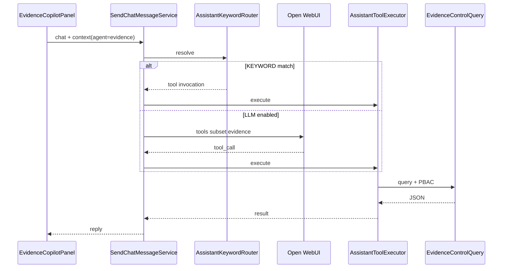

# DD-AGENT-003 — Copiloto de control documental

## 1. Propósito

Perfil especializado del asistente SIGESA (`agent=evidence`) para **controlar la documentación subida por el [CC]** (UC-004). Comparte motor con `/ayuda`, fases (`DD-AGENT-001`) y usuarios (`DD-AGENT-002`).

Extiende MOD-EVIDENCE con interacción conversacional de **solo lectura** en MVP. **No** reemplaza UC-008/009.

## 2. Trazabilidad

| Artefacto | ID |
|-----------|-----|
| FSD | FSD-UC-024 |
| Design agente | **DD-AGENT-003** (este documento) |
| Prompt | **PR-IMPL-026** |
| Catálogo | TOOL-CATALOG.md §agente evidence |
| Carga base | FSD-UC-004 / DD-UC-004 |
| MCP | `mcp/sigesa-evidence/` (tools espejo HTTP) |

## 3. Superficies UI

| Pantalla | Roles | Modo |
|----------|-------|------|
| `/evidencias/cargar` | CC, TD, JD | Lectura |
| `/ayuda` | Según rol | Asistente general (catálogo completo; subset si `agent=evidence`) |
| EE | — | Panel no montado; API 403 |

### Layout

- Desktop (`xl+`): panel sticky ~340px (patrón Phases/Users).
- Mobile: acordeón colapsable.

## 4. Contrato API

```http
POST /api/v1/assistant/chat
GET  /api/v1/assistant/status?agent=evidence
```

```json
{
  "message": "Lista las evidencias pendientes de revisión",
  "context": {
    "agent": "evidence",
    "programId": "uuid-opcional"
  }
}
```

| Campo | Obligatorio | Uso |
|-------|-------------|-----|
| `agent` | sí (`evidence`) | Selecciona perfil |
| `programId` | no | Acota consulta; [CC] se fuerza a su scope JWT |

**RBAC HTTP:** si `agent=evidence` y rol es `EE` (u otro no JD/TD/CC) → **403**.

## 5. Tools

| Tool | Tipo | JD | TD | CC |
|------|------|:--:|:--:|:--:|
| `list_pending_evidences` | read | ✓ | ✓ | ✓* |
| `get_evidence_detail` | read | ✓ | ✓ | ✓* |
| `check_evidence_completeness` | read | ✓ | ✓ | ✓* |
| `filter_indicators` | read | ✓ | ✓ | ✓* |

\*CC solo sobre `programScope` del JWT.

### 5.1 Arquitectura Híbrida de Enrutamiento (Minimización de Consultas IA)

El filtrado dinámico de indicadores optimiza los recursos de cómputo clasificando la consulta en 4 escenarios:

1. **Escenario 1 — Coincidencia Directa SQL (Sin IA):**
   Si la consulta del usuario contiene patrones o códigos exactos (UUID de programa, código de indicador, o nombres de estado explícitos como `SUBIDO`, `OBSERVADO`), se resuelve mediante una consulta SQL directa a la base de datos sin invocar al modelo LLM.
2. **Escenario 2 — Decodificación Semántica con Tool Calling (AI Toggle = ON):**
   Si el Toggle de IA está habilitado y la consulta requiere procesamiento de lenguaje natural para inferir criterios o estados, el modelo de lenguaje decodifica la intención e invoca la tool `filter_indicators` pasando los filtros estructurados (`programId`, `state`, `criterionId`).
3. **Escenario 3 — Fuera de Alcance (Out-of-Scope):**
   Consultas no relacionadas con la evaluación o acreditación son detectadas inmediatamente y devuelven una respuesta de rechazo sin ejecutar llamadas SQL ni de IA adicionales.
4. **Escenario 4 — Fallback con Toggle Desactivado (AI Toggle = OFF):**
   Si el Toggle de IA está apagado y la consulta no coincide con el Escenario 1 (búsqueda directa SQL), el sistema retorna un resultado nulo (`null`) o lista vacía de forma predeterminada.

## 6. Flujo



## 7. MCP

Servidor MCP en `mcp/sigesa-evidence/` expone las mismas tres tools contra la API SIGESA (`SIGESA_API_URL` + `SIGESA_JWT`). Permite a clientes MCP (p. ej. Cursor) auditar documentación sin duplicar reglas de negocio.

## 8. Componentes

| Capa | Archivo |
|------|---------|
| Perfil | `AssistantAgentProfile.EVIDENCE` |
| Contexto | `AssistantChatContext.evidence(programId)` |
| Tools | `AssistantToolRegistry` + `AssistantToolExecutor` |
| Query | `EvidenceControlQueryPort` / use cases |
| UI | `EvidenceCopilotPanel` + `useEvidenceCopilot` |
| MCP | `mcp/sigesa-evidence/src/index.ts` |

## 9. Palabras clave

- «evidencias pendientes», «pendientes de revisión», «documentación subida»
- «detalle de evidencia», «completeness», «está completa la evidencia»

## 10. Fase 2 (fuera de MVP)

Tools write con confirmación: `reject_indicator`, `approve_indicator` (UC-008/009).
