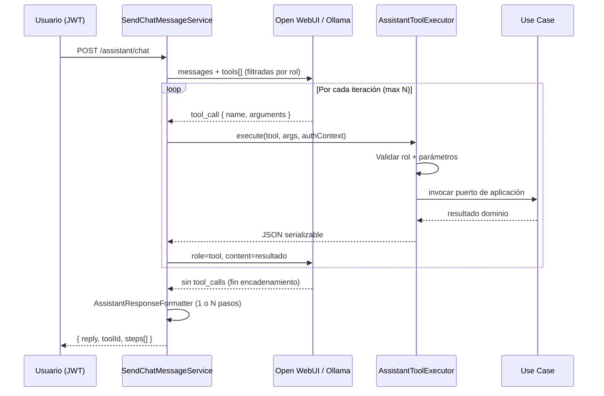

# TOOL-CATALOG — Asistente Virtual SIGESA

Catálogo vivo de **tools** expuestas al LLM vía tool calling. Es la fuente de verdad para:

- Descripciones semánticas enviadas al modelo.
- JSON Schema de parámetros.
- Reglas de autorización en el executor backend.
- Trazabilidad hacia casos de uso y API REST existentes.

> **Regla de oro:** el LLM **nunca** accede a la base de datos ni a controladores REST directamente. Cada tool delega en un **caso de uso** de la capa de aplicación, con el contexto JWT del usuario que inició el chat.

---

## 1. Convenciones globales

### 1.1 Ciclo de vida de una tool



### 1.2 Registro dinámico por rol

| Regla | Descripción |
|-------|-------------|
| **R1** | Las tools se incluyen en el payload al LLM **solo** si el rol del JWT cumple `allowed_roles`. |
| **R2** | El `AssistantToolExecutor` **revalida** el rol antes de ejecutar (defensa en profundidad). |
| **R3** | Si un usuario no autorizado pregunta por datos restringidos, el asistente responde con texto genérico **sin invocar** la tool (no debe aparecer en `tools[]`). |
| **R4** | Ninguna tool expone contraseñas, hashes, tokens ni datos fuera del contrato documentado. |
| **R5** | El `AssistantToolExecutor` revalida el **subset del agente** (`phases`/`users`/`evidence`) aunque el LLM alucine un `tool_call` fuera del panel. |
| **R6** | Toda invocación (éxito o denegación) se registra vía `AssistantToolAuditPort` → log `AUDIT_ASSISTANT_TOOL` (sin argumentos sensibles). |

### 1.2.1 Capas RBAC (defensa en profundidad)

| Capa | Componente | Qué valida |
|------|------------|------------|
| **L1 HTTP** | `AssistantController` | Agente permitido por rol (`users`→JD; `evidence`→JD/TD/CC) → 403 |
| **L2 Registro LLM** | `AssistantToolRegistry.toolsForRoleAndAgent` | Tools visibles al modelo según rol + agente |
| **L3 Executor rol** | `AssistantToolRbacGuard` | Rol JWT ∈ `allowedRoles` de la tool |
| **L4 Executor agente** | `AssistantToolRbacGuard` + `isToolAllowedForAgent` | Tool ∈ subset del agente embebido |
| **L5 Dominio** | Use cases (`ProcessAccessPolicy`, `programScope`) | PBAC carrera / permisos REST equivalentes |
| **L6 Auditoría** | `Slf4jAssistantToolAuditAdapter` | Trazabilidad: userId, role, agent, tool, sideEffect, outcome |

### 1.3 Formato estándar de respuesta de tool

Todas las tools devuelven un objeto JSON con esta envoltura:

```json
{
  "ok": true,
  "data": {},
  "error": null
}
```

En caso de fallo de negocio (filtro inválido, sin permisos):

```json
{
  "ok": false,
  "data": null,
  "error": {
    "code": "ACCESS_DENIED",
    "message": "Descripción legible para el LLM"
  }
}
```

### 1.4 Side-effects

| Clasificación | Significado |
|---------------|-------------|
| `read` | Solo consulta; no modifica estado persistente. |
| `write` | Modifica estado; requiere confirmación explícita en chat (`confirmed=true`). |

---

## 2. Tools registradas

### 2.0 Matriz RBAC (resumen)

| Tool ID | Side-effect | JD | TD | CC | EE |
|---------|-------------|:--:|:--:|:--:|:--:|
| `list_users` | read | ✓ | — | — | — |
| `get_user_detail` | read | ✓ | — | — | — |
| `create_user` | write | ✓ | — | — | — |
| `set_user_status` | write | ✓ | — | — | — |
| `manage_user_status` | write | ✓ | — | — | — |
| `manage_user_assignment` | write | ✓ | — | — | — |
| `list_programs` | read | ✓ | ✓ | — | — |
| `list_process_phases` | read | ✓ | ✓ | ✓ | — |
| `list_process_structure` | read | ✓ | ✓ | ✓ | — |
| `list_active_processes` | read | ✓ | ✓ | — | — |
| `manage_process_phase` | write | ✓ | ✓ | — | — |
| `manage_process_subphase` | write | ✓ | ✓ | — | — |
| `list_pending_evidences` | read | ✓ | ✓ | ✓ | — |
| `get_evidence_detail` | read | ✓ | ✓ | ✓ | — |
| `check_evidence_completeness` | read | ✓ | ✓ | ✓ | — |
| `search_normative_docs` | read | ✓ | ✓ | ✓ | ✓ |

> **Agente `phases`:** subset (5 tools, incluye RAG). CC solo lectura. Ver [DD-AGENT-001](DD-AGENT-001.md).  
> **Agente `users`:** subset (6 tools JD-only + RAG). Ver [DD-AGENT-002](DD-AGENT-002.md). HTTP 403 si rol ≠ JD.  
> **Gestión de usuarios:** exclusiva **JD** (alineada a `GET/PATCH /admin/users`).  
> **Fases/subfases:** **JD** y **TD** escritura; **CC** solo lectura en su carrera asignada.

| Tool ID | Side-effect | Roles permitidos | Caso de uso | API REST equivalente |
|---------|-------------|------------------|-------------|----------------------|
| `list_users` | `read` | **JD** | `ListUsersUseCase` | `GET /api/v1/admin/users` |
| `get_user_detail` | `read` | **JD** | `ListUsersUseCase` + `UserRepositoryPort` | `GET /api/v1/admin/users` |
| `create_user` | `write` | **JD** | `RegisterUserUseCase` | `POST /api/v1/admin/users` |
| `list_programs` | `read` | **JD**, **TD** | `ListProgramsUseCase` | `GET /api/v1/programs` |
| `list_process_phases` | `read` | **JD**, **TD**, **CC** | `GetProcessDetailUseCase` + resolución carrera→proceso activo | `GET /api/v1/processes/{id}` |
| `list_process_structure` | `read` | **JD**, **TD**, **CC** | `GetProcessDetailUseCase` (árbol fase→subfase) | `GET /api/v1/processes/{id}` |
| `set_user_status` | `write` | **JD** | `ActivateUserUseCase` / `DeactivateUserUseCase` | *(asistente general; deactivate vía PATCH)* |
| `manage_user_status` | `write` | **JD** | `ActivateUserUseCase` / `DeactivateUserUseCase` | *(agente users; ACTIVATE/DEACTIVATE/REACTIVATE)* |
| `manage_user_assignment` | `write` | **JD** | `ManageUserProgramAssignmentUseCase` | *(user_program_assignment)* |
| `manage_process_phase` | `write` | **JD**, **TD** | `Add/Update/Delete/ReorderProcess*` | `ProcessStructureController` |
| `manage_process_subphase` | `write` | **JD**, **TD** | `Add/Update/DeleteProcessSubphase*` | `ProcessStructureController` |
| `search_normative_docs` | `read` | **JD**, **TD**, **CC**, **EE** | `SearchNormativeDocumentsUseCase` | *(índice `normative_document` — RAG FTS)* |

### 2.0.1 RAG normativo (PR-IMPL-032)

| Componente | Descripción |
|------------|-------------|
| **Corpus** | Tabla `normative_document` (título, template_type, body_text, source_url) |
| **Retrieval** | PostgreSQL FTS (`tsvector` + GIN) en prod; fallback LIKE en dev/Hibernate |
| **Tool** | `search_normative_docs` — todos los agentes y roles del asistente |
| **Enriquecimiento** | `AssistantNormativeRagService` inyecta fragmentos en system prompt del LLM |
| **Fallback** | Si el LLM no elige tool, respuesta directa vía path `RAG` cuando hay hits |
| **Config** | `sigesa.assistant.rag-enabled` (default true), `rag-max-chunks` (default 3) |


### 2.1 Protocolo de confirmación (tools `write`)

1. Primera invocación con `confirmed: false` (o omitido) → respuesta `confirmationRequired: true` + `preview`.
2. El LLM muestra la vista previa y pide confirmación al usuario.
3. Segunda invocación con los **mismos parámetros** y `confirmed: true` → ejecuta la acción.

Respuesta de vista previa:

```json
{
  "ok": true,
  "data": {
    "confirmationRequired": true,
    "action": "DEACTIVATE",
    "preview": { "email": "cc@umss.edu.bo", "fullName": "..." },
    "message": "Confirme que desea desactivar..."
  },
  "error": null
}
```

---

## 3. Tool: `list_users`

### 3.1 Metadatos

| Campo | Valor |
|-------|-------|
| **ID** | `list_users` |
| **Tipo** | `read` |
| **Roles permitidos** | `JD` exclusivamente |
| **Trazabilidad FSD** | [FSD-UC-002](../../product/uc/FSD-UC-002.md) — Gestión de usuarios |
| **Trazabilidad diseño** | [DD-UC-002](../DD-UC-002.md), [DD-SYS-002](../DD-SYS-002.md) §11 |
| **Contrato API** | [API-USER-03](../../product/api/API-USER-03.md) |
| **Puerto aplicación** | `com.umss.sigesa.application.port.in.ListUsersUseCase` |
| **Implementación** | `ListUsersService` |

### 3.2 Descripción para el LLM

Texto que se incluye en la definición de la tool enviada al modelo:

> Lista los usuarios registrados en SIGESA con su nombre completo, correo institucional, rol y estado de cuenta. Opcionalmente filtra por rol (`JD`, `CC`, `TD`) o por estado (`INACTIVE`, `ACTIVE`, `DEACTIVATED`). Solo disponible para Jefatura DUEA [JD]. Usa esta tool cuando el usuario pregunte quiénes están registrados, qué rol tienen, cuántos coordinadores hay, o quién está inactivo o desactivado. **No** expone contraseñas ni permite modificar usuarios.

### 3.3 Cuándo invocar / cuándo no

| Invocar | No invocar |
|---------|------------|
| "¿Qué usuarios CC tenemos activos?" | Usuario autenticado como `CC` o `TD` (tool no registrada) |
| "Lista todos los usuarios del sistema" | Preguntas sobre credenciales o contraseñas |
| "¿Hay cuentas inactivas pendientes?" | Alta, baja o modificación de usuarios (fuera de alcance) |
| "Muéstrame los técnicos DUEA registrados" | Preguntas normativas de acreditación sin relación a usuarios |

### 3.4 JSON Schema (parámetros)

Compatible con [OpenAI function calling](https://platform.openai.com/docs/guides/function-calling):

```json
{
  "type": "object",
  "properties": {
    "role": {
      "type": "string",
      "enum": ["JD", "CC", "TD"],
      "description": "Filtro opcional por rol de usuario."
    },
    "status": {
      "type": "string",
      "enum": ["INACTIVE", "ACTIVE", "DEACTIVATED"],
      "description": "Filtro opcional por estado de cuenta."
    }
  },
  "additionalProperties": false
}
```

Ambos parámetros son **opcionales**. Sin filtros, devuelve todos los usuarios visibles para JD.

### 3.5 Semántica de dominio

#### Roles (`role`)

| Valor | Significado |
|-------|-------------|
| `JD` | Jefatura DUEA — administración global |
| `CC` | Coordinador de Carrera — scope por programa |
| `TD` | Técnico DUEA — scope global de lectura/operación |

#### Estados (`status`)

| Valor | Significado |
|-------|-------------|
| `INACTIVE` | Cuenta creada por JD; aún no ha iniciado sesión |
| `ACTIVE` | Cuenta operativa |
| `DEACTIVATED` | Cuenta revocada (soft delete); historial conservado |

### 3.6 Esquema de respuesta (`data`)

Array de objetos usuario. Alineado a `UserAdminSummaryResponse`:

```json
{
  "ok": true,
  "data": {
    "users": [
      {
        "userId": "550e8400-e29b-41d4-a716-446655440000",
        "email": "cc@umss.edu.bo",
        "role": "CC",
        "status": "ACTIVE",
        "programIds": ["550e8400-e29b-41d4-a716-446655440000"]
      }
    ],
    "total": 1
  },
  "error": null
}
```

| Campo | Tipo | Descripción |
|-------|------|-------------|
| `userId` | `UUID` | Identificador único del usuario |
| `email` | `string` | Correo `@umss.edu.bo` |
| `role` | `string` | `JD` \| `CC` \| `TD` |
| `status` | `string` | `INACTIVE` \| `ACTIVE` \| `DEACTIVATED` |
| `programIds` | `UUID[]` | Programas asignados (relevante para `CC`; vacío para `JD`/`TD`) |
| `total` | `number` | Cantidad de registros devueltos |

> **Privacidad:** no se incluyen `passwordHash`, intentos fallidos, fechas de bloqueo ni metadatos de auditoría.

### 3.7 Autorización

```mermaid
flowchart TD
  A[Request chat con JWT] --> B{Rol == JD?}
  B -->|No| C[tools[] sin list_users]
  C --> D[LLM responde sin datos de usuarios]
  B -->|Sí| E[tools[] incluye list_users]
  E --> F{LLM invoca list_users?}
  F -->|Sí| G[Executor revalida JD]
  G -->|OK| H[ListUsersUseCase.list]
  G -->|Fail| I[error ACCESS_DENIED]
  H --> J[Devuelve JSON a LLM]
```

| Capa | Comportamiento |
|------|----------------|
| **Registro de tools** | `list_users` solo si `authContext.role == JD` |
| **Executor** | Si rol ≠ `JD` → `{ ok: false, error: { code: "ACCESS_DENIED", ... } }` |
| **Use case** | Reutiliza `ListUsersUseCase`; misma lógica que `UserAdminController.list()` |
| **SecurityConfig** | Endpoint REST `/api/v1/admin/users` ya exige `hasRole("JD")` — la tool no bypassa esta regla |

### 3.8 Errores

| Código | HTTP equivalente | Causa | Mensaje sugerido al usuario (vía LLM) |
|--------|------------------|-------|----------------------------------------|
| `ACCESS_DENIED` | 403 | Rol distinto de JD intentó ejecutar | "No tiene permisos para consultar el listado de usuarios." |
| `INVALID_ROLE` | 422 | Parámetro `role` inválido | "El filtro de rol no es válido. Use JD, CC o TD." |
| `INVALID_FILTER` | 422 | Parámetro `status` inválido | "El filtro de estado no es válido. Use INACTIVE, ACTIVE o DEACTIVATED." |
| `ASSISTANT_TOOL_FAILED` | 502 | Error inesperado en use case | "No fue posible obtener el listado de usuarios. Intente más tarde." |

### 3.9 Ejemplos de conversación

#### Ejemplo 1 — Listado completo

**Usuario (JD):** "¿Qué usuarios tenemos registrados?"

**Tool call:**
```json
{
  "name": "list_users",
  "arguments": {}
}
```

**Respuesta tool → LLM:** 5 usuarios (JD, TD, 2×CC, 1 INACTIVE).

**Respuesta asistente (natural):** "Actualmente hay 5 usuarios registrados: 1 JD activo, 1 TD activo, 2 coordinadores de carrera activos y 1 cuenta CC inactiva pendiente de primer acceso."

---

#### Ejemplo 2 — Filtro por rol

**Usuario (JD):** "¿Cuántos coordinadores de carrera activos hay?"

**Tool call:**
```json
{
  "name": "list_users",
  "arguments": { "role": "CC", "status": "ACTIVE" }
}
```

---

#### Ejemplo 3 — Usuario CC pregunta (tool no disponible)

**Usuario (CC):** "¿Quiénes son los demás usuarios del sistema?"

**Comportamiento:** `list_users` **no** está en `tools[]`. El system prompt indica que no puede acceder a administración de usuarios. El LLM responde sin invocar la tool.

---

### 3.10 Definición OpenAI-compatible (referencia implementación)

```json
{
  "type": "function",
  "function": {
    "name": "list_users",
    "description": "Lista usuarios SIGESA (email, rol, estado). Solo JD. Filtros opcionales role/status.",
    "parameters": {
      "type": "object",
      "properties": {
        "role": {
          "type": "string",
          "enum": ["JD", "CC", "TD"],
          "description": "Filtro opcional por rol."
        },
        "status": {
          "type": "string",
          "enum": ["INACTIVE", "ACTIVE", "DEACTIVATED"],
          "description": "Filtro opcional por estado de cuenta."
        }
      },
      "additionalProperties": false
    }
  }
}
```

### 3.11 Pseudocódigo del executor

```java
// AssistantToolExecutor — list_users
if (!authContext.role().equals("JD")) {
    return ToolResult.denied("ACCESS_DENIED", "Solo JD puede listar usuarios.");
}

String roleFilter = args.path("role").asText(null);
String statusFilter = args.path("status").asText(null);

List<ListUsersUseCase.UserSummary> users =
    listUsersUseCase.list(roleFilter, statusFilter);

return ToolResult.ok(Map.of(
    "users", users.stream().map(this::toToolDto).toList(),
    "total", users.size()
));
```

---

## 4. System prompt — instrucciones complementarias

### 4.1 Fragmento JD

```text
Tienes acceso a tools de administración de usuarios (list_users, set_user_status) y de estructura
de procesos (list_programs, list_process_phases, manage_process_phase).
Para set_user_status y manage_process_phase: primero confirmed=false (vista previa), luego confirmed=true
solo tras confirmación explícita del usuario en el chat.
Nunca inventes datos ni reveles contraseñas.
```

### 4.2 Fragmento TD

```text
Tienes acceso a tools de estructura de procesos: list_programs, list_process_phases, manage_process_phase.
NO tienes acceso a gestión de usuarios (list_users, set_user_status).
Para manage_process_phase: primero confirmed=false (vista previa), luego confirmed=true
solo tras confirmación explícita del usuario en el chat.
```

### 4.3 Fragmento CC (agente phases — solo lectura)

```text
En el copiloto de fases tienes acceso de lectura: list_process_phases, list_process_structure
para tu carrera asignada. NO puedes crear, editar ni eliminar fases ni subfases por chat.
Si te lo solicitan, indica que solo JD o TD pueden modificar la estructura.
```

### 4.4 Fragmento EE

Fragmento sugerido para `sigesa.assistant.system-prompt` cuando el caller es JD:

```text
Tienes acceso a la tool `list_users` para consultar usuarios registrados (email, rol, estado).
Úsala cuando te pregunten por cuentas, roles o estados de acceso.
Nunca inventes usuarios: si necesitas datos, invoca la tool.
No reveles contraseñas ni sugieras compartir credenciales por chat.
```

Para callers **CC** y **TD**, añadir:

```text
No tienes acceso a información administrativa de usuarios del sistema.
Si te lo solicitan, indica que solo Jefatura DUEA [JD] puede consultar o modificar usuarios.
```

> **Nota:** TD sí tiene tools de fases; ver §4.2.

---

## 5. Plan de pruebas (aceptación — tarea semana tool calling)

Documento de entrega: [`ENTREGA-TOOL-CALLING-SEMANA.md`](ENTREGA-TOOL-CALLING-SEMANA.md)

| # | Escenario | Pregunta SIGESA (JD/TD) | Camino | Esperado en pantalla |
|---|-----------|-------------------------|--------|----------------------|
| **1** | Controlado | «Lista las fases de Ingeniería de Sistemas CEUB» | **KEYWORD** | Tool `list_process_phases`, tablas `phases`, …, sin LLM |
| **2** | Sinónimo | «¿Qué **etapas** tiene el proceso activo de Ingeniería de Sistemas CEUB?» | **LLM** | Misma tool/datos que esc. 1; LLM invocado solo para elegir tool |
| **3** | Fuera de alcance | «¿Cuál es el presupuesto de la universidad para 2027?» | **OUT_OF_SCOPE** | «No puedo responder eso» + capacidades; sin tool |
| **4** | Modelo apagado | Igual esc. 1 con `SIGESA_ASSISTANT_LLM_ENABLED=false` | **KEYWORD** | Idéntico a esc. 1; esc. 2 debe fallar con mensaje claro |
| **5** | Multi-tool (Nivel 4) | «Muestra la estructura de Ingeniería de Sistemas CEUB y busca normativa de Matriz de evidencias» | **LLM** | ≥2 tools; traza `steps[]` visible; `reply` con **Paso 1** / **Paso 2** |

**Regla:** la respuesta con datos la produce **siempre** `AssistantResponseFormatter` (código), nunca el LLM.

### 5.0 Escenarios Nivel 4 por agente embebido

| Agente | # | Pregunta demo | Encadenamiento esperado |
|--------|---|---------------|-------------------------|
| `phases` | 5 | Estructura completa + normativa Matriz de evidencias | `list_process_structure` → `search_normative_docs` |
| `users` | 5 | Lista CC activos + detalle de cc@umss.edu.bo | `list_users` → `get_user_detail` |
| `evidence` | 4 | Pendientes + normativa matriz CEUB | `list_pending_evidences` → `search_normative_docs` |

### 5.1 RBAC (tests unitarios existentes)

| # | Escenario | Rol | Esperado |
|---|-----------|-----|----------|
| T1 | JD pregunta "lista usuarios" | JD | Tool invocada; respuesta con datos reales |
| T2 | JD filtra `role=CC, status=ACTIVE` | JD | Solo CC activos |
| T3 | CC pregunta "lista usuarios" | CC | Tool **no** registrada; respuesta textual sin datos |
| T4 | TD pregunta "lista usuarios" | TD | Idem T3 |
| T5 | JD pasa `role=INVALID` | JD | `INVALID_ROLE` |
| T6 | Manipulación directa executor con rol CC | CC | `ACCESS_DENIED` aunque LLM alucine tool_call |

---

## 6. Trazabilidad e implementación

| Artefacto | Acción pendiente |
|-----------|------------------|
| [DD-SYS-002](../DD-SYS-002.md) §11 | Referencia a este catálogo — **hecho** |
| [DTP.md](../../product/DTP.md) §B.5 | Tool calling, RAG, Nivel 4 multi-tool |
| `PR-IMPL-013` | Contrato loop tool calling — **hecho** |
| `PR-IMPL-033` | Encadenamiento multi-tool + traza `steps[]` — **hecho** |
| `PR-IMPL-032` | RAG normativo — **hecho** |
| [API-USER-03](../../product/api/API-USER-03.md) | Contrato formal GET `/admin/users` |
| [api_contracts.md](../../product/api_contracts.md) | Índice resumido MOD-AUTH |

---

## 7. Evolución prevista

| Tool ID | Fase | Roles | Descripción |
|---------|------|-------|-------------|
| `list_programs` | 1.b | JD, TD | Catálogo de carreras — **implementado** |
| `get_active_process` | 1.b | JD, TD | Resuelto vía `list_process_phases` / `manage_process_phase` |
| `create_process` | 2 | JD | Escritura con confirmación explícita en UI — pendiente |

Este documento se versionará incrementando tools en la tabla §2 sin modificar `docs/baseline/`.

---

## 8. Agente `users` (DD-AGENT-002)

Subset JD-only embebido en `/admin/users`. Contrato: `context.agent=users` (+ `userId` / `programId` opcionales).

| Tool | Confirmación | Resumen |
|------|--------------|---------|
| `list_users` | — | + filtro opcional `programId` |
| `get_user_detail` | — | Detalle + `createdAt` / `updatedAt` |
| `create_user` | sí (`UserActionPlan`) | Alta INACTIVE + assignment CC/EE |
| `manage_user_status` | sí | ACTIVATE / DEACTIVATE / REACTIVATE |
| `manage_user_assignment` | sí | CREATE / UPDATE assignment |

Ver [DD-AGENT-002](DD-AGENT-002.md) y [PR-IMPL-025](../../prompts/impl/PR-IMPL-025.md).

---

## 9. Agente `evidence` (DD-AGENT-003)

Subset de **control documental** embebido en `/evidencias/cargar`. Contrato: `context.agent=evidence` (+ `programId` opcional). Roles: **JD, TD, CC** (EE → 403). Solo lectura (Fase 1 / FSD-UC-024).

| Tool | Confirmación | Resumen |
|------|--------------|---------|
| `list_pending_evidences` | — | Indicadores en `SUBIDO` (docs listas para control TD); CC acotado a su carrera |
| `get_evidence_detail` | — | Metadatos evidencia/versión (hash, descripción, criterio, estado) |
| `check_evidence_completeness` | — | Checklist archivo/descripción/criterio/hash + flag `complete` |
| `search_normative_docs` | — | Fragmentos normativos CEUB/ARCU-SUR indexados (RAG) |

**MCP espejo:** `mcp/sigesa-evidence` (mismas tools vía HTTP + JWT).

Ver [DD-AGENT-003](DD-AGENT-003.md), [FSD-UC-024](../../product/uc/FSD-UC-024.md) y [PR-IMPL-026](../../prompts/impl/PR-IMPL-026.md).

---

## 10. RAG en todos los agentes

La tool `search_normative_docs` está disponible en **general**, **phases**, **users** y **evidence**. El servicio `AssistantNormativeRagService` enriquece el prompt del LLM antes de la selección de tool.

Ver [PR-IMPL-032](../../prompts/impl/PR-IMPL-032.md).

