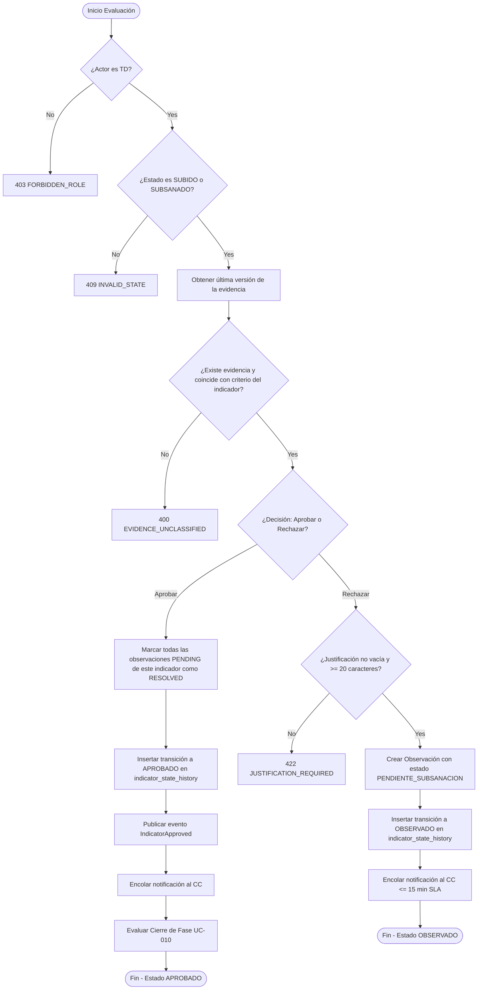

# Flowchart: FSD-UC-008 & FSD-UC-009 Indicator Validation Workflow

Este diagrama rige el flujo de aprobación y rechazo de indicadores.

```mermaid
flowchart TD
    Start([Inicio Evaluación]) --> CheckRole{¿Actor es TD?}
    CheckRole -- No --> Err403[403 FORBIDDEN_ROLE]
    CheckRole -- Yes --> CheckState{¿Estado es SUBIDO o SUBSANADO?}
    
    CheckState -- No --> Err409[409 INVALID_STATE]
    CheckState -- Yes --> FetchEvidence[Obtener última versión de la evidencia]
    
    FetchEvidence --> CheckEvidence{¿Existe evidencia y coincide con criterio del indicador?}
    CheckEvidence -- No --> Err400[400 EVIDENCE_UNCLASSIFIED]
    CheckEvidence -- Yes --> EvalAction{¿Decisión: Aprobar o Rechazar?}
    
    %% Approve Flow
    EvalAction -- Aprobar --> ResolveObs[Marcar todas las observaciones PENDING de este indicador como RESOLVED]
    ResolveObs --> TransApprove[Insertar transición a APROBADO en indicator_state_history]
    TransApprove --> PubApproveEvent[Publicar evento IndicatorApproved]
    PubApproveEvent --> NotifyCCApprove[Encolar notificación al CC]
    NotifyCCApprove --> PhaseClosure[Evaluar Cierre de Fase UC-010]
    PhaseClosure --> EndApprove([Fin - Estado APROBADO])
    
    %% Reject Flow
    EvalAction -- Rechazar --> CheckJustification{¿Justificación no vacía y >= 20 caracteres?}
    CheckJustification -- No --> Err422[422 JUSTIFICATION_REQUIRED]
    CheckJustification -- Yes --> CreateObservation[Crear Observación con estado PENDIENTE_SUBSANACION]
    CreateObservation --> TransReject[Insertar transición a OBSERVADO en indicator_state_history]
    TransReject --> NotifyCCReject[Encolar notificación al CC <= 15 min SLA]
    NotifyCCReject --> EndReject([Fin - Estado OBSERVADO])
```
