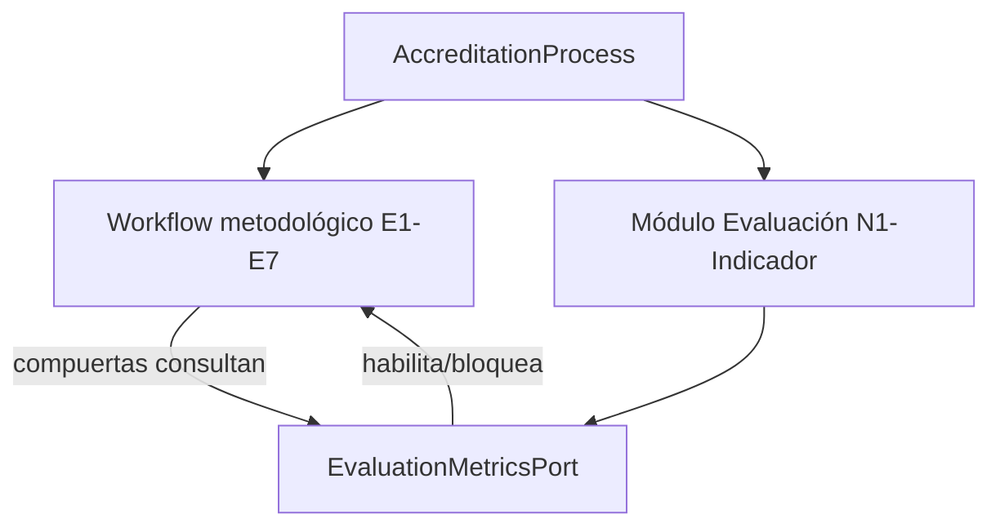

---

## producto: "SIGESA / AcredIA"
documento: LFSD ⚡ (Lean Functional Specification Document)
version: v2.0 (Vivo)
release: "2.0.0"
fecha_inicio_implementacion: "2026-05-16"
status: vivo
audiencia: dual (humanos + agentes IA)
baseline_ref: "docs/baseline/04_fsd/FSD.md"
ultima_actualizacion: "2026-09-09"

# Especificación Funcional Viva (LFSD ⚡) — SIGESA

> **Qué es:** Índice ágil de requerimientos funcionales durante la implementación.  
> **Modelo v2.0 (release 2.0.0):** **Modelo evaluador (CEUB  ARCU-SUR) → Nivel 1 → Nivel 2 → Nivel 3 → Indicador → Evidencia**, instanciado en un **Proceso** de acreditación por carrera. Ver `[glosario.md](glosario.md)` §2.  
> **Modelo v2.1 (ADR-0005):** **Workflow metodológico (7 etapas)** desacoplado del árbol normativo; evaluación **transversal** al ciclo. **M6 implementado** (UC-025…028); M7–M11 planificados. Ver §8–§10.  
> **Legacy v1.x:** Fase/Subfase — **retirado** (M5, Flyway V16). Ver §11.  
> **Atención agentes IA:** Para implementar un feature, naveguen al `FSD-UC-NNN` enlazado en la tabla inferior.  
> **Baseline congelado (no editar):** `[docs/baseline/04_fsd/FSD.md](../baseline/04_fsd/FSD.md)` · Dorada v1.0 · 2026-05-16

---

## 1. Referencias globales invariables

| Referencia                   | Ruta viva                                                                                                                                                                                                   |
| ---------------------------- | ----------------------------------------------------------------------------------------------------------------------------------------------------------------------------------------------------------- |
| Glosario del dominio         | `[glosario.md](glosario.md)` · `context/03_domain_glossary.md` (si existe en repo)                                                                                                                          |
| Reglas de negocio globales   | `[reglas_negocio.md](reglas_negocio.md)`                                                                                                                                                                    |
| Catálogo API completo        | `[api_contracts.md](api_contracts.md)`                                                                                                                                                                      |
| DTP (contrato técnico vivo)  | `[DTP.md](DTP.md)`                                                                                                                                                                                          |
| Máquina de estados Indicador | `PENDIENTE` → `SUBIDO` ↔ `OBSERVADO` / `APROBADO` · `[diagramas/FSD-UC-006_008_009_estados_indicador.mmd](diagramas/FSD-UC-006_008_009_estados_indicador.mmd)` *(diagrama legacy:* `estados_subfase.mmd`*)* |
| Jerarquía normativa v2.0     | `[glosario.md](glosario.md)` §2 · CEUB: Área→Variable→Sub-variable→Indicador · ARCU-SUR: Dimensión→Componente→Criterio→Indicador                                                                            |
| Workflow metodológico v2.1   | [ADR-0005](../adr/ADR-0005-workflow-metodologico-evaluacion-transversal.md) · `[modelo_datos.md](modelo_datos.md)` §9–§11 · `[MAR-ER-003](diagramas/MAR-ER-003-workflow-metodologico.mmd)`                  |
| Modelo documental AI-SDLC    | `[../MODELO_DOCUMENTAL_IMPLEMENTACION.md](../MODELO_DOCUMENTAL_IMPLEMENTACION.md)`                                                                                                                          |

**Artefactos descompuestos (solo lectura / histórico):** `[docs/baseline/04_fsd/](../baseline/04_fsd/)` — fuente de extracción del baseline.

---

## 2. Índice de casos de uso (módulos funcionales)

| ID           | Nombre                                                         | Actor            | Release | Estado                                             | FSD                             | Design Doc                                            | PR-IMPL                                               |
| ------------ | -------------------------------------------------------------- | ---------------- | ------- | -------------------------------------------------- | ------------------------------- | ----------------------------------------------------- | ----------------------------------------------------- |
| `FSD-UC-001` | Autenticación y sesión                                         | Interno          | v1.0    | **Hecho**                                          | [Ver detalle](uc/FSD-UC-001.md) | `[DD-UC-001](../design/DD-UC-001.md)`                 | `[PR-IMPL-001](../prompts/impl/PR-IMPL-001.md)`       |
| `FSD-UC-002` | Gestión de usuarios [JD]                                       | [JD]             | v1.0    | **Hecho**                                          | [Ver detalle](uc/FSD-UC-002.md) | `[DD-UC-002](../design/DD-UC-002.md)`                 | `[PR-IMPL-002](../prompts/impl/PR-IMPL-002.md)`       |
| `FSD-UC-003` | Plantillas y Proceso CEUB/ARCU-SUR                             | [JD]             | v2.0    | **Implementado v2**                                | [Ver detalle](uc/FSD-UC-003.md) | `[DD-UC-003](../design/DD-UC-003.md)`                 | `[PR-IMPL-003](../prompts/impl/PR-IMPL-003.md)`       |
| `FSD-UC-004` | Cargar Evidencia en Indicador                                  | [CC]             | v2.0    | **Implementado v2**                                | [Ver detalle](uc/FSD-UC-004.md) | `[DD-UC-004](../design/DD-UC-004.md)`                 | `[PR-IMPL-006](../prompts/impl/PR-IMPL-006.md)`       |
| `FSD-UC-005` | Versionado y bloqueo de borrado                                | [CC], [TD]       | v2.0    | **Implementado** *(evidencia por indicador en v2)* | [Ver detalle](uc/FSD-UC-005.md) | `[DD-UC-005](../design/DD-UC-005.md)`                 | `[PR-IMPL-035](../prompts/impl/PR-IMPL-035.md)`       |
| `FSD-UC-006` | Subsanar Evidencia                                             | [CC]             | v2.0    | **Implementado v2**                                | [Ver detalle](uc/FSD-UC-006.md) | `[DD-UC-006](../design/DD-UC-006.md)`                 | `[PR-IMPL-036](../prompts/impl/PR-IMPL-036.md)`       |
| `FSD-UC-007` | Buscar Evidencia                                               | [CC], [TD]       | v2.0    | **Implementado v2**                                | [Ver detalle](uc/FSD-UC-007.md) | `[DD-UC-007](../design/DD-UC-007.md)`                 | `[PR-IMPL-037](../prompts/impl/PR-IMPL-037.md)`       |
| `FSD-UC-008` | Rechazar Indicador                                             | [TD]             | v2.0    | **Implementado v2**                                | [Ver detalle](uc/FSD-UC-008.md) | `[DD-UC-008](../design/DD-UC-008.md)`                 | `[PR-IMPL-038](../prompts/impl/PR-IMPL-038.md)`       |
| `FSD-UC-009` | Aprobar Indicador                                              | [TD]             | v2.0    | **Implementado v2**                                | [Ver detalle](uc/FSD-UC-009.md) | `[DD-UC-009](../design/DD-UC-009.md)`                 | `[PR-IMPL-038](../prompts/impl/PR-IMPL-038.md)`       |
| `FSD-UC-010` | Cerrar Nivel 1 (Dimensión/Área)                                | [TD]             | v2.0    | **Implementado v2**                                | [Ver detalle](uc/FSD-UC-010.md) | `[DD-UC-010](../design/DD-UC-010.md)`                 | `[PR-IMPL-039](../prompts/impl/PR-IMPL-039.md)`       |
| `FSD-UC-011` | Dashboard [CC] y observaciones                                 | [CC]             | v2.0    | **En Curso**                                       | [Ver detalle](uc/FSD-UC-011.md) | `[DD-UC-011](../design/DD-UC-011.md)`                 | `[PR-IMPL-011](../prompts/impl/PR-IMPL-011.md)`       |
| `FSD-UC-012` | Bandeja auditoría [TD]                                         | [TD]             | v2.0    | **En Curso**                                       | [Ver detalle](uc/FSD-UC-012.md) | —                                                     | —                                                     |
| `FSD-UC-013` | Panel semáforo [JD]                                            | [JD]             | v2.0    | **En Curso**                                       | [Ver detalle](uc/FSD-UC-013.md) | —                                                     | —                                                     |
| `FSD-UC-014` | Reporte ejecutivo PDF                                          | [JD]             | v1.0    | **Implementado**                                   | [Ver detalle](uc/FSD-UC-014.md) | `[DD-UC-014](../design/DD-UC-014.md)`                 | `[PR-IMPL-005](../prompts/impl/PR-IMPL-005.md)`       |
| `FSD-UC-015` | Notificaciones y alertas                                       | Sistema          | v2.0    | Pendiente                                          | [Ver detalle](uc/FSD-UC-015.md) | —                                                     | —                                                     |
| `FSD-UC-016` | Portal público                                                 | [P]              | v1.1    | Pendiente                                          | [Ver detalle](uc/FSD-UC-016.md) | —                                                     | —                                                     |
| `FSD-UC-017` | Bitácora de auditoría                                          | [JD]             | v1.0    | Pendiente                                          | [Ver detalle](uc/FSD-UC-017.md) | —                                                     | —                                                     |
| `FSD-UC-018` | Importación masiva                                             | [CC]             | v1.1    | Pendiente                                          | [Ver detalle](uc/FSD-UC-018.md) | —                                                     | —                                                     |
| `FSD-UC-019` | Consulta de procesos de acreditación                           | [JD], [TD], [CC] | v2.0    | **Implementado v2**                                | [Ver detalle](uc/FSD-UC-019.md) | `[DD-UC-019](../design/DD-UC-019.md)`                 | `[PR-IMPL-019](../prompts/impl/PR-IMPL-019.md)`       |
| `FSD-UC-020` | Revisión documental [EE]                                       | [EE]             | v2.0    | **En Curso**                                       | [Ver detalle](uc/FSD-UC-020.md) | `[DD-UC-020](../design/DD-UC-020.md)`                 | `[PR-IMPL-014](../prompts/impl/PR-IMPL-014.md)`       |
| `FSD-UC-021` | Gestión de plantillas normativas (jerarquía N1–N3 + Indicador) | [JD]             | v2.0    | **Hecho (Full-Stack v2)**                          | [Ver detalle](uc/FSD-UC-021.md) | `[DD-UC-021](../design/DD-UC-021.md)`                 | `[PR-IMPL-021](../prompts/impl/PR-IMPL-021.md)`       |
| `FSD-UC-022` | Gestión de estructura normativa en proceso                     | [JD], [TD]       | v2.0    | **Implementado v2**                                | [Ver detalle](uc/FSD-UC-022.md) | `[DD-UC-022](../design/DD-UC-022.md)`                 | `[PR-IMPL-022](../prompts/impl/PR-IMPL-022.md)`       |
| `FSD-UC-023` | Asignación de responsable [CC] a proceso                       | [JD]             | v1.0    | **Hecho (Full-Stack)**                             | [Ver detalle](uc/FSD-UC-023.md) | `[DD-UC-023](../design/DD-UC-023.md)`                 | `[PR-IMPL-023](../prompts/impl/PR-IMPL-023.md)`       |
| `FSD-UC-024` | Copiloto de control documental                                 | [TD]/[CC]/[JD]   | v2.0    | **Hecho (Full-Stack + MCP)**                       | [Ver detalle](uc/FSD-UC-024.md) | `[DD-AGENT-003](../design/assistant/DD-AGENT-003.md)` | `[PR-IMPL-026](../prompts/impl/PR-IMPL-026.md)`       |
| `FSD-UC-025` | Timeline etapas metodológicas                                  | [CC], [TD], [JD] | v2.1    | **Implementado**                                   | [Ver detalle](uc/FSD-UC-025.md) | `[DD-UC-025](../design/DD-UC-025.md)`                 | `[PR-IMPL-M6-025](../prompts/impl/PR-IMPL-M6-025.md)` |
| `FSD-UC-026` | Enviar etapa a revisión [CC]                                   | [CC]             | v2.1    | **Implementado**                                   | [Ver detalle](uc/FSD-UC-025.md) | `[DD-UC-025](../design/DD-UC-025.md)`                 | `[PR-IMPL-M6-025](../prompts/impl/PR-IMPL-M6-025.md)` |
| `FSD-UC-027` | Aprobar/rechazar etapa metodológica                            | [TD], [JD]       | v2.1    | **Implementado**                                   | [Ver detalle](uc/FSD-UC-025.md) | `[DD-UC-025](../design/DD-UC-025.md)`                 | `[PR-IMPL-M6-025](../prompts/impl/PR-IMPL-M6-025.md)` |
| `FSD-UC-028` | Compuertas de avance (gate preview)                            | [TD]             | v2.1    | **Implementado**                                   | [Ver detalle](uc/FSD-UC-025.md) | `[DD-UC-025](../design/DD-UC-025.md)`                 | `[PR-IMPL-M6-025](../prompts/impl/PR-IMPL-M6-025.md)` |
| `FSD-UC-029` | Métricas completitud evaluación                                | [CC], [TD], [JD] | v2.1    | **Planificado**                                    | —                               | —                                                     | —                                                     |
| `FSD-UC-030` | Congelamiento / Sala de Pares                                  | [TD], [EE]       | v2.1    | **Planificado**                                    | —                               | —                                                     | —                                                     |
| `FSD-UC-031` | Plan de Mejoras post-acreditación                              | [CC], [TD]       | v2.1    | **Planificado**                                    | —                               | —                                                     | —                                                     |

**Leyenda de estado:** `Pendiente` · `En Curso` · `Implementado` / `Implementado v2` · `Hecho` / `Hecho (Full-Stack)` · `Planificado` *(ADR-0005, sin código)* · `Reespecificado` *(spec v2 reescrita; revisar atom UC o índice)* · `Verificado` · `Obsoleto`

**Snapshot (2026-09-09):** Release **2.0.0** cerrado (M5 legacy retirado; UC-004…010 v2 operativos). Release **2.1.0** en curso — **M6** (UC-025…028) implementado; M7–M11 pendientes.

---

## 3. Reglas críticas del sistema (hard constraints)

1. **Append-Only:** Prohibido el borrado físico (`DELETE`) de Evidencias aprobadas. Intentos → `409 EVIDENCE_IMMUTABLE` + `AUDIT_DELETE_DENIED` (FSD-BR-02, FSD-BR-15).
2. **Cierre de Nivel 1:** `COUNT(indicadores_subárbol) == COUNT(indicadores WHERE estado = APROBADO)`. Si no se cumple → `409 NIVEL1_CIERRE_BLOQUEADO` (FSD-BR-07). *Legacy v1: cierre de Fase.*
3. **Aislamiento de rol:** El Coordinador [CC] solo accede a información de **su propia carrera** (FSD-BR-09).
4. **Separación de dictamen:** Solo [TD] aprueba/rechaza **Indicador**; dictamen final institucional solo humano (FSD-BR-04, FSD-BR-11). *Legacy v1: Subfase.*
5. **Correo institucional:** Cuentas solo `@umss.edu.bo` (FSD-BR-12).
6. **Jerarquía normativa:** Toda Evidencia exige `indicatorId` válido en el árbol N1→N2→N3 del proceso (FSD-BR-01). *Legacy v1:* `subphaseId`*.*

---

## 4. Actores (referencia rápida)

| Actor                   | Código                       | Responsabilidad                                                                      |
| ----------------------- | ---------------------------- | ------------------------------------------------------------------------------------ |
| Coordinador de Carrera  | [CC]                         | Carga/subsana evidencias; envía etapas a revisión; responsable operativo del proceso |
| Técnico DUEA / ODE      | [TD]                         | Aprueba/rechaza indicadores; cierra N1; aprueba entregables de etapa; compuertas     |
| Jefatura DUEA           | [JD]                         | Usuarios, plantillas, semáforo, PDF; autoriza paso formal entre etapas               |
| Evaluador externo / Par | [EE]                         | Solo lectura en modo auditoría (Sala de Pares, simulación)                           |
| Miembro CAE / auxiliar  | `CAE_MEMBER` *(planificado)* | Carga evidencias y FODA en ámbito delegado                                           |
| Público                 | [P]                          | Consulta portal (solo publicados)                                                    |

### 4.1 Matriz rol × módulo (resumen)

| Acción                               | CC  | TD  | JD  | EE  | CAE |
| ------------------------------------ | --- | --- | --- | --- | --- |
| Cargar evidencia en indicador        | ✓   | —   | —   | —   | ✓*  |
| Aprobar/rechazar indicador           | —   | ✓   | —   | —   | —   |
| Cerrar N1 (dimensión/área)           | —   | ✓   | —   | —   | —   |
| Enviar etapa metodológica a revisión | ✓   | —   | —   | —   | —   |
| Aprobar entregable de etapa          | —   | ✓   | ✓   | —   | —   |
| Navegar árbol en auditoría           | —   | ✓   | ✓   | ✓   | —   |
| Editar FODA                          | ✓   | —   | —   | —   | ✓*  |

 Alcance delegado por N1/N2/indicador (ADR-0005 §5).

---

## 5. Trazabilidad viva → implementación

Cadena obligatoria (ver `[MODELO_DOCUMENTAL_IMPLEMENTACION.md](../MODELO_DOCUMENTAL_IMPLEMENTACION.md)`):

`Código → PR-IMPL-NNN → DD-UC-NNN → FSD-UC-NNN → DTP / PRD vivo`

| Task Spec Kit                     | FSD-UC                                  | Release |
| --------------------------------- | --------------------------------------- | ------- |
| T-001 Modelo normativo + Proceso  | UC-003, UC-021, UC-022, UC-023          | v2.0    |
| T-002 Auth + RBAC                 | UC-001, UC-002                          | v1.0-rc |
| T-003 Upload + versionado         | UC-004, UC-005                          | v2.0    |
| T-004 State machine Indicador     | UC-008, UC-009, UC-010                  | v2.0    |
| T-005 Observaciones + subsanación | UC-006, UC-008                          | v1.0-rc |
| T-006 Búsqueda indexada           | UC-007                                  | v1.0-rc |
| T-007 Dashboards + semáforo       | UC-011, UC-012, UC-013                  | v1.0    |
| T-008 Notificaciones outbox       | UC-015                                  | v1.0    |
| T-009 Reporte PDF                 | UC-014                                  | v1.0    |
| T-010 Bitácora append-only        | UC-017                                  | v1.0    |
| T-011 Portal público              | UC-016                                  | v1.1    |
| T-012 Importación CSV             | UC-018                                  | v1.1    |
| T-013 MOD-ASSISTANT copilotos     | UC-024 (+ agentes embebidos UC-002/022) | v1.0    |
| T-014 Workflow metodológico       | UC-025…031                              | v2.1    |

**Estado Task Spec Kits (2026-09-08):**

| Kit   | Estado                                                                             |
| ----- | ---------------------------------------------------------------------------------- |
| T-001 | ✅ Cerrado v2.0 — M5 retiró legacy Fase/Subfase (Flyway V16, UI/API v2-only)        |
| T-002 | ✅ Cerrado                                                                          |
| T-003 | ✅ Cerrado v2.0 — evidencia en Indicador (UC-004, UC-005)                           |
| T-004 | ✅ Cerrado v2.0 — workflow Indicador + cierre N1 (UC-008…010)                       |
| T-005 | ✅ Cerrado (UC-006 subsanación + UC-008 rechazo formal TD)                          |
| T-006 | ✅ Implementado (buscador + FTS GIN V11 en prod; LIKE fallback dev/H2)              |
| T-007 | ⚠️ Parcial — UI híbrida `/dashboard`; rutas dedicadas y workflow TD/JD incompletos |
| T-008 | ❌ Pendiente (`NoOpNotificationOutboxAdapter`)                                      |
| T-009 | ✅ Cerrado                                                                          |
| T-010 | ❌ Pendiente (`NoOpAuditLogAdapter`)                                                |
| T-011 | ❌ Pendiente (v1.1)                                                                 |
| T-012 | ❌ Pendiente (v1.1)                                                                 |
| T-013 | ✅ Cerrado (UC-024 + copilotos MOD-ASSISTANT)                                       |
| T-014 | ⚠️ Parcial — **M6** ✅ (UC-025…028); M7–M11 pendientes                              |

---

## 8. Arquitectura dual: Workflow × Evaluación

SIGESA separa dos bounded contexts (ADR-0005):

| Módulo                    | Eje                     | Responsabilidad                                  | Estado código                                       |
| ------------------------- | ----------------------- | ------------------------------------------------ | --------------------------------------------------- |
| **Evaluación normativa**  | Transversal (taxonomía) | Árbol CEUB/ARCU, evidencias, FODA, métricas      | ✅ v2.0 (UC-003…010)                                 |
| **Workflow metodológico** | Temporal (metodología)  | 7 etapas, entregables, compuertas, congelamiento | ⚠️ v2.1 **M6** (E1–E2 + timeline); M7–M11 pendiente |

**Principio:** N1 (Dimensión/Área) **≠** Etapa metodológica. Confundirlos fue el error del modelo v1.x (Fase/Subfase).

Diagrama ER integrado: `[diagramas/MAR-ER-003-workflow-metodologico.mmd](diagramas/MAR-ER-003-workflow-metodologico.mmd)`.

---

## 9. Etapas metodológicas y entregables

Ciclo común CEUB y ARCU-SUR (7 etapas + post-acreditación recurrente):

| #   | Código               | Etapa                          | Entregables clave para aprobar                                                                 | Uso del módulo evaluación          |
| --- | -------------------- | ------------------------------ | ---------------------------------------------------------------------------------------------- | ---------------------------------- |
| 1   | `PREPARATORY`        | Preparatoria y administrativa  | Resolución HCC (CAE), cronograma, informe recomendaciones previas, previsión presupuestaria    | Revisión proceso anterior          |
| 2   | `COLLECTION`         | Recolección de información     | Repo evidencias secundarias 100%, reporte encuestas, informe de vacíos                         | Carga evidencias en indicadores    |
| 3   | `SYSTEMATIZATION`    | Sistematización y análisis     | FODA completos, matriz de síntesis                                                             | `IndicatorAnalysis`                |
| 4   | `DRAFTING`           | Elaboración documentos clave   | Informe autoevaluación, formulario oficial CNACU/CEUB, Plan Mejoras, Plan Desarrollo Académico | Consolidación desde árbol          |
| 5   | `PRESENTATION`       | Presentación y validación      | Acta validación comunitaria, paquete formal DUEA/CNACU                                         | Snapshot cumplimiento              |
| 6   | `EXTERNAL_PREP`      | Preparación evaluación externa | Acta simulación, checklist Sala de Pares                                                       | **Congelamiento** read-only + [EE] |
| 7   | `POST_ACCREDITATION` | Seguimiento post-acreditación  | Informes periódicos Plan de Mejoras                                                            | Monitoreo cíclico debilidades      |

Estados de etapa: `PENDING` → `IN_PROGRESS` → `SUBMITTED_FOR_REVIEW` → (`OBSERVED`  `APPROVED`).

### 9.1 Compuertas de avance (gateways)

| Transición | Regla mínima                                                       | Error                    |
| ---------- | ------------------------------------------------------------------ | ------------------------ |
| Cerrar E1  | Entregables E1 aprobados por [TD]                                  | `409 STAGE_GATE_BLOCKED` |
| E2 → E3    | 100% indicadores con ≥1 evidencia; encuestas primarias registradas | idem                     |
| Cerrar E3  | FODA completos en scope configurado                                | idem                     |
| E4 → E5    | Documentos E4 generados y aprobados                                | idem                     |
| Entrar E6  | `ProcessFreeze = AUDIT_READONLY`                                   | idem                     |

UC-010 (cierre N1) permanece como compuerta **local** dentro del módulo de evaluación.

### 9.2 Modos operativos del proceso

| Modo                     | Evaluación             | Workflow              |
| ------------------------ | ---------------------- | --------------------- |
| `ACTIVE`                 | Editable según etapa   | Avance con compuertas |
| `AUDIT_READONLY`         | Solo lectura [EE]/[TD] | Etapa 6               |
| `IMPROVEMENT_MONITORING` | Parcial (plan mejora)  | Etapa 7 cíclica       |

---

## 10. Roadmap release 2.1.0 (ADR-0005)

| Milestone | Entregable                               | UC                                                  |
| --------- | ---------------------------------------- | --------------------------------------------------- |
| **M6**    | Etapas + entregables E1–E2 + UI timeline | UC-025, UC-026, UC-027, UC-028 — **✅ implementado** |
| **M7**    | `DocumentAsset` + enlace M:N indicadores | UC-004 ext.                                         |
| **M8**    | FODA + compuerta E2→E3 + delegación CAE  | UC-028, UC-029                                      |
| **M9**    | Generación informes E4 + Plan Mejoras    | UC-031                                              |
| **M10**   | Congelamiento + Sala de Pares + [EE]     | UC-030, UC-020                                      |
| **M11**   | Post-acreditación cíclica                | UC-031                                              |

**Requisitos transversales planificados:**

- Redireccionamiento documental M:N (un PDF → N indicadores)
- Foliado digital (`DocumentAsset.folioCode`) + control de versiones append-only
- Exportación jerárquica por carpetas (dimensión/área/indicador)
- Tablero completitud en tiempo real por N1 (UC-029 alimenta UC-011…013)

---

## 6. Registro de cambios (capa viva)

| Fecha      | Cambio                                                                                                                                                                                                                                                                        |
| ---------- | ----------------------------------------------------------------------------------------------------------------------------------------------------------------------------------------------------------------------------------------------------------------------------- |
| 2026-06-15 | Transformación FSD clásico → **LFSD ⚡**; 18 UC atomizados en `[uc/](uc/)`                                                                                                                                                                                                     |
| 2026-06-15 | UC-003 marcado **En Curso** (scaffolding Gestión de Fases en código)                                                                                                                                                                                                          |
| 2026-08-03 | FSD-UC-019 implementado (consulta procesos); FSD-UC-020 rol [EE]; PM-004/PM-005 gestión usuarios                                                                                                                                                                              |
| 2026-08-07 | Nuevos UC-021 (plantillas CRUD), UC-022 (estructura en proceso), UC-023 (responsable [CC]); UC-003/019 actualizados                                                                                                                                                           |
| 2026-08-07 | Design docs DD-UC-021, DD-UC-022, DD-UC-023 (borrador)                                                                                                                                                                                                                        |
| 2026-08-07 | Contratos PR-IMPL-021, PR-IMPL-022, PR-IMPL-023 (backend)                                                                                                                                                                                                                     |
| 2026-08-07 | FSD-UC-023 Full-Stack implementado (API-PROC-09…11 + UI responsable); PM-010                                                                                                                                                                                                  |
| 2026-08-07 | FSD-UC-022 Full-Stack implementado (API-PROC-05…08 + UI `/procesos/{id}/estructura`); PM-009                                                                                                                                                                                  |
| 2026-08-07 | FSD-UC-022: contrato PR-IMPL-022 aprobado (API-PROC-05…08); PM-008 documental                                                                                                                                                                                                 |
| 2026-08-07 | FSD-UC-021 backend implementado (API-TPL-01…08); UI `/admin/plantillas` pendiente `PR-IMPL-021-FE`                                                                                                                                                                            |
| 2026-08-21 | FSD-UC-024 copiloto control documental Full-Stack + MCP (`mcp/sigesa-evidence`); PM-013                                                                                                                                                                                       |
| 2026-08-27 | **Reconciliación de estados** contra código: UC-003 → Implementado; UC-021 → Hecho (Full-Stack); UC-011/012/013 → En Curso; snapshot T-001…T-013 y bloque workflow pendiente                                                                                                  |
| 2026-08-27 | **FSD-UC-005:** historial de versiones (`GET /evidences/{id}/versions`) + bloqueo DELETE append-only (`409 EVIDENCE_IMMUTABLE`); UI historial en subfases; PM-002 sprint 3                                                                                                    |
| 2026-08-27 | **FSD-UC-007:** API-EVD-02 búsqueda multifiltro; panel en detalle de proceso; PM-004 sprint 3                                                                                                                                                                                 |
| 2026-08-27 | **FSD-UC-006:** subsanación por subfase (API-SUB-02), una subsanación por observación OPEN, historial liviano (`blob_purged`); PM-003 sprint 3                                                                                                                                |
| 2026-09-02 | **MOD-ASSISTANT UI shell:** copilotos fases/evidencias/usuarios unificados en ventana flotante (`DomainCopilotFloatingChat`); historial conversaciones `sessionStorage`; `/ayuda` sin cambios; [DD-AGENT-UI-SHELL](../design/assistant/DD-AGENT-UI-SHELL.md); PM-007 sprint 3 |
| 2026-09-08 | **FSD-UC-021 Full-Stack v2:** API-TPL-08 jerarquía plantilla; UI tabs v2/legacy `/admin/plantillas`; publicación BR-24; duplicar clona árbol v2; PM-008 sprint 3                                                                                                              |
| 2026-09-08 | **FSD-UC-003 v2:** `POST /processes` clona N1→N2→N3→Indicador (`ProcessNormativeTreeCloner`); validación A4; PM-009 sprint 3                                                                                                                                                  |
| 2026-09-08 | **ADR-0004** aceptada; `modelo_datos.md`, `reglas_negocio.md`, `api_contracts.md`, `DTP.md` v2.0                                                                                                                                                                              |
| 2026-09-08 | **ADR-0005** aceptada: workflow metodológico 7 etapas, evaluación transversal, compuertas, UC-025…031 planificados; MAR-ER-003; FSD §8–§10                                                                                                                                    |
| 2026-09-08 | **M5 retiro legacy:** Flyway V16; UI/API v2-only                                                                                                                                                                                                                              |
| 2026-09-09 | **M6 workflow metodológico:** Flyway V17; UC-025…028 (API-WF-04…08, timeline UI, bootstrap etapas); `FSD-UC-025`, `PR-IMPL-M6-025`; PM-010 sprint 3                                                                                                                           |
| 2026-09-09 | **Reconciliación índice v2.0:** UC-004…010, UC-019 → **Implementado v2** (alineado a atom UC y código post-M5)                                                                                                                                                                |
| 2026-09-09 | **UI árbol normativo:** capas desplegables N1→Indicador (`NormativeCollapsibleLayer`); PM-011 sprint 3                                                                                                                                                                        |
| 2026-09-09 | **README + PM sprint 03:** releases 2.0.0/2.1.0; PM-011…013 (UI capas, fix login, sync docs)                                                                                                                                                                                  |
| 2026-08-27 | **Pivot modelo v1.1:** Proceso→Fase→Subfase→Evidencia *(supersedido por v2.0)*                                                                                                                                                                                                |

---

## 11. Migración implementación v1.x → v2.0

| Capa                        | Estado (2026-09-08)         | Acción pendiente                |
| --------------------------- | --------------------------- | ------------------------------- |
| FSD / glosario              | ✅ Actualizado               | §8–§10 workflow (ADR-0005)      |
| ADR-0004                    | ✅ Aceptada e implementada   | —                               |
| ADR-0005                    | ✅ Aceptada                  | M6 ✅ (V17); M7–M11 pendientes   |
| `modelo_datos.md`           | ✅ v2.1                      | V17 aplicado (M6); V18+ en M7+  |
| Backend legacy Fase/Subfase | ✅ Retirado M5               | —                               |
| Frontend legacy             | ✅ Retirado M5               | —                               |
| Diagramas `.mmd`            | ✅ MAR-ER-001 v2, MAR-ER-003 | Secuencia etapas (opcional M8+) |
| Workflow UI timeline        | ✅ M6                        | Entregables E3–E7 en M8–M11     |

**Mapeo histórico v1.x:** Fase → N1 · Subfase → Indicador · evidencia: `subphase_id` → `normative_indicator_id`.

Divergencias de implementación respecto a este FSD requieren **ADR** en `docs/adr/` antes de merge.