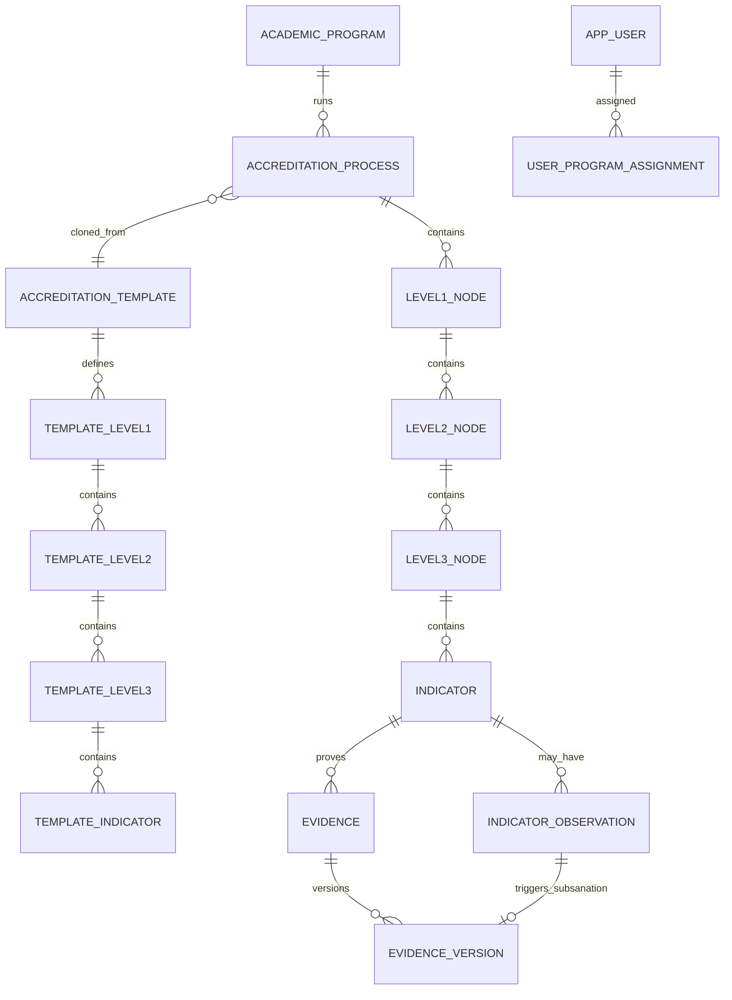

# Modelo de datos funcional — SIGESA / AcredIA

## Control de versión

| Campo | Valor |
|-------|-------|
| **Diagrama ER evaluación (implementado)** | [`diagramas/MAR-ER-001-modelo-datos-nucleo.mmd`](diagramas/MAR-ER-001-modelo-datos-nucleo.mmd) |
| **Diagrama ER integrado (diseño 2.1+)** | [`diagramas/MAR-ER-003-workflow-metodologico.mmd`](diagramas/MAR-ER-003-workflow-metodologico.mmd) |
| **Versión** | v2.1 (evaluación v2.0 implementada + workflow metodológico diseñado) |
| **Release implementado** | `2.0.0` (M5) |
| **Release objetivo diseño** | `2.1.0` (M6–M11) |
| **Timestamp** | `2026-09-08T21:00:00-04:00` |
| **Vista** | Lógica / de dominio (FSD) |
| **Glosario** | [`glosario.md`](glosario.md) |
| **ADR** | [ADR-0004](../adr/ADR-0004-normative-hierarchy-v2.md) · [ADR-0005](../adr/ADR-0005-workflow-metodologico-evaluacion-transversal.md) |

> **Implementado (2.0.0):** **Proceso → Modelo evaluador → N1 → N2 → N3 → Indicador → Evidencia**.  
> **Diseñado (2.1.0+):** **Workflow metodológico (7 etapas)** desacoplado del árbol normativo, unido por compuertas y métricas (ADR-0005).

---

## 1. Principios

| Principio | Regla funcional |
|-----------|-----------------|
| Append-only | Sin borrado físico de Evidencia aprobada; subsanación = nueva `EvidenceVersion` |
| Trazabilidad | `version`, `supersedesVersion`, `observationId`, `createdBy`, `createdAt`, `folioCode` |
| Jerarquía normativa | CEUB/ARCU-SUR: **N1 → N2 → N3 → Indicador → Evidencia**, instanciada en `AccreditationProcess` |
| Evaluación transversal | El árbol normativo **no es una fase**; se usa desde Preparatoria hasta Post-acreditación |
| Workflow metodológico | Siete etapas temporales con entregables y compuertas independientes de la taxonomía CEUB/ARCU |
| Workflow indicador | Estados en **Indicador** (no en N2/N3); cierre agregado en **N1** |
| Aislamiento [CC] | Datos acotados a `programId` del coordinador |
| Un Proceso activo | Por carrera + modelo evaluador + periodo (FSD-BR-08) |
| Redireccionamiento | Un `DocumentAsset` puede enlazarse a múltiples indicadores (M:N) sin duplicar blob |

---

## 2. Diagrama ER — Módulo de Evaluación (v2.0 implementado)

Fuente: [`MAR-ER-001-modelo-datos-nucleo.mmd`](diagramas/MAR-ER-001-modelo-datos-nucleo.mmd)



### 2.1 Mapeo semántico CEUB / ARCU-SUR

| Nivel genérico | ARCU-SUR | CEUB | Tabla |
|----------------|----------|------|-------|
| N1 | Dimensión (4) | Área (10) | `level1_nodes` |
| N2 | Componente | Variable | `level2_nodes` |
| N3 | Criterio | Sub-variable | `level3_nodes` |
| Hoja | Indicador (203 total ARCU) | Indicador | `indicators` |

---

## 3. Entidades core — implementadas (release 2.0.0)

### 3.1 Maestros institucionales

| Entidad (EN) | ES | Atributos clave | Notas |
|--------------|-----|-----------------|-------|
| `AcademicProgram` | Carrera | `id`, `code`, `name`, `status` | Unidad de acreditación |
| `AppUser` | Usuario | `id`, `email`, `role`, `status` | Rol (`CC`/`TD`/`JD`/`EE`); email `@umss.edu.bo` |
| `UserProgramAssignment` | Asignación alcance | `id`, `userId`, `programId`, `assignedAt`, `revokedAt` | Alcance carrera [CC]/[EE] (FSD-BR-09) |

### 3.2 Plantilla normativa

| Entidad | Atributos clave | Notas |
|---------|-----------------|-------|
| `AccreditationTemplate` | `evaluatorModel` (CEUB \| ARCU-SUR), `name`, `version`, `status` | Activada por [JD]; `DRAFT` \| `PUBLISHED` \| `ARCHIVED` |
| `TemplateLevel1` | `templateId`, `order`, `name`, `description` | Dimensión (ARCU) / Área (CEUB) |
| `TemplateLevel2` | `level1Id`, `order`, `name`, `description` | Componente / Variable |
| `TemplateLevel3` | `level2Id`, `order`, `name`, `description` | Criterio / Sub-variable |
| `TemplateIndicator` | `level3Id`, `code`, `description`, `weight`, `order`, `referenceUrl` | Hoja de plantilla; clonada al crear proceso |

### 3.3 Proceso en ejecución

| Entidad | Atributos clave | Notas |
|---------|-----------------|-------|
| `AccreditationProcess` | `programId`, `templateId`, `evaluatorModel`, `managementYear`, `status` | `ACTIVE` \| `COMPLETED` \| `CANCELLED` |
| `Level1Node` | `processId`, `order`, `name`, `description`, `status` | `ABIERTA` \| `COMPLETADA` — UC-010 |
| `Level2Node` | `level1Id`, `order`, `name`, `description` | Contenedor normativo |
| `Level3Node` | `level2Id`, `order`, `name`, `description` | Contenedor normativo |
| `Indicator` | `level3Id`, `code`, `description`, `weight`, `order`, `referenceUrl`, `status` | **Unidad de workflow y evidencias** |

### 3.4 Evidencia, observaciones y auditoría

| Entidad | Atributos clave | Notas |
|---------|-----------------|-------|
| `Evidence` | `normativeIndicatorId`, `latestVersionId` | Cabecera estable; FK a Indicador |
| `EvidenceVersion` | `evidenceId`, `versionNumber`, `contentHash`, `description`, `externalUrl`, `indicatorObservationId` | Append-only; archivo y/o enlace |
| `IndicatorObservation` | `indicatorId`, `body`, `status` (OPEN\|RESOLVED), `authorId`, `authorRole`, `resolvedVersionId` | Origen de subsanación y rechazo TD |
| `AuditLog` | `action`, `actorId`, `entityType`, `entityId`, `payload` | Login, DELETE denegado, etc. |
| `NotificationOutbox` | `eventType`, `recipientId`, `payload`, `sentAt` | Patrón outbox |

---

## 4. Máquina de estados — Indicador

| Estado | Descripción |
|--------|-------------|
| `PENDIENTE` | Sin Evidencia cargada |
| `SUBIDO` | Evidencia en revisión [TD] |
| `OBSERVADO` | Rechazada con observación OPEN |
| `SUBSANADO` | Nueva versión enviada; pendiente re-revisión |
| `APROBADO` | Validación [TD] completa |

Transiciones: UC-004, UC-006, UC-008, UC-009. Cierre N1 (UC-010): todos los indicadores del subárbol = `APROBADO`.

---

## 5. Diccionario de validación (campos críticos)

| Entidad | Atributo | Tipo lógico | Obl. | Validación |
|---------|----------|-------------|------|------------|
| `Evidence` | `normativeIndicatorId` | UUID | sí | Indicador existe; carrera ∈ alcance [CC] |
| `EvidenceVersion` | `contentHash` | string(64) | cond. | SHA-256 del blob (si hay archivo) |
| `EvidenceVersion` | `description` | text | sí | Metadato obligatorio |
| `EvidenceVersion` | `externalUrl` | URL | cond. | HTTPS si se usa enlace sin archivo |
| `IndicatorObservation` | `body` | text | sí | min 20 caracteres en rechazo formal TD |
| `Indicator` | `code` | string | sí | Único dentro del Nivel 3 |
| `Indicator` | `weight` | decimal | sí | ≥ 0 (FSD-BR-25) |
| `Indicator` | `referenceUrl` | URL | sí | HTTPS (plantilla y proceso) |
| `AppUser` | `email` | string | sí | Dominio `@umss.edu.bo` |

**Invariante:** al menos **uno** de `contentHash` o `externalUrl` en cada versión de evidencia.

---

## 6. Mapeo lógico → físico (implementado)

| Entidad lógica | Tabla física | Flyway |
|----------------|--------------|--------|
| `AccreditationTemplate` | `templates` | V14+ |
| `TemplateLevel1…3`, `TemplateIndicator` | `template_level1_nodes`, … | V14 |
| `AccreditationProcess` | `accreditation_processes` | V5+ |
| `Level1Node`, `Level2Node`, `Level3Node` | `level1_nodes`, `level2_nodes`, `level3_nodes` | V14 |
| `Indicator` | `indicators` | V14 |
| `Evidence` | `evidence` (`normative_indicator_id`) | V14, V16 |
| `EvidenceVersion` | `evidence_version` | V9+ |
| `IndicatorObservation` | `indicator_observation` | V14 |

**M5 (V16):** eliminadas tablas legacy `phases`, `subphases`, `template_phases`, `template_subphases`, `subphase_observation` y columnas `legacy_*`, `evidence.subphase_id`.

---

## 7. Reglas de datos vinculadas

| Regla FSD | Impacto en modelo |
|-----------|-------------------|
| FSD-BR-01 | Evidencia exige `normativeIndicatorId` + metadatos |
| FSD-BR-02 | Sin DELETE en `evidence_version` aprobada |
| FSD-BR-06 | FK observación en versión subsanatoria |
| FSD-BR-07 | Cierre N1 cuando todos los indicadores del subárbol = APROBADO |
| FSD-BR-09 | Filtro `program_id` en queries [CC] |
| FSD-BR-22 | No eliminar indicador con evidencias/workflow iniciado |
| FSD-BR-24 | Plantilla publicada exige árbol completo hasta indicador |
| FSD-BR-25 | `weight` obligatorio y ≥ 0 en indicador |

---

## 8. Migración v1.x → v2.0 (histórico)

| Origen | Destino | Script |
|--------|---------|--------|
| `phases` | `level1_nodes` | V15 |
| `subphases` | `indicators` (+ N2/N3 placeholder) | V15 |
| `subphase_observation` | `indicator_observation` | V15 |
| Tablas legacy | DROP | **V16** (M5) |

---

## 9. Módulo de Evaluación — ciclo de vida transversal

El árbol normativo **permanece activo** (con distintos modos de edición) a lo largo del workflow metodológico:

| Etapa metodológica | Actividad principal en evaluación |
|--------------------|-----------------------------------|
| E1 Preparatoria | Consulta proceso anterior; indicadores/recomendaciones heredadas |
| E2 Recolección | Carga evidencias en indicadores; detección vacíos |
| E3 Sistematización | FODA (`IndicatorAnalysis`) por indicador/N1 |
| E4 Elaboración | Extracción datos → informes oficiales |
| E5 Presentación | Snapshot de cumplimiento |
| E6 Eval. externa | Modo `AUDIT_READONLY`; rol [EE] |
| E7 Post-acreditación | Seguimiento debilidades → Plan de Mejoras |

**Métricas calculadas** (puerto `EvaluationMetricsPort`, planificado M6):

```
completitud_N1(k) = indicadores_con_evidencia(k) / indicadores_totales(k)
vacíos = { indicador | obligatorio ∧ sin_evidencia ∧ etapa ≥ COLLECTION }
```

---

## 10. Módulo Workflow metodológico — entidades planificadas (2.1.0+)

Fuente ER: [`MAR-ER-003-workflow-metodologico.mmd`](diagramas/MAR-ER-003-workflow-metodologico.mmd)

### 10.1 Gestión de etapas

| Entidad | Atributos clave | Notas |
|---------|-----------------|-------|
| `MethodologicalStage` | `processId`, `order` (1–7), `code`, `status`, `startedAt`, `closedAt` | Una fila por etapa por proceso |
| `StageDeliverable` | `stageId`, `deliverableCode`, `approvalStatus`, `documentAssetId`, `approvedBy` | Hitos: Resolución HCC, Informe autoevaluación, Acta validación, etc. |
| `StageGateEvaluation` | `stageId`, `gateRulesSnapshot`, `result` (PASS\|BLOCK), `evaluatedAt` | Append-only; auditable |
| `ProcessFreeze` | `processId`, `mode`, `frozenAt`, `liftedAt` | Etapa 6: congelamiento |

**Códigos de etapa (`MethodologicalStage.code`):**

`PREPARATORY` · `COLLECTION` · `SYSTEMATIZATION` · `DRAFTING` · `PRESENTATION` · `EXTERNAL_PREP` · `POST_ACCREDITATION`

**Entregables por etapa (catálogo `StageDeliverable.deliverableCode`):**

| Etapa | Códigos ejemplo |
|-------|-----------------|
| E1 | `HCC_RESOLUTION`, `WORK_SCHEDULE`, `PRIOR_RECOMMENDATIONS_REPORT`, `BUDGET_FORECAST` |
| E2 | `SECONDARY_EVIDENCE_COMPLETE`, `PRIMARY_SURVEY_REPORT`, `COLLECTION_GAP_REPORT` |
| E3 | `FODA_FORMS_COMPLETE`, `SYNTHESIS_MATRIX` |
| E4 | `SELF_ASSESSMENT_REPORT`, `OFFICIAL_DATA_FORM`, `IMPROVEMENT_PLAN`, `ACADEMIC_DEV_PLAN` |
| E5 | `COMMUNITY_VALIDATION_MINUTES`, `FORMAL_SUBMISSION_PACKAGE` |
| E6 | `SIMULATION_REPORT`, `PEER_ROOM_CHECKLIST` |
| E7 | `IMPROVEMENT_PROGRESS_REPORT` (recurrente) |

### 10.2 Compuertas (gateways)

| Transición | Condición |
|------------|-----------|
| Cerrar E1 | Entregables E1 obligatorios = `APPROVED` |
| E2 → E3 | 100% indicadores con ≥1 evidencia; `PrimarySurveyBatch` registrados |
| Cerrar E3 | 100% `IndicatorAnalysis` requeridos completos |
| E4 → E5 | Entregables E4 generados y aprobados |
| Entrar E6 | `ProcessFreeze.mode = AUDIT_READONLY` |
| E7 (corte anual) | Items Plan de Mejoras vencidos con evidencia o justificación |

Error HTTP: `409 STAGE_GATE_BLOCKED` con detalle de reglas fallidas.

### 10.3 Extensión de `AccreditationProcess`

| Atributo nuevo | Tipo | Notas |
|--------------|------|-------|
| `operationalMode` | enum | `ACTIVE` \| `AUDIT_READONLY` \| `IMPROVEMENT_MONITORING` |
| `currentStageId` | UUID FK | Etapa metodológica activa |
| `priorProcessId` | UUID FK nullable | Reacreditación: enlace al proceso anterior archivado |

---

## 11. Documentación transversal — entidades planificadas

### 11.1 Redireccionamiento documental (M:N)

| Entidad | Atributos clave | Notas |
|---------|-----------------|-------|
| `DocumentAsset` | `folioCode`, `title`, `storageKey`, `contentHash`, `isInstitutional`, `uploadedBy` | **Un blob** por documento físico |
| `IndicatorEvidenceLink` | `indicatorId`, `documentAssetId`, `evidenceId`, `isPrimaryReference` | Enlace lógico; evita duplicar PDF en MinIO/disco |

**Migración M7:** `Evidence` conserva metadatos por indicador; `EvidenceVersion.contentHash` apunta al mismo `DocumentAsset` cuando es referencia compartida.

### 11.2 Análisis FODA

| Entidad | Atributos clave | Notas |
|---------|-----------------|-------|
| `IndicatorAnalysis` | `indicatorId`, `fodaQuadrant`, `compliance`, `synthesis`, `authorId` | Etapa 3; alimenta Plan de Mejoras |

### 11.3 Plan de Mejoras y encuestas

| Entidad | Atributos clave | Notas |
|---------|-----------------|-------|
| `ImprovementPlanItem` | `processId`, `sourceIndicatorId`, `objective`, `activity`, `responsibleId`, `deadline`, `progress` | Auto-import desde debilidades FODA (M9) |
| `PrimarySurveyBatch` | `processId`, `audience`, `responsesCount`, `documentAssetId` | Registro agregado encuestas Etapa 2 |

### 11.4 Delegación CAE

| Entidad | Atributos clave | Notas |
|---------|-----------------|-------|
| `IndicatorDelegation` | `processId`, `userId`, `level1Id`/`level2Id`/`indicatorId`, `permission` | Rol `CAE_MEMBER`; alcance granular |

### 11.5 Mapeo lógico → físico (planificado Flyway V17+)

| Entidad lógica | Tabla física propuesta | Milestone |
|----------------|------------------------|-----------|
| `MethodologicalStage` | `methodological_stages` | M6 |
| `StageDeliverable` | `stage_deliverables` | M6 |
| `StageGateEvaluation` | `stage_gate_evaluations` | M6 |
| `ProcessFreeze` | `process_freeze` | M10 |
| `DocumentAsset` | `document_assets` | M7 |
| `IndicatorEvidenceLink` | `indicator_evidence_links` | M7 |
| `IndicatorAnalysis` | `indicator_analysis` | M8 |
| `ImprovementPlanItem` | `improvement_plan_items` | M9 |
| `PrimarySurveyBatch` | `primary_survey_batches` | M6 |
| `IndicatorDelegation` | `indicator_delegations` | M8 |

---

## Registro de cambios

| Versión | Fecha | Cambio |
|---------|-------|--------|
| v2.1 | 2026-09-08 | ADR-0005: workflow metodológico, entidades planificadas, MAR-ER-003; MAR-ER-001 actualizado v2.0; M5 reflejado en §6 |
| v2.0 | 2026-09-08 | Jerarquía N1→N2→N3→Indicador→Evidencia; ADR-0004 |
| v1.1 | 2026-08-27 | Pivot Proceso→Fase→Subfase *(supersedido)* |
| Dorada v1.0 | 2026-05-16 | Vista funcional extraída de FSD.md |
