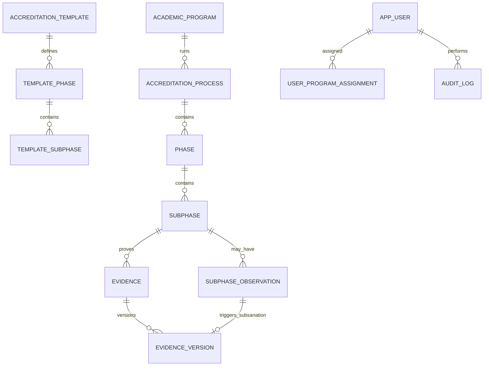

# Modelo de datos funcional — SIGESA / AcredIA

## Control de versión

| Campo | Valor |
|-------|-------|
| **Diagrama ER (fuente)** | [`diagramas/MAR-ER-001-modelo-datos-nucleo.mmd`](diagramas/MAR-ER-001-modelo-datos-nucleo.mmd) |
| **Versión** | v1.1 (modelo subfase-centrado) |
| **Timestamp** | `2026-08-27T20:00:00-04:00` |
| **Vista** | Lógica / de dominio (FSD) |
| **Glosario** | [`glosario.md`](glosario.md) |

> Modelo operativo del piloto v1.0: **Proceso → Fase → Subfase → Evidencia**. Sin taxonomía Dimensión/Criterio/Indicador.

---

## 1. Principios

| Principio | Regla funcional |
|-----------|-----------------|
| Append-only | Sin borrado físico de Evidencia aprobada; subsanación = nueva `EvidenceVersion` |
| Trazabilidad | `version`, `supersedesVersion`, `observationId`, `createdBy`, `createdAt` |
| Jerarquía | CEUB/ARCU-SUR: **Proceso → Fase → Subfase → Evidencia** |
| Aislamiento [CC] | Datos acotados a `programId` del coordinador |
| Un Proceso activo | Por carrera + modalidad + periodo (FSD-BR-08) |

---

## 2. Diagrama ER lógico

---

## 3. Entidades y atributos core

### 3.1 Maestros institucionales

| Entidad (EN) | ES | Atributos clave | Notas |
|--------------|-----|-----------------|-------|
| `AcademicProgram` | Carrera | `id`, `code`, `name`, `status` | Unidad de acreditación |
| `AppUser` | Usuario | `id`, `email`, `role`, `status` | Rol único (`CC`/`TD`/`JD`); email `@umss.edu.bo` |
| `UserProgramAssignment` | Asignación alcance | `id`, `userId`, `programId`, `assignedAt`, `revokedAt` | Alcance carrera [CC] (FSD-BR-09) |

### 3.2 Plantilla normativa

| Entidad | Atributos clave | Notas |
|---------|-----------------|-------|
| `AccreditationTemplate` | `modality` (CEUB \| ARCU-SUR), `version`, `status` | Activada por [JD] |
| `TemplatePhase` | `templateId`, `order`, `name` | |
| `TemplateSubphase` | `phaseId`, `order`, `name`, `referenceUrl`, `description`, `requirements` | Clonada al crear proceso |

### 3.3 Proceso en ejecución

| Entidad | Atributos clave | Notas |
|---------|-----------------|-------|
| `AccreditationProcess` | `programId`, `templateId`, `managementYear`, `status` | EN_PROCESO \| ACREDITADO \| VENCIDO |
| `Phase` | `processId`, `order`, `name`, `description` | Estado derivado por subfases |
| `Subphase` | `phaseId`, `order`, `name`, `referenceUrl`, `description`, `requirements` | Unidad de workflow y evidencias |

### 3.4 Evidencia, observaciones y auditoría

| Entidad | Atributos clave | Notas |
|---------|-----------------|-------|
| `Evidence` | `subphaseId`, `latestVersionId` | Cabecera estable; **sin** `indicatorId` |
| `EvidenceVersion` | `evidenceId`, `versionNumber`, `contentHash`, `description`, `observationId`, `supersedesVersion` | Append-only |
| `SubphaseObservation` | `subphaseId`, `body`, `status` (OPEN\|RESOLVED), `authorId`, `authorRole` | Origen de subsanación y rechazo TD |
| `AuditLog` | `action`, `actorId`, `entityType`, `entityId`, `payload` | Login, DELETE denegado, etc. |
| `NotificationOutbox` | `eventType`, `recipientId`, `payload`, `sentAt` | Patrón outbox |

---

## 4. Máquina de estados — Subfase (derivado)

| Estado | Descripción |
|--------|-------------|
| `PENDIENTE` | Sin Evidencia cargada |
| `SUBIDO` | Evidencia en revisión [TD] |
| `OBSERVADO` | Rechazada con observación OPEN |
| `SUBSANADO` | Nueva versión enviada; pendiente re-revisión |
| `APROBADO` | Validación [TD] completa |

Transiciones: UC-004 (carga → SUBIDO), UC-008 (rechazo → OBSERVADO), UC-006 (subsanación → SUBSANADO), UC-009 (aprobación → APROBADO).

---

## 5. Diccionario de validación (campos críticos)

| Entidad | Atributo | Tipo lógico | Obl. | Validación |
|---------|----------|-------------|------|------------|
| `Evidence` | `subphaseId` | UUID | sí | Subfase existe; carrera ∈ alcance [CC] |
| `EvidenceVersion` | `contentHash` | string(64) | sí | SHA-256 del blob |
| `EvidenceVersion` | `description` | text | sí | Metadato obligatorio |
| `EvidenceVersion` | `observationId` | UUID | cond. | Obligatorio si subsanación |
| `SubphaseObservation` | `body` | text | sí | min 20 caracteres en rechazo formal TD |
| `Subphase` | `requirements` | text | sí | Requisitos de completitud (UC-022) |
| `AppUser` | `email` | string | sí | Dominio `@umss.edu.bo` |

**Prohibido:** `isDeleted` / `deletedAt` en `Evidence` o `EvidenceVersion` aprobados.

---

## 6. Mapeo lógico → físico (implementación v1.0)

| Entidad lógica | Tabla física |
|----------------|--------------|
| `AcademicProgram` | `programs` |
| `AppUser` | `app_user` |
| `UserProgramAssignment` | `user_program_assignment` |
| `AccreditationProcess` | `accreditation_processes` |
| `Phase` | `phases` | `status` (`ABIERTA`\|`COMPLETADA`) — UC-010 |
| `Subphase` | `subphases` |
| `Evidence` | `evidence` (`subphase_id` FK; `indicator_id` legacy nullable — **deprecado**) |
| `EvidenceVersion` | `evidence_version` |
| `SubphaseObservation` | `subphase_observation` |
| `AuditLog` | `audit_log` |

> **Nota de migración:** columnas/tablas legacy `indicator`, `indicator_state_history` permanecen en código histórico pero **no forman parte del modelo funcional v1.1**. Nuevas features deben ignorarlas.

---

## 7. Reglas de datos vinculadas

| Regla FSD | Impacto en modelo |
|-----------|-------------------|
| FSD-BR-01 | Evidencia exige `subphaseId` + metadatos |
| FSD-BR-02 | Sin DELETE en `evidence_version` aprobada |
| FSD-BR-06 | FK `observation_id` en versión subsanatoria |
| FSD-BR-07 | Cierre de fase cuando todas las subfases = APROBADO |
| FSD-BR-09 | Filtro `program_id` en queries [CC] |
| FSD-BR-22 | No eliminar subfase con evidencias/workflow iniciado |

---

## Registro de cambios

| Versión | Fecha | Cambio |
|---------|-------|--------|
| v1.1 | 2026-08-27 | Pivot Proceso→Fase→Subfase→Evidencia; retiro taxonomía Indicador/Criterio/Dimensión |
| v1.2 | 2026-06-23 | MOD-AUTH alineado DD-UC-001 |
| Dorada v1.0 | 2026-05-16 | Vista funcional extraída de FSD.md |
