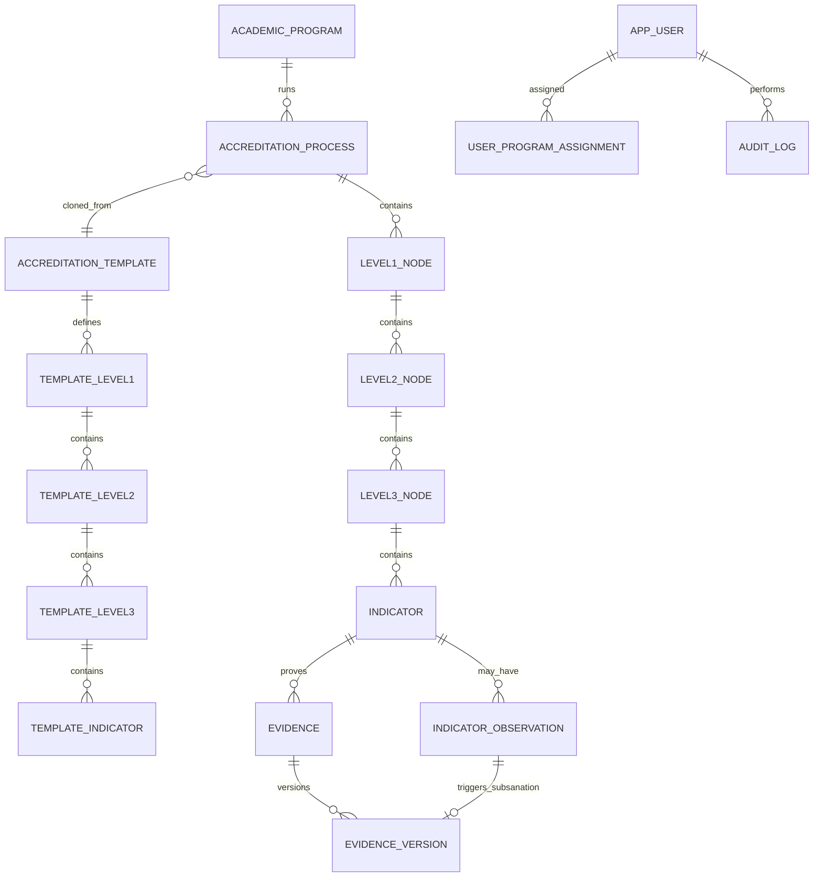

# Modelo de datos funcional — SIGESA / AcredIA

## Control de versión

| Campo | Valor |
|-------|-------|
| **Diagrama ER (fuente)** | [`diagramas/MAR-ER-001-modelo-datos-nucleo.mmd`](diagramas/MAR-ER-001-modelo-datos-nucleo.mmd) *(actualizar para v2.0)* |
| **Versión** | v2.0 (jerarquía normativa multinivel) |
| **Release** | `2.0.0` |
| **Timestamp** | `2026-09-08T00:00:00-04:00` |
| **Vista** | Lógica / de dominio (FSD) |
| **Glosario** | [`glosario.md`](glosario.md) |
| **ADR** | [`ADR-0004-normative-hierarchy-v2.md`](../adr/ADR-0004-normative-hierarchy-v2.md) |

> Modelo operativo **release 2.0.0:** **Proceso → Modelo evaluador → N1 → N2 → N3 → Indicador → Evidencia**.  
> Implementación en código (2026-09): legacy **Fase/Subfase** — ver §8.

---

## 1. Principios

| Principio | Regla funcional |
|-----------|-----------------|
| Append-only | Sin borrado físico de Evidencia aprobada; subsanación = nueva `EvidenceVersion` |
| Trazabilidad | `version`, `supersedesVersion`, `observationId`, `createdBy`, `createdAt` |
| Jerarquía | CEUB/ARCU-SUR: **N1 → N2 → N3 → Indicador → Evidencia**, instanciada en `AccreditationProcess` |
| Workflow | Estados derivados en **Indicador** (no en N1/N2/N3) |
| Cierre agregado | **Nivel 1** `COMPLETADO` cuando todos los indicadores del subárbol = `APROBADO` |
| Aislamiento [CC] | Datos acotados a `programId` del coordinador |
| Un Proceso activo | Por carrera + modelo evaluador + periodo (FSD-BR-08) |

---

## 2. Diagrama ER lógico (v2.0)

---

## 3. Entidades y atributos core

### 3.1 Maestros institucionales

| Entidad (EN) | ES | Atributos clave | Notas |
|--------------|-----|-----------------|-------|
| `AcademicProgram` | Carrera | `id`, `code`, `name`, `status` | Unidad de acreditación |
| `AppUser` | Usuario | `id`, `email`, `role`, `status` | Rol (`CC`/`TD`/`JD`/`EE`); email `@umss.edu.bo` |
| `UserProgramAssignment` | Asignación alcance | `id`, `userId`, `programId`, `assignedAt`, `revokedAt` | Alcance carrera [CC]/[EE] (FSD-BR-09) |

### 3.2 Plantilla normativa

| Entidad | Atributos clave | Notas |
|---------|-----------------|-------|
| `AccreditationTemplate` | `evaluatorModel` (CEUB \| ARCU-SUR), `name`, `version`, `status` | Activada por [JD]; `DRAFT` \| `PUBLISHED` \| `ARCHIVED` |
| `TemplateLevel1` | `templateId`, `order`, `name`, `description` | Dimensión (ARCU) / Área (CEUB) |
| `TemplateLevel2` | `level1Id`, `order`, `name`, `description` | Componente / Variable |
| `TemplateLevel3` | `level2Id`, `order`, `name`, `description` | Criterio / Sub-variable |
| `TemplateIndicator` | `level3Id`, `code`, `description`, `weight`, `order`, `referenceUrl` | Hoja de plantilla; clonada al crear proceso |

### 3.3 Proceso en ejecución

| Entidad | Atributos clave | Notas |
|---------|-----------------|-------|
| `AccreditationProcess` | `programId`, `templateId`, `evaluatorModel`, `managementYear`, `status` | `ACTIVE` \| `COMPLETED` \| `CANCELLED` |
| `Level1Node` | `processId`, `order`, `name`, `description`, `status` | `ABIERTA` \| `COMPLETADA` — UC-010 |
| `Level2Node` | `level1Id`, `order`, `name`, `description` | Contenedor normativo |
| `Level3Node` | `level2Id`, `order`, `name`, `description` | Contenedor normativo |
| `Indicator` | `level3Id`, `code`, `description`, `weight`, `order`, `referenceUrl`, `status` | **Unidad de workflow y evidencias** |

### 3.4 Evidencia, observaciones y auditoría

| Entidad | Atributos clave | Notas |
|---------|-----------------|-------|
| `Evidence` | `indicatorId`, `latestVersionId` | Cabecera estable; FK obligatoria a Indicador |
| `EvidenceVersion` | `evidenceId`, `versionNumber`, `contentHash`, `description`, `externalUrl`, `observationId`, `supersedesVersion` | Append-only; archivo y/o enlace |
| `IndicatorObservation` | `indicatorId`, `body`, `status` (OPEN\|RESOLVED), `authorId`, `authorRole`, `resolvedVersionId` | Origen de subsanación y rechazo TD |
| `AuditLog` | `action`, `actorId`, `entityType`, `entityId`, `payload` | Login, DELETE denegado, etc. |
| `NotificationOutbox` | `eventType`, `recipientId`, `payload`, `sentAt` | Patrón outbox |

---

## 4. Máquina de estados — Indicador (derivado)

| Estado | Descripción |
|--------|-------------|
| `PENDIENTE` | Sin Evidencia cargada |
| `SUBIDO` | Evidencia en revisión [TD] |
| `OBSERVADO` | Rechazada con observación OPEN |
| `SUBSANADO` | Nueva versión enviada; pendiente re-revisión |
| `APROBADO` | Validación [TD] completa |

Transiciones: UC-004 (carga → SUBIDO), UC-008 (rechazo → OBSERVADO), UC-006 (subsanación → SUBSANADO), UC-009 (aprobación → APROBADO).

> N1/N2/N3 **no** tienen máquina de workflow propia; N1 tiene estado de cierre agregado (`ABIERTA` / `COMPLETADA`).

---

## 5. Diccionario de validación (campos críticos)

| Entidad | Atributo | Tipo lógico | Obl. | Validación |
|---------|----------|-------------|------|------------|
| `Evidence` | `indicatorId` | UUID | sí | Indicador existe; carrera ∈ alcance [CC] |
| `EvidenceVersion` | `contentHash` | string(64) | cond. | SHA-256 del blob (si hay archivo) |
| `EvidenceVersion` | `description` | text | sí | Metadato obligatorio |
| `EvidenceVersion` | `externalUrl` | URL | cond. | HTTPS si se usa enlace sin archivo |
| `EvidenceVersion` | `observationId` | UUID | cond. | Obligatorio si subsanación |
| `IndicatorObservation` | `body` | text | sí | min 20 caracteres en rechazo formal TD |
| `Indicator` | `code` | string | sí | Único dentro del Nivel 3 |
| `Indicator` | `weight` | decimal | sí | ≥ 0 (FSD-BR-25) |
| `Indicator` | `referenceUrl` | URL | sí | HTTPS (plantilla y proceso) |
| `TemplateIndicator` | `code`, `weight`, `referenceUrl` | — | sí | Igual que instancia |
| `AppUser` | `email` | string | sí | Dominio `@umss.edu.bo` |

**Prohibido:** `isDeleted` / `deletedAt` en `Evidence` o `EvidenceVersion` aprobados.

**Invariante:** al menos **uno** de `contentHash` (archivo) o `externalUrl` en cada versión de evidencia.

---

## 6. Mapeo lógico → físico

### 6.1 Objetivo v2.0 (Flyway **V14** — DDL; datos en V15+)

| Entidad lógica | Tabla física |
|----------------|--------------|
| `AccreditationTemplate` | `templates` (`evaluator_model`, backfill desde `type`) |
| `TemplateLevel1` | `template_level1_nodes` |
| `TemplateLevel2` | `template_level2_nodes` |
| `TemplateLevel3` | `template_level3_nodes` |
| `TemplateIndicator` | `template_indicators` |
| `AccreditationProcess` | `accreditation_processes` |
| `Level1Node` | `level1_nodes` (`status`: `ABIERTA`\|`COMPLETADA`; `legacy_phase_id` opcional) |
| `Level2Node` | `level2_nodes` |
| `Level3Node` | `level3_nodes` |
| `Indicator` | `indicators` (`status`, workflow; `legacy_subphase_id` opcional) |
| `Evidence` | `evidence` (`normative_indicator_id` FK nullable hasta M2; legacy `subphase_id` intacto) |
| `EvidenceVersion` | `evidence_version` (+ `external_url`, `indicator_observation_id`) |
| `IndicatorObservation` | `indicator_observation` |
| `AuditLog` | `audit_log` |

**Índices recomendados:**

- `UNIQUE (level3_id, code)` en `indicators` / `template_indicators`
- `UNIQUE (parent_id, order)` por nivel (N1 en proceso, N2 en N1, etc.)
- `idx_indicators_status` para bandeja TD (UC-012)

### 6.2 Legacy v1.x (implementación actual)

| Entidad lógica obsoleta | Tabla física |
|-------------------------|--------------|
| `Phase` | `phases` |
| `Subphase` | `subphases` |
| `TemplatePhase` | `template_phases` |
| `TemplateSubphase` | `template_subphases` |
| `SubphaseObservation` | `subphase_observation` |
| `Evidence` | `evidence` (`subphase_id`; `indicator_id` nullable legacy) |

Ver migración en [ADR-0004](../adr/ADR-0004-normative-hierarchy-v2.md) §3.

---

## 7. Reglas de datos vinculadas

| Regla FSD | Impacto en modelo |
|-----------|-------------------|
| FSD-BR-01 | Evidencia exige `indicatorId` + metadatos |
| FSD-BR-02 | Sin DELETE en `evidence_version` aprobada |
| FSD-BR-06 | FK `observation_id` en versión subsanatoria |
| FSD-BR-07 | Cierre N1 cuando todos los indicadores del subárbol = APROBADO |
| FSD-BR-09 | Filtro `program_id` en queries [CC] |
| FSD-BR-22 | No eliminar indicador con evidencias/workflow iniciado |
| FSD-BR-24 | Plantilla publicada exige árbol completo hasta indicador |
| FSD-BR-25 | `weight` obligatorio y ≥ 0 en indicador |

---

## 8. Migración v1.x → v2.0 (resumen)

| Origen | Destino | Script |
|--------|---------|--------|
| `phases` | `level1_nodes` | **V15** (UUID preservado) |
| `subphases` | `indicators` (+ N2/N3 placeholder) | **V15** |
| `template_phases` / `template_subphases` | árbol `template_*` v2 | **V15** |
| `subphase_observation` | `indicator_observation` | **V15** |
| `evidence.subphase_id` | `evidence.normative_indicator_id` | **V15** |
| `evidence_version.observation_id` | `evidence_version.indicator_observation_id` | **V15** |

Post-migración: [JD]/[TD] refinan árbol vía UC-022; [JD] corrige códigos/ponderaciones en plantillas vía UC-021.

---

## Registro de cambios

| Versión | Fecha | Cambio |
|---------|-------|--------|
| v2.0 | 2026-09-08 | Jerarquía N1→N2→N3→Indicador→Evidencia; ADR-0004; obsolescencia Fase/Subfase |
| v1.1 | 2026-08-27 | Pivot Proceso→Fase→Subfase→Evidencia *(supersedido)* |
| v1.2 | 2026-06-23 | MOD-AUTH alineado DD-UC-001 |
| Dorada v1.0 | 2026-05-16 | Vista funcional extraída de FSD.md |
