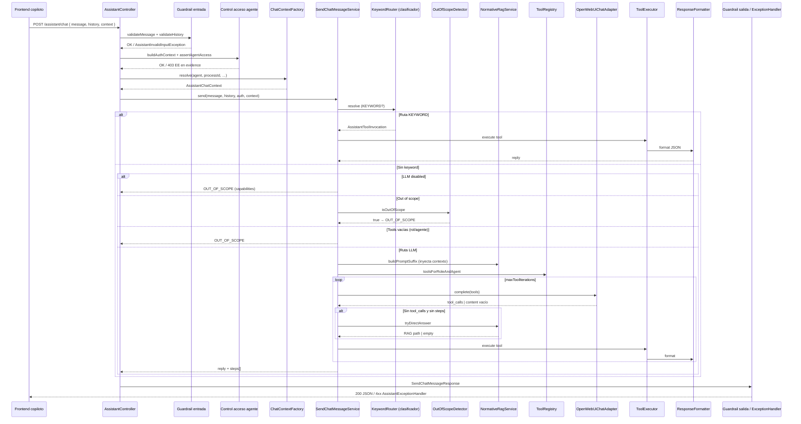

# Mapeo estructural del agente / chatbot SIGESA

> **Fase 1 AcredIA** — Identificación de nodos del pipeline antes de generar tests con agente IA.  
> **Alcance:** backend `POST /api/v1/assistant/chat` · agentes `general` | `phases` | `users` | `evidence`.

---

## 1. Diagrama de flujo (secuencia)

---

## 2. Tabla de nodos (requerimiento AcredIA)

| # | Nodo requerido | ¿Existe? | Componente SIGESA | Ubicación | Notas |
|---|----------------|----------|-------------------|-----------|-------|
| 1 | **Guardrail de entrada** | ✅ Sí | `AssistantChatInputValidator` | `application/service/assistant/` | Anti SQL/XSS, tamaño mensaje, roles historial, max history |
| | | ✅ Sí | `AssistantController.chat` | `adapter/in/web/` | `@Valid` DTO + flags `assistant.enabled` |
| | | ✅ Sí | `AssistantExceptionHandler` | `adapter/in/web/advice/` | 400 input inválido |
| 2 | **Clasificador** | ✅ Sí | `AssistantKeywordRouter` | `application/service/assistant/` | Regex → tool sin LLM (KEYWORD) |
| | | ✅ Sí | `AssistantOutOfScopeDetector` | idem | Presupuesto, clima, etc. → OUT_OF_SCOPE |
| | | ✅ Sí | Resolución `AssistantResolutionPath` | `KEYWORD` · `LLM` · `RAG` · `OUT_OF_SCOPE` | Enum en resultado |
| | | ⚠️ Parcial | Clasificador «urgencia» | — | **No aplica** — no hay cola de prioridad ni SLA |
| 3 | **Caché** | ❌ No | — | — | **No aplica.** Sin cache de respuestas FAQ; historial solo en frontend (`sessionStorage` UI) |
| 4 | **Recuperador / Tool calling** | ✅ Sí | `AssistantNormativeRagService` | RAG FTS PostgreSQL (`normative_document`) | `tryDirectAnswer` + suffix en prompt LLM |
| | | ✅ Sí | `AssistantToolRegistry` | Catálogo tools por rol × agente | 16 tools JD; subsets por profile |
| | | ✅ Sí | `AssistantToolExecutor` | Delegación a use cases hexagonales | JSON `{ ok, data, error }` |
| | | ✅ Sí | `AssistantToolRbacGuard` | RBAC tool × rol × agente | CC no `list_users`; audit |
| | | ✅ Sí | `AssistantProcessQueryParser` | Extrae CEUB/ARCU-SUR del mensaje | Usado en resolución procesos |
| | | ✅ Sí | `AssistantStructureLookup` | Fases/subfases por orden, UUID, NLU | Agente `phases` |
| | | ⚠️ Parcial | MCP `mcp/sigesa-evidence` | Diseño DD-AGENT-003 | Evidencias vía use cases Java, no MCP en runtime tests |
| 5 | **Llamada al modelo y respuesta** | ✅ Sí | `SendChatMessageService.executeLlmToolLoop` | Orquestador multi-turno | max `SIGESA_ASSISTANT_MAX_TOOL_ITERATIONS` |
| | | ✅ Sí | `OpenWebUiChatAdapter` | `ChatCompletionPort` → Open WebUI/Ollama | `/v1/chat/completions`, tools OpenAI format |
| | | ✅ Sí | System prompts por agente | Suffixes en `SendChatMessageService` | phases/users/evidence context |
| 6 | **Fallback / escalamiento** | ⚠️ Parcial | `SIGESA_ASSISTANT_LLM_ENABLED=false` | Properties | Mensaje capabilities; keyword sigue |
| | | ⚠️ Parcial | `AssistantChatResult.outOfScope` | Sin 500 al usuario | Texto amigable + catálogo capacidades |
| | | ⚠️ Parcial | `OpenWebUiChatAdapter` timeout 120s | HTTP client | `AssistantCompletionException` → handler |
| | | ⚠️ Parcial | Límite iteraciones tools | `hitIterationLimit` | «Resultados parciales» en reply |
| | | ❌ No | Escalamiento a humano / ticket | — | **No aplica** en MVP |
| | | ❌ No | Retry automático LLM | — | **No implementado** |
| 7 | **Guardrail de salida** | ⚠️ Parcial | `AssistantResponseFormatter` | Formatea JSON tool → texto usuario | Sin PII leak filter dedicado |
| | | ✅ Sí | Preview escritura + confirmación | `confirmationRequired` | «confirmo» vía keyword router |
| | | ✅ Sí | `AssistantExceptionHandler` | 503 unavailable, 403 agent, 400 input | Evita stack trace al cliente |
| | | ❌ No | Moderación contenido LLM | — | **No aplica** — confianza en tools + out-of-scope |

**Leyenda:** ✅ implementado · ⚠️ parcial / sustituto · ❌ no aplica o ausente

---

## 3. Rutas de resolución (`AssistantResolutionPath`)

| Ruta | Disparador | LLM invocado | Tests existentes |
|------|------------|:------------:|------------------|
| **KEYWORD** | `AssistantKeywordRouter` match | No | `SendChatMessageServiceToolLoopTest` scenario1, phasesAgent_* |
| **LLM** | Sin keyword; tools disponibles; in-scope | Sí | scenario2, multiToolLoop_*, phasesAgent_llmSelection_* |
| **RAG** | `NormativeRagService.tryDirectAnswer` (LLM sin tool_calls, 0 steps) | No* | `AssistantNormativeRagServiceTest` |
| **OUT_OF_SCOPE** | OOS detector, LLM off, tools vacías, error tool | No | scenario3, scenario4_llmDisabled_* |

\*RAG puede inyectar contexto en prompt antes de llamar LLM (`buildPromptSuffix`).

---

## 4. Perfiles de agente embebido

| Agente | ID | Contexto UI | Tools principales | Control acceso |
|--------|-----|-------------|-------------------|----------------|
| General | `general` | `/ayuda` | Todas las del rol | JWT estándar |
| Fases | `phases` | `/procesos/{id}`, estructura | fases, estructura, manage phase/subphase, normativa | TD/JD/CC según tool |
| Usuarios | `users` | `/admin/users` | list/create/manage users, normativa | **Solo JD** (`assertUsersAgentAccess`) |
| Evidencias | `evidence` | `/evidencias/cargar` | pending, detail, completeness, normativa | JD/TD/CC; **EE → 403** |

**Factory:** `AssistantChatContextFactory` — para `phases` carga detalle proceso y catálogo fases vía `GetProcessDetailUseCase`.

---

## 5. Inventario de componentes por capa

### 5.1 Entrada web

| Clase | Rol |
|-------|-----|
| `AssistantController` | REST `/status`, `/chat` |
| `SendChatMessageRequest` / `Response` | DTO contrato API |
| `AssistantChatInputValidator` | Guardrail entrada |
| `AssistantChatContextFactory` | Contexto agente + processId |
| `AssistantExceptionHandler` | Errores → HTTP |

### 5.2 Orquestación (aplicación)

| Clase | Rol |
|-------|-----|
| `SendChatMessageService` | Pipeline principal |
| `AssistantKeywordRouter` | Clasificador keyword |
| `AssistantOutOfScopeDetector` | Filtro temático |
| `AssistantNormativeRagService` | RAG + respuesta directa |
| `AssistantToolRegistry` | Catálogo + subset agente |
| `AssistantToolExecutor` | Ejecución tools → use cases |
| `AssistantToolRbacGuard` | Autorización fine-grained |
| `AssistantResponseFormatter` | Guardrail salida (formato) |
| `AssistantCapabilitiesCatalog` | Mensajes out-of-scope |
| `AssistantProcessQueryParser` | NLP ligero plantillas |
| `AssistantStructureLookup` | Resolución fase/subfase |
| `AssistantConfirmationSupport` | Flujos confirmación escritura |

### 5.3 Salida / infraestructura

| Clase | Rol |
|-------|-----|
| `OpenWebUiChatAdapter` | Cliente LLM (OpenAI-compatible) |
| `Slf4jAssistantToolAuditAdapter` | Auditoría tools |
| `AssistantProperties` | Config env |

### 5.4 Frontend (fuera del pipeline backend)

| Componente | Rol |
|------------|-----|
| `DomainCopilotFloatingChat` | Shell UI copilotos |
| `useCopilotConversationArchive` | Historial local (no backend) |
| `AssistantChatUI` | `/ayuda` página completa |

---

## 6. Configuración runtime (variables)

| Variable | Nodo afectado |
|----------|---------------|
| `SIGESA_ASSISTANT_ENABLED` | Guardrail entrada / disponibilidad |
| `SIGESA_ASSISTANT_LLM_ENABLED` | Fallback sin LLM |
| `SIGESA_ASSISTANT_BASE_URL` | Llamada modelo |
| `SIGESA_ASSISTANT_API_KEY` | Auth Open WebUI |
| `SIGESA_ASSISTANT_MODEL` | Modelo inferencia |
| `SIGESA_ASSISTANT_MAX_TOOL_ITERATIONS` | Límite multi-tool |
| `SIGESA_ASSISTANT_RAG_ENABLED` | Recuperador normativo |
| `SIGESA_ASSISTANT_RAG_MAX_CHUNKS` | Top-K RAG |

---

## 7. Mapeo nodo → tests existentes (S2/S3)

| Nodo | Clases test | Invocaciones | Gap |
|------|-------------|-------------:|-----|
| Guardrail entrada | `AssistantChatInputValidatorTest`, `AssistantControllerToolCallingTest` | 18 | — |
| Clasificador KEYWORD | `SendChatMessageServiceToolLoopTest`, `AssistantKeywordRouter`* | 13+ | *Router no testeado aislado |
| Clasificador OOS | `AssistantOutOfScopeDetectorTest` | 2 | — |
| Caché | — | 0 | N/A |
| RAG | `AssistantNormativeRagServiceTest`, `NormativeSearchQueryNormalizerTest` | 5 | Sin test integración FTS |
| Tool registry | `AssistantToolRegistryTest` | 11 | 3 tests desactualizados (normativa en users) |
| Tool executor | `AssistantToolExecutorTest` | 6 | Sin tests tools evidence |
| Tool RBAC | `AssistantToolRbacGuardTest` | 7 | 1 test desactualizado |
| LLM loop | `SendChatMessageServiceToolLoopTest` | 13 | Mock only |
| Llamada HTTP LLM | — | 0 | Sin test `OpenWebUiChatAdapter` |
| Fallback | `SendChatMessageServiceToolLoopTest` scenario4 | 2 | Sin test timeout real |
| Guardrail salida | Implícito en formatter tests | 0 | Sin tests dedicados formatter |
| Controller + JWT | `AssistantControllerToolCallingTest` | 5 | Sin `@WebMvcTest` HTTP |

---

## 8. Nodos declarados «no aplican» — justificación

| Nodo | Justificación SIGESA |
|------|----------------------|
| **Caché respuestas estáticas** | MVP sin FAQ cache; keyword router responde determinista sin almacenar turnos previos en BD |
| **Clasificador de urgencia** | Dominio acreditación sin colas prioritarias ni SLA en chat |
| **Escalamiento a soporte humano** | Out-of-scope devuelve mensaje guía; no hay integración ticketing |
| **Moderación LLM salida** | Respuestas derivadas de JSON tools auditables; LLM no redacta datos inventados en path feliz |
| **MCP runtime evidence** | Tools evidence ejecutan use cases Java; MCP documentado pero no en path de test unitario actual |

---

## 9. Implicaciones para Fase 2 (diseño cobertura)

**Prioridad alta (gaps + tests rotos baseline):**
1. Actualizar `AssistantToolRegistryTest` / `AssistantToolRbacGuardTest` (normativa en perfil users)
2. `@WebMvcTest(AssistantController)` — contrato HTTP S3
3. `AssistantToolExecutorTest` — tools evidence (`list_pending_evidences`, etc.)
4. Tests aislados `AssistantResponseFormatter` (guardrail salida)
5. Contract test JSON `SendChatMessageResponse` (schema)

**Prioridad media:**
6. `OpenWebUiChatAdapter` con WireMock
7. `AssistantKeywordRouter` unit (sin pasar por SendChatMessageService)

**Fuera alcance Fase 2–3 (pirámide superior):**
- Caché, escalamiento humano, evals probabilísticos (S6–S7)

---

## 10. Trazabilidad documental

| Documento | Relación |
|-----------|----------|
| [TEST-BASELINE-2026-09-06.md](./TEST-BASELINE-2026-09-06.md) | Foto inicial + ejecución 232 tests |
| [DD-SYS-002.md](../design/DD-SYS-002.md) | Motor assistant §4–§11 |
| [DD-AGENT-001…003](../design/assistant/) | Agentes embebidos |
| [TOOL-CATALOG.md](../design/assistant/TOOL-CATALOG.md) | Contrato tools |

---

## 11. Estado Fase AcredIA

| Fase | Estado |
|------|--------|
| Fase 0 — Baseline | ✅ |
| **Fase 1 — Mapeo nodos** | **✅ Completada** |
| Fase 2 — Diseño cobertura S2–S3 | ✅ [AGENT-TEST-COVERAGE-PLAN.md](./AGENT-TEST-COVERAGE-PLAN.md) |
| Fase 3 — Agente generador | Pendiente aprobación |
